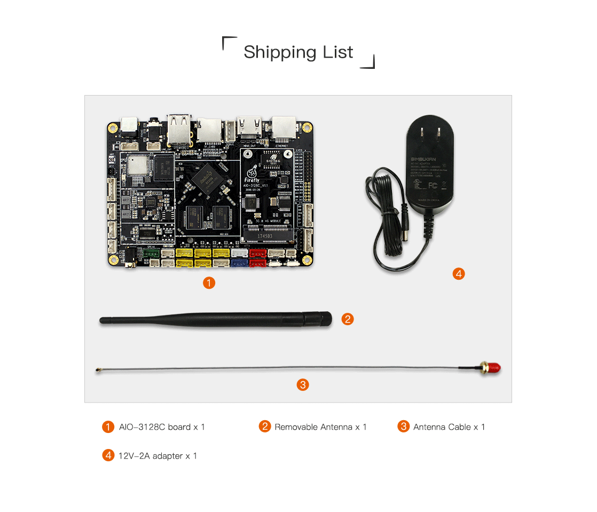
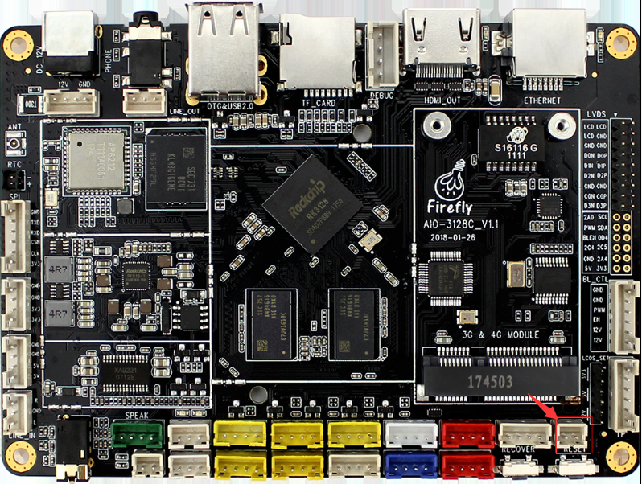

# User manual

## Accessories 

Standard suit for AIO-3128C includes the following items:

* AIO-3128C development board × 1
* WiFi antenna

Other available accessories include:

* [12V/2A DC power adapter (supports 220V/110V inputs)](https://www.firefly.store/products/12v-2a-power-adapter)
* [Firefly USB to UART Module](https://www.firefly.store/products/usb-to-uart-module-cp2104)

During using, you may need the following accessories:

- Display device
    + Display or TV supporting HDMI interface, and HDMI cable
- Network
    + 100M/1000M ethernet cable, and wired router
    + WiFi router
- Input devices
    + USB wire/wireless mouse/keyboard
    + Infrared remote control
- Firmware upgrade and debug:
    + Dual USB cable
    + USB to serial adapter

## Packing list

* Note: The packing list is for reference only.

## Start-up

After confirming the motherboard accessories are connected correctly, connect the power adapter to the live socket and the power cable to the development board. The power board will auto power on when it is powered up for the first time. 		

Select "Shutdown" in Android system, keeping the board's power. AIO-3128C can choose to press and hold the power button for 3 seconds: (Need an external power button, the interface is shown in the red box)

When starting up, the blue indicator will illuminate.