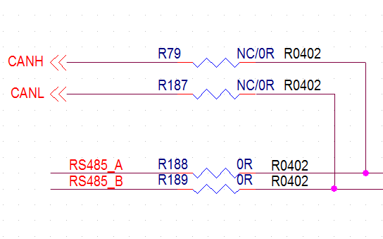
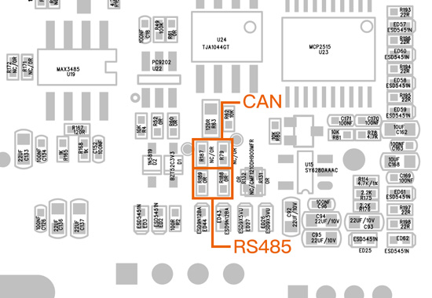
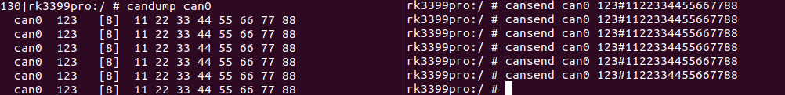

## CAN
### Introduction
Controller area network (can) is a kind of serial communication network which can effectively support distributed control or real-time control. Can bus is a bus protocol widely used in automobile, which is designed as the communication of microcontroller in automobile environment.
* check [TI application report for more](https://www.ti.com/lit/an/sloa101b/sloa101b.pdf)

### Hardware Connection
Connection between two CAN devices, only need CAN_H to CAN_H, CAN_L to CAN_L.

But it is neccessary to modify PCB of the board below.


**Since the default hardware interface has priority over RS485, it is necessary for the hardware to modify the resistance below**



### Communication
CAN communication test,**First of all, The Software of the board AIO-3399ProC have already supported default**, Use the "candump" and "cansend" tools directly to send and receive messages, push tool into /system/bin/ . Tools "candump/cansend" download from [Officail link](http://www.t-firefly.com/share/index/index/id/3cacb04c663f9fe97bf494ca55763dcd.html) or [github](https://github.com/linux-can/can-utils).
```
ip link set can0 type can bitrate 250000    //Set the bit rate to 250Kbps at the transceiver
ip link set can0 up                            //Open the can0 device at the transceiver
candump can0                                //Perform candump on the receiving end, blocking waiting for messages
cansend can0 123#1122334455667788             //Execute cansend at the sending end to send the message
```
Successful message sending and receiving (Here AIO-3399ProC as the receiving and the sending)

So far, MCP2515 module communication debugging has been successful.

During the test, it was found that when the bit rate is set to 500Kbps and above, if the interval of using cansend is too short (the frequency of use is too fast), over-receiving and receiving errors will occur at the receiving end

### More Command
```
1、#ip link set canX down 		//turn off CAN device
2、#ip link set canX up   		//turn on CAN device
3、#ip -details link show canX 		//show CAN device details
4、#candump canX  			//Receive data from CAN bus
5、#ifconfig canX down 			//shutdown CAn device
6、#ip link set canX up type can bitrate 250000 //Set CAN Baudrate
7、#conconfig canX bitrate + (Baudrate)
8、#canconfig canX start 		//start CAN device
9、#canconfig canX ctrlmode loopback on //loopback test
10、#canconfig canX restart 		//restart CAN device
11、#canconfig canX stop 		//stop CAN device
12、#canecho canX 			//check CAN device status查看can设备总线状态；
13、#cansend canX --identifier=ID+data 	//send data
14、#candump canX --filter=ID:mask 	//Use the filter to receive ID matching data
```

### FAQS
Summarize several problems and solutions encountered during debugging.

Q: "ifconfig -a" cannot found canX device.

A: Check whether the driver successfully enters the probe, and check whether the power supply of the MCP2515_CAN module is normal or damaged.

Q: The message was received long after it was sent, or could not be received.

A: Check if the CAN_H and CAN_L lines of the bus are loose or connected in reverse.

Q: The receiving end only successfully received the message once, and then no longer received the message.

A: Check whether the INT interrupt pin of the MCP2515 module is paired in dts; whether the INT pin is connected to the corresponding pin of the development board.

