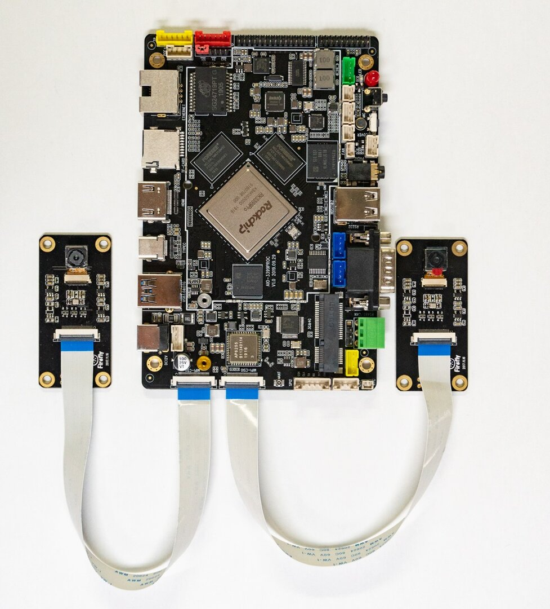
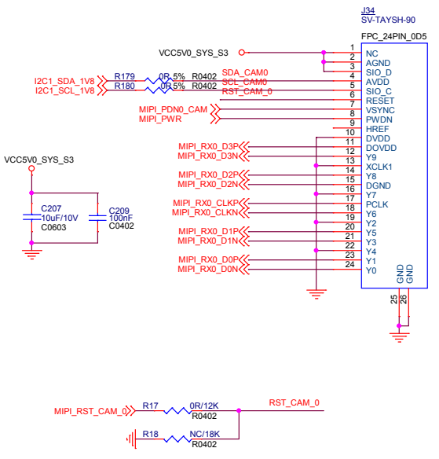

# MIPI CSI
## Introduction

AIO-3399ProC Development board with two MIPI interface, MIPI maximum support support 4K photography, and support 1080P 30FPS above video recording. In addition, the development board also supports USB camera.

This article takes OV13850 camera as an example to explain the configuration process on the development board.

## Interface rendering


## DTS configuration
```
isp0: isp@ff910000 {
    …
    status = "okay";
}
isp1: isp@ff920000 {
    …
    status = "okay";
}
```
## Driving instructions
The directory of camera codes is as follows:
```
hal3_camera :
├── AAL //Android abstraction layer is responsible for interacting with the framework
├── common //Implementation of common files, such as threads, message processing, log printing, etc
│ ├── gcss //xml Analytical correlation
│ ├── imageProcess //Image processing, such as scale
│ ├── jpeg //jpeg Encoding correlation
│ ├── mediacontroller //Media pipeline related
│ ├── platformdata hal3 The attributes supported by Hal 3 capability are mainly the attributes obtained from XML
│ ├── utils //At present, there is only one error. H, which defines some return values
│ └── v4l2dev //It encapsulates some specific IOS that interact with the v4l2 driver
├── etc //Profile directory
├── include //Header file of control loop, buffer & Manager related header file
├── lib //3A engine related Library
├── psl //Physical layer, physical implementation layer, all the implementation logic is basically here
│ └── rkisp1 //At present, only rkisp1 is available
│ ├── tasks //Basically, only a few notify interface classes and jpegencodetask are used
│ └── workers //Data acquisition and processing are all here
└── tools //Contains a python script that automatically generates graph setting XML

Linux Kernel-4.4:|
|-- arch/arm64/boot/dts/rockchip //DTS
|-- drivers/phy/rockchip/   //mipi dphy driver
        |-- phy-rockchip-mipi-rx.c
|-- drivers/media|
 |-- platform/rockchip/isp1 //rkisp1 isp driver
  |-- capture.c  //Including MP / SP configuration and VB2, frame interrupt processing
  |-- dev.c      //Including probe, asynchronous registration, clock, pipeline, IOMMU and media / v4l2 framework
  |-- isp_params.c //3A related parameter settings
  |-- isp_stats.c //3A related parameter settings
  |-- regs.c //Register Related read and write operations
  |-- rkisp1.c //Corresponding to ISP ﹣ SD entity node, including receiving data from Mipi, and with the function of cross
 |-- i2c/
  |-- ov13850.c CIS(cmos image sensor)driver
  |-- vm149c.c VCM driver ic driver
 |-- spi/ rk1608 ap driver
  |-- rk1608.c register the rk1608 spi device
  |-- rk1608_dev.c register the /dev/rk_preisp misc device
  |-- rk1608_dphy.c //Register v4l2 media node and interact with rk1608 and AP

```
## Configuration principle

The configuration process can be completed by setting camera-related pins and clocks.

As can be seen from the schematic diagram of the camera interface below, pins to be configured are: MIPI_PWR, MIPI_PDN0_CAM/MIPI_PDN1_CAM, RST_CAM_0/RST_CAM_1.

* mipi interface

* MIPI_PWR = GPIO3_D5;
* MIPI_PDN0_CAM/MIPI_PDN1_CAM =  GPIO3_D3 / GPIO3_D4;
* MIPI_RST0/MIPI_RST1 = GPIO2_A6 / GPIO2_A1;


In the development board, these three pins are set in kernel/arch/arm64/boot/dts/rockchip/rk3399pro-firefly-usbacm.dtsi.

## Configuration steps
### configure driver ov13850 and driver VCM
### Configure Android
Modify kernel/arch/arm64/boot/dts/rockchip/rk3399pro-firefly-usbacm.dtsi to init the camera driver:
```
{
        vcc_mipi: vcc_mipi {
                compatible = "regulator-fixed";
                enable-active-high;
                gpio = <&gpio3 29 GPIO_ACTIVE_HIGH>;
                pinctrl-names = "default";
                pinctrl-0 = <&dvp_pwr>;
                regulator-name = "vcc_mipi";
        };
};
.....
&i2c1 {
        vm149c: vm149c@0c {
                compatible = "silicon touch,vm149c";
                status = "okay";
                reg = <0x0c>;
                rockchip,camera-module-index = <0>;
                rockchip,camera-module-facing = "back";
        };

        ov13850b: ov13850b@10 {
                compatible = "ovti,ov13850";
                reg = <0x10>;
                clocks = <&cru SCLK_CIF_OUT>;
                clock-names = "xvclk";
                avdd-supply = <&vcc_mipi>;
                /* dvdd-supply = <>; */
                /* dovdd-supply = <>; */
                /* reset-gpios = <>; */
                //mipi-pwr-gpios = <&gpio3 29 GPIO_ACTIVE_HIGH>;
                reset-gpios = <&gpio2 6 GPIO_ACTIVE_HIGH>;
                pwdn-gpios = <&gpio3 27 GPIO_ACTIVE_HIGH>;
                //pinctrl-names = "rockchip,camera_default", "rockchip,camera_sleep";
                //pinctrl-0 = <&cam0_default_pins>;
                //pinctrl-1 = <&cam0_sleep_pins>;
                pinctrl-names = "rockchip,camera_default";
                pinctrl-0 = <&cif_clkout>;

                firefly,clkout-enabled-index = <0>;
                rockchip,camera-module-index = <0>;
                rockchip,camera-module-facing = "back";
                rockchip,camera-module-name = "CMK-CT0116";
                rockchip,camera-module-lens-name = "Largan-50013A1";
                lens-focus = <&vm149c>;

                port {
                        ucam_out0: endpoint {
                                remote-endpoint = <&mipi_in_ucam0>;
                                data-lanes = <1 2>;
                        };
                };
        };
        vm149c_front: vm149c_front@0c {
                compatible = "silicon touch,vm149c";
                status = "okay";
                reg = <0x0c>;
                rockchip,camera-module-index = <1>;
                rockchip,camera-module-facing = "front";
        };

        ov13850f: ov13850f@10 {
                compatible = "ovti,ov13850";
                reg = <0x10>;
                clocks = <&cru SCLK_CIF_OUT>;
                clock-names = "xvclk";
                avdd-supply = <&vcc_mipi>;
                //mipi-pwr-gpios = <&gpio3 29 GPIO_ACTIVE_HIGH>;
                reset-gpios = <&gpio2 1 GPIO_ACTIVE_HIGH>;
                pwdn-gpios = <&gpio3 28 GPIO_ACTIVE_HIGH>;
                //pinctrl-names = "rockchip,camera_default", "rockchip,camera_sleep";
                //pinctrl-0 = <&cam0_default_pins>;
                //pinctrl-1 = <&cam0_sleep_pins>;
                pinctrl-names = "rockchip,camera_default";
                pinctrl-0 = <&cif_clkout>;

                firefly,second-enabled-index = <1>;
                firefly,clkout-enabled-index = <0>;
                rockchip,camera-module-index = <1>;
                rockchip,camera-module-facing = "front";
                rockchip,camera-module-name = "CMK-CT0116";
                rockchip,camera-module-lens-name = "Largan-50013A1";
                lens-focus = <&vm149c_front>;

                port {
                        ucam_out0: endpoint {
                                remote-endpoint = <&mipi_in_ucam0>;
                                data-lanes = <1 2>;
                        };
                };
        };
```

Modify the power on sequence of ov13850 drive kernel/drivers/media/i2c/ov13850.c

```
+static int __ov13850_power_on(struct ov13850 *ov13850);
+static void __ov13850_power_off(struct ov13850 *ov13850);
 static int ov13850_s_power(struct v4l2_subdev *sd, int on)
 {
        struct ov13850 *ov13850 = to_ov13850(sd);
@@ -1055,6 +1058,7 @@ static int ov13850_s_power(struct v4l2_subdev *sd, int on)
                        goto unlock_and_return;
                }

+               __ov13850_power_on(ov13850);
                ret = ov13850_write_array(ov13850->client, ov13850_global_regs);
                if (ret) {
                        v4l2_err(sd, "could not set init registers\n");
@@ -1063,9 +1067,20 @@ static int ov13850_s_power(struct v4l2_subdev *sd, int on)
                }

                ov13850->power_on = true;
+               /* export gpio */
+               if (!IS_ERR(ov13850->reset_gpio))
+                       gpiod_export(ov13850->reset_gpio, false);
+               if (!IS_ERR(ov13850->pwdn_gpio))
+                       gpiod_export(ov13850->pwdn_gpio, false);
        } else {
                pm_runtime_put(&client->dev);
+               __ov13850_power_off(ov13850);
                ov13850->power_on = false;
+               /* unexport gpio */
+               if (!IS_ERR(ov13850->reset_gpio))
+                       gpiod_unexport(ov13850->reset_gpio);
+               if (!IS_ERR(ov13850->pwdn_gpio))
+                       gpiod_unexport(ov13850->pwdn_gpio);
        }
```
According to the sensor requirements, power on configuration of __ov13850_power_on.
### Android configuration
modify hardware/rockchip/camera/etc/camera/camera3_profiles_rk3399pro.xml to register the camera：

```
<CameraSettings>
  <Profiles cameraId="0" name="ov13850" moduleId="m00">
        <Supported_hardware>
            <hwType value="SUPPORTED_HW_RKISP1"/>
        </Supported_hardware>

        <Android_metadata> <!-- Android static metadata only -->
            <!-- Color Correction -->
            <colorCorrection.availableAberrationModes value="OFF"/>
            <!-- Control -->
            <control.availableModes value="AUTO"/>
            <control.aeAvailableAntibandingModes value="OFF,50HZ,60Hz,AUTO"/>
            <control.aeAvailableModes value="ON,OFF"/>
            <control.aeLockAvailable value="FALSE"/>
            <!-- <control.aeAvailableTargetFpsRanges value="15,30,30,30,60,60"/> -->
            <control.aeAvailableTargetFpsRanges value="15,30,30,30"/>
            <control.aeCompensationRange value="-6,6"/>
            <control.aeCompensationStep value="1,3"/>
            <control.afAvailableModes value="OFF,AUTO,MACRO,CONTINUOUS_VIDEO,CONTINUOUS_PICTURE,EDOF"/>
            <control.availableEffects value="OFF"/>
            <!-- <control.awbAvailableModes value="AUTO"/> -->
            <control.awbAvailableModes value="AUTO,INCANDESCENT,FLUORESCENT,DAYLIGHT,CLOUDY_DAYLIGHT"/>
            <control.awbLockAvailable value="false"/>
            <control.availableSceneModes value="DISABLED"/>
            <control.availableVideoStabilizationModes value="OFF"/>
            <control.maxRegions value="1,0,1"/>
            <!-- JPEG -->
            <jpeg.maxSize value="19267584"/>  <!-- w*h*1.5 -->
            <!-- /* TODO */ -->
            <!-- The aspect ratio of the largest thumbnail size will be same as the aspect ratio of largest JPEG output size -->
            <!-- buf hw encode may not support such thumbnail size, so if we should change the jpeg output size? -->
            <jpeg.availableThumbnailSizes value="0,0,128,96,160,96,160,120,256,196"/>
            <!-- <jpeg.availableThumbnailSizes value="0,0,160,120,320,180,320,240"/> -->
            <!-- Lens Info-->
            <!-- TODO: availableApertures now is fake for we do not get the real apertures -->
            <lens.info.availableApertures value="2.0"/> <!-- HAL may override this value from CMC for RAW sensors -->
            <lens.info.availableFocalLengths value="2.04"/> <!-- HAL may override this value from CMC for RAW sensors -->
            <lens.info.availableOpticalStabilization value="OFF"/> <!-- OPTIONS: OFF, ON -->
            <lens.info.hyperfocalDistance value="0.0"/> <!-- HAL may override this value from CMC for RAW sensors -->
            <lens.info.minimumFocusDistance value="0.1"/> <!-- HAL may override this value from CMC for RAW sensors -->
            <!-- Lens -->
            <lens.facing value="BACK"/>
            <!-- Request -->
            <request.maxNumOutputStreams value="1,2,1"/>
            <request.pipelineMaxDepth value="4"/>
            <request.maxNumInputStreams value="0"/>
            <request.partialResultCount value="1"/>
            <!-- <request.availableCapabilities value="BACKWARD_COMPATIBLE,YUV_REPROCESSING,PRIVATE_REPROCESSING"/> -->
            <request.availableCapabilities value="BACKWARD_COMPATIBLE"/>
            <request.availableRequestKeys value="blackLevel.lock,
                colorCorrection.aberrationMode,
                colorCorrection.gains,
                colorCorrection.transform,
                control.aeAntibandingMode,
                control.aeExposureCompensation,
                control.aeLock,
                control.aeMode,
                control.aeTargetFpsRange,
                control.aePrecaptureTrigger,
                control.afMode,
                control.aeRegions,
                control.afRegions,
                control.afTrigger,
                control.awbLock,
                control.awbMode,
                control.captureIntent,
                control.effectMode,
                control.mode,
                control.sceneMode,
                control.videoStabilizationMode,
                edge.mode,
                flash.mode,
                jpeg.gpsLocation,
                jpeg.orientation,
                jpeg.quality,
                jpeg.thumbnailQuality,
                jpeg.thumbnailSize,
                lens.aperture,
                lens.focalLength,
                lens.opticalStabilizationMode,
                noiseReduction.mode,
                scaler.cropRegion,
                statistics.faceDetectMode,
                statistics.hotPixelMapMode,
                statistics.sceneFlicker,
                statistics.lensShadingMapMode
                "/>

            <request.availableResultKeys value="colorCorrection.mode,
                colorCorrection.transform,
                colorCorrection.gains,
                colorCorrection.aberrationCorrectionMode,
                control.aeAntibandingMode,
                control.aeExposureCompensation,
                control.aeLock,
                control.aeMode,
                control.aeTargetFpsRange,
                control.aePrecaptureTrigger,
                control.afMode,
                control.afRegions,
                control.afTrigger,
                control.awbLock,
                control.awbMode,
                control.captureIntent,
                control.effectMode,
                control.mode,
                control.sceneMode,
                control.videoStabilizationMode,
                control.aeState,
                control.afState,
                control.awbState,
                sync.frameNumber,
                edge.mode,
                flash.mode,
                jpeg.gpsLocation,
                jpeg.orientation,
                jpeg.quality,
                jpeg.thumbnailQuality,
                jpeg.thumbnailSize,
                lens.focalLength,
                lens.aperture,
                lens.opticalStabilizationMode,
                request.pipelineDepth,
                scaler.cropRegion,
                sensor.testPatternData,
                sensor.testPatternMode,
                sensor.timestamp,
                sensor.rollingShutterSkew,
                statistics.faceDetectMode,
                statistics.hotPixelMapMode,
                statistics.faces,
                noiseReduction.mode,
                statistics.sceneFlicker,
                statistics.lensShadingMapMode
                "/>
            <request.availableCharacteristicsKeys value="0"/>
            <!-- Scaler -->
            <scaler.availableMaxDigitalZoom value="4.0"/>
            <scaler.availableInputOutputFormatsMap value="IMPLEMENTATION_DEFINED,2,YCbCr_420_888,BLOB,YCbCr_420_888,2,YCbCr_420_888,BLOB"/>
			<scaler.availableStreamConfigurations value="
				BLOB,4096x3136,OUTPUT,
				BLOB,2112x1568,OUTPUT,
                BLOB,1920x1080,OUTPUT,
                BLOB,1280x960,OUTPUT,
                BLOB,1280x720,OUTPUT,
                BLOB,640x480,OUTPUT,
                BLOB,352x288,OUTPUT,
                BLOB,320x240,OUTPUT,
                BLOB,176x144,OUTPUT,
                YCbCr_420_888,2112x1568,OUTPUT,
                YCbCr_420_888,1920x1080,OUTPUT,
                YCbCr_420_888,1280x960,OUTPUT,
                YCbCr_420_888,1280x720,OUTPUT,
                YCbCr_420_888,640x480,OUTPUT,
                YCbCr_420_888,352x288,OUTPUT,
                YCbCr_420_888,320x240,OUTPUT,
                YCbCr_420_888,176x144,OUTPUT,
                IMPLEMENTATION_DEFINED,2112x1568,OUTPUT,
                IMPLEMENTATION_DEFINED,1920x1080,OUTPUT,
                IMPLEMENTATION_DEFINED,1280x960,OUTPUT,
                IMPLEMENTATION_DEFINED,1280x720,OUTPUT,
                IMPLEMENTATION_DEFINED,640x480,OUTPUT,
                IMPLEMENTATION_DEFINED,352x288,OUTPUT,
                IMPLEMENTATION_DEFINED,320x240,OUTPUT,
                IMPLEMENTATION_DEFINED,176x144,OUTPUT"/>
			<scaler.availableMinFrameDurations value="
				BLOB,4096x3136,150000000,
				BLOB,2112x1568,33333333,
                BLOB,1920x1080,33333333,
                BLOB,1280x960,33333333,
                BLOB,1280x720,33333333,
                BLOB,640x480,33333333,
                BLOB,352x288,33333333,
                BLOB,320x240,33333333,
                BLOB,176x144,33333333,
                YCbCr_420_888,2112x1568,33333333,
                YCbCr_420_888,1920x1080,33333333,
                YCbCr_420_888,1280x960,33333333,
                YCbCr_420_888,1280x720,33333333,
                YCbCr_420_888,640x480,33333333,
                IMPLEMENTATION_DEFINED,2112x1568,33333333,
                IMPLEMENTATION_DEFINED,1920x1080,33333333,
                IMPLEMENTATION_DEFINED,1280x960,33333333,
                IMPLEMENTATION_DEFINED,1280x720,33333333,
                IMPLEMENTATION_DEFINED,640x480,33333333,
                IMPLEMENTATION_DEFINED,352x288,33333333,
                IMPLEMENTATION_DEFINED,320x240,33333333,
                IMPLEMENTATION_DEFINED,176x144,33333333" />
			<scaler.availableStallDurations value="
												   BLOB,4096x3136,150000000,
												   BLOB,2112x1568,33333333,
                                                   BLOB,1920x1080,33333333,
                                                   BLOB,1280x960,33333333,
                                                   BLOB,1280x720,33333333,
                                                   BLOB,640x480,33333333,
                                                   BLOB,352x288,33333333,
                                                   BLOB,320x240,33333333,
                                                   BLOB,176x144,33333333" />
            <scaler.croppingType value="CENTER_ONLY"/>
            <!-- Sensor Info -->
            <sensor.info.activeArraySize value="0,0,4224,3136"/>
            <sensor.info.sensitivityRange value="32,2400"/>
            <sensor.info.colorFilterArrangement value="BGGR"/> <!-- HAL may override this value from CMC for RAW sensors -->
            <sensor.info.exposureTimeRange value="100000,333333330"/>
            <sensor.info.maxFrameDuration value="66666666"/>
            <sensor.info.physicalSize value="5.5,4.5"/> <!-- 4224x1.12um 3136x1.12um -->
            <sensor.info.pixelArraySize value="4224x3136"/>
            <sensor.info.whiteLevel value="0"/> <!-- HAL may override this value from CMC for RAW sensors -->
            <sensor.info.timestampSource value="UNKNOWN"/>
            <!-- Sensor -->
            <sensor.baseGainFactor value="0,1"/> <!-- HAL may override this value from CMC for RAW sensors -->
            <sensor.blackLevelPattern value="0,0,0,0"/>
            <sensor.maxAnalogSensitivity value="2400"/> <!-- HAL may override this value from CMC for RAW sensors -->
            <sensor.orientation value="180"/>
            <sensor.profileHueSatMapDimensions value="0,0,0"/>
            <sensor.availableTestPatternModes value="OFF,COLOR_BARS"/>
            <!-- Info -->
            <info.supportedHardwareLevel value="LIMITED"/>
            <!-- shading -->
            <!-- <shading.availableModes value="OFF"/> -->
            <!-- Statistics Info -->
            <statistics.info.availableFaceDetectModes value="OFF"/>
            <statistics.info.histogramBucketCount value="0"/>
            <statistics.info.maxFaceCount value="0"/>
            <statistics.info.availableHotPixelMapModes value="OFF"/>
            <statistics.info.availableLensShadingMapModes value="OFF"/>
            <!-- Flash -->
            <flash.colorTemperature value="0"/>
            <flash.maxEnergy value="0"/>
            <!-- Flash info -->
            <flash.info.available value="FALSE"/>
            <flash.info.chargeDuration value="1000000"/>
            <flash.maxEnergy value="10"/>
            <!-- Sync -->
            <sync.maxLatency value="PER_FRAME_CONTROL"/>
            <!-- maxCaptureStall -->
            <reprocess.maxCaptureStall value="4"/>
            <!-- Edge -->
            <edge.availableEdgeModes value="OFF,FAST,HIGH_QUALITY"/>
            <!-- Noise Reduction -->
            <noiseReduction.availableNoiseReductionModes value="OFF,FAST,HIGH_QUALITY"/>

        </Android_metadata>

<!-- ******************PSL specific section start **************************************************************-->
        <Hal_tuning_RKISP1> <!-- Parameters to tune the HAL and hacks for the HAL that are camera dependent -->
            <flipping value="" value_v=""/> <!-- value: SENSOR_FLIP_H or "", value_v: SENSOR_FLIP_V or "" -->
            <supportIsoMap value="false"/>
            <supportTuningSize value="4224x3136, 2112x1568"/>
        </Hal_tuning_RKISP1>

        <Sensor_info_RKISP1> <!-- Information that parametrizes the behavior or qualities of the physical sensor -->
            <sensorType value="SENSOR_TYPE_RAW"/> <!-- SENSOR_TYPE_SOC or SENSOR_TYPE_RAW -->
            <exposure.sync value="true"/> <!-- compensate expsure sync-->
            <sensor.digitalGain value="false"/> <!-- digital gain support on sensor-->
            <gain.lag value="2"/> <!-- camera3 HAL CPF parameters moved here start-->
            <exposure.lag value="2"/>
            <fov value= "54.8" value_v="42.5"/>
            <statistics.initialSkip value="1"/> <!-- camera3 HAL CPF parameters moved here end-->
            <frame.initialSkip value="3"/> <!-- camera3 HAL CPF parameters moved here end-->
            <isoAnalogGain1 value="75"/> <!--Pseudo ISO corresponding analog gain value 1.0. -->
            <cITMaxMargin value="10"/> <!--coarse integration time max margin -->
        </Sensor_info_RKISP1>

<!-- ******************PSL specific section end **************************************************************-->

```

The main modifications are as follows:

   * Sensor name
 ```
cameraId="0"  //Cameraid is set to 0 after and 1 before. When there is only one camera, it is 0.

 ```
The name must be consistent with the name of the sensor driver. The currently provided sensor driver format is as follows:
```
name="ov13850"
moduleId="m00"
```
By the following command: adb shell cat /sys/class/video4linux/*/name  get the names of all v4l2 device nodes, where the form is as follows
m00_b_ov13850 1-0010 as sensor node name。 In this command rule, M00 represents moduleid, mainly for matching len and flash
, 'B' means the camera direction is post, if it is front, 'f', 'ov13850' means the sensor name, '1-0010' means the I2C address.

### DEBUG

(1) If the rkisp driver is loaded successfully, there will be video and media devices in the /dev/ directory. Possible in system
Multiple /dev/video devices. You can query the video nodes registered by rkisp through /sys
```
console:/ # grep '' /sys/class/video4linux/video*/name
/sys/class/video4linux/video0/name:rkisp1_mainpath
/sys/class/video4linux/video1/name:rkisp1_selfpath
/sys/class/video4linux/video2/name:rkisp1_dmapath
/sys/class/video4linux/video3/name:rkisp1-statistics
/sys/class/video4linux/video4/name:rkisp1-input-params
/sys/class/video4linux/video5/name:rkisp1_mainpath
/sys/class/video4linux/video6/name:rkisp1_selfpath
/sys/class/video4linux/video7/name:rkisp1_dmapath
/sys/class/video4linux/video8/name:rkisp1-statistics
/sys/class/video4linux/video9/name:rkisp1-input-params
```
(2) Judge whether the camera driver is loaded successfully
When all cameras are registered, the kernel will print out the following log.
```
localhost ~ # dmesg | grep Async
[ 0.682982] rkisp1: Async subdev notifier completed
```
If find that the kernel does not have the async subdev notifier completed log line, please check the sensor first
Whether there are related errors and whether I2C communication is successful.

(3) debug upper layer information
```
dumpsys media.camera
```
Under the terminal, you can directly modify /vendor/etc/camera/Camera3_profiles.xml to debug each parameter and restart it to take effect

## FAQs

1. Unable to open the camera, first determine whether sensor I2C is communicating.
If not, check whether MCLK and power supply are normal (power / powerdown / reset / MCLK / i2cbus) respectively

2. Refer to the driver list
ov8858.c
Gc2145.c
Ov7251
tc35874x.c

