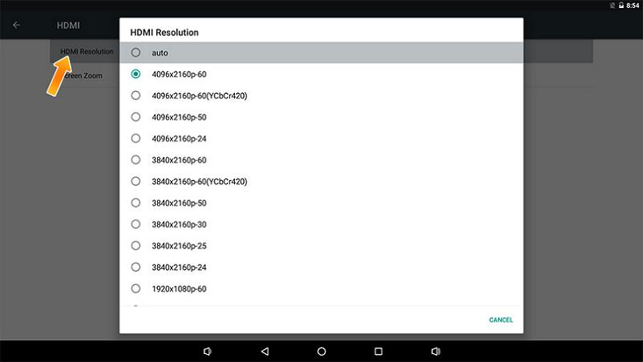

# FAQS


## HDMI can’t display 4K?

The default firmware of the AIO-3399ProC is a dual-screen display that supports LVDS+HDMI 1080P. The HDMI resolution can only be up to 1080P. HDMI to support 4K resolution needs to re-upgrade the [default firmware](http://en.t-firefly.com/doc/download/52.html#other_118), or recompile the kernel `make ARCH=arm64 rk3399pro-firefly-aioc.img`, re-upgrade `resource.img`.

## How to confirm whether the firmware supports 4K?

AIO-3399ProC open `Settings` -> `Display`. If HDMI and DSI appear on the display device, the firmware supports dual-screen display and does not support 4K. If only HDMI is the default firmware, it can support 4K.

## How to adjust the HDMI output resolution?

AIO-3399ProC HDMI can automatically identify the display resolution. If you can not read the monitor’s EDID (Extended Display Identification Data, extended display identification data), HDMI will default to 1080P resolution. You can also enter the system settings to adjust the HDMI resolution manually.


### Open Root permissions

There are many powerful functions of the Android system that require root permissions. Developers often encounter permissions problems when using them. How to enable the root permissions of the system on the Firefly platform? Firefly has added the function of starting root privileges in the system. The specific steps are as follows:

1. Find `About device` in `Settgins apk` and click into it;
2. After clicking on `Build number` 5 times, it will prompt (you are now a developer);
3. Then return to the previous level and click the option `Developer options`, and click `ROOT access` in the options to open the root authority function.


## What should I do if the boot is abnormal and restarts cyclically?

It may be that the power supply current is not enough. Please use a power supply with a voltage of 12V and a current of 2.5A~3A.

## What is the default username and password for Ubuntu?

* Username: `firefly`
* Password: `firefly`
* Switch super user `sudo -s`

## Where is the RK3399Pro chip technical manual?

K3399Pro chip technical manual link: [Part1](https://download.t-firefly.com/product/RK3399/Docs/Chip%20Specifications/RK3399Pro-TRM-V1.0/Rockchip%20RK3399Pro%20TRM%20V1.0% 20Part1-20190122.pdf) [Part2](https://download.t-firefly.com/product/RK3399/Docs/Chip%20Specifications/RK3399Pro-TRM-V1.0/Rockchip%20RK3399Pro%20TRM%20V1.0% 20Part2-20190122.pdf)


## How to turn off audio in Android system?

For users without a codec module, if the audio-related configuration is not turned off, the kernel will always report abnormal log information. There are two ways to turn off the audio:

1. Disable audioserver in the source code:

```
--- a/vendor/rockchip/common/device-vendor.mk
+++ b/vendor/rockchip/common/device-vendor.mk
@@ -121,6 +121,8 @@ ifeq ($(strip $(TARGET_BOARD_PLATFORM)), rk3399pro)
 $(call inherit-product-if-exists, vendor/rockchip/common/npu/npu_transfer.mk)
  endif

   -$(call inherit-product-if-exists, vendor/rockchip/common/tinyalsa/tinyalsa.mk)

    $(call inherit-product-if-exists, vendor/rockchip/common/pppoe/pppoe.mk)
```

2. Directly delete `udio.primary.default.so`:
```
out/target/product/rk3399pro_firefly_aiojd4/vendor/lib64/hw/audio.primary.default.so
```

## Write number tool to write SN, MAC address

<font color=red>**Note:**</font> If the eMMC erase operation is performed on the development board, the previously written data will also be cleared.

### Windows way
* Install RKDevInfoWriteTool
    * [Download link](http://en.t-firefly.com/doc/download/69.html#other_297)
* Select "RPMB" in **Settings** of RKDevInfoWriteTool
* Configure "SN", "WIFI MAC", "LAN MAC", "BT MAC", etc. in the **Settings** of RKDevInfoWriteTool as needed
* The development board enters loader mode
* RKDevInfoWriteTool performs **write** or **read** operations

For specific operations, please refer to the PDF document "RKDevInfoWriteTool User Guide" under the RKDevInfoWriteTool installation directory.

### Linux way

How to write the number of the development board itself

* Buildroot enable `BR2_PACKAGE_VENDOR_STORAGE`
* Read and write operations through the vendor_storage command
    * [Download link](http://en.t-firefly.com/doc/download/69.html#other_297)
     * SN
     ```shell
     vendor_storage -w VENDOR_SN_ID -t string -i cad895bedb8ee15f
     vendor_storage -r VENDOR_SN_ID -t hex -i /dev/null
     ```

     * LAN MAC
     ```shell
     vendor_storage -w VENDOR_LAN_MAC_ID -t string -i AABBCCDDEEFF
     vendor_storage -r VENDOR_LAN_MAC_ID -t hex -i /dev/null
     ```

        Others can be operated according to the prompt of `vendor_storage -h`.

For how to read the application, please refer to the `vendor_storage_read` function in `buildroot/package/rockchip/vendor_storage/vendor_storage.c`.

## On Ubuntu system, if there is no sound after plugging in headphones, what should I do?

`Menu` -> `Multimedia` -> `PulseAudio Volume Control` -> `Configuration` -> Select the sound card that is working and turn off the other sound card.

## How to make the system crawl LOG under Android?

`Settings (settings)` -> `About phone (about phone)` -> Click 5 times `Build number (version number)` -> `Developer options (Developer options)` -> `Enable logging to save Save)`. After the function is turned on, the folder `.LOGSAVE` will be generated under the root directory of the system `storage`, which includes the system logcat and kernel kmsg.