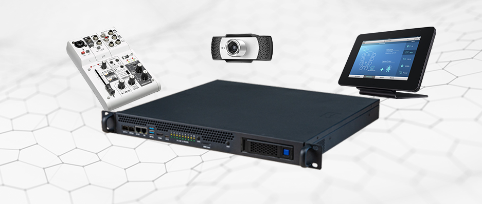
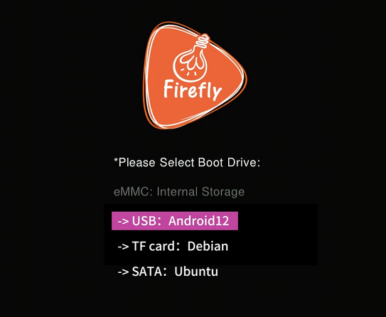
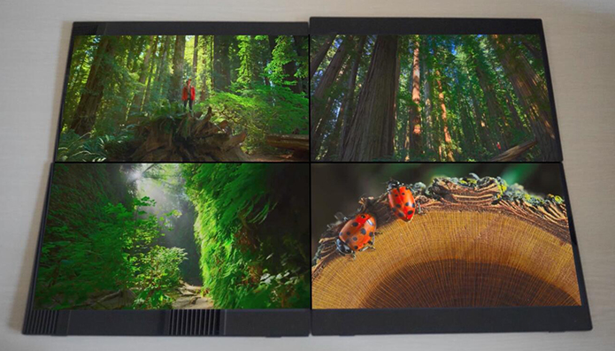
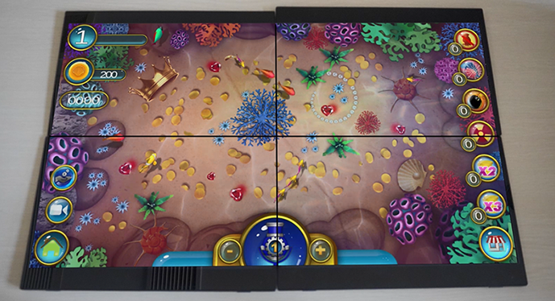

# Technical Case

## Virtual Hardware Technology

For details, please refer to [Virtual Hardware Technology](https://en.t-firefly.com/solution/84.html)

## Booting Systems from Multiple Storage Devices

For details, please refer to [Booting Systems from Multiple Storage Devices](https://en.t-firefly.com/solution/82.html)

## Multiscreen Out of Sync

For details, please refer to [RK3588 Multiscreen Out of Sync](https://en.t-firefly.com/solution/98.html)

## Multiscreen Splicing

For details, please refer to [RK3588 Multiscreen Splicing](https://en.t-firefly.com/solution/97.html)