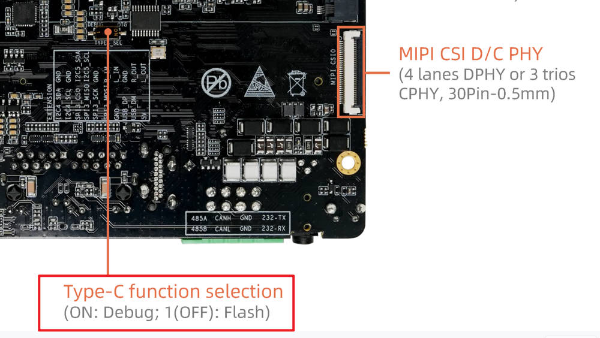

# Debug Console

Debug serial port is very useful during debugging and troubleshooting, especially when the GUI is unavailable.

## Connection

AIO-8550JD4 provides two types of debug console.

* 3pin ttl slot

It needs additional usb-to-ttl module, please refer to [Serial Module](https://wiki.t-firefly.com/en/USB-TO-TTL-Serial/usb-to-ttl-serial.html)

* Type-C Port

This Type-C port also used as Download port, so you need to set the following dip switch to "ON" to enable Debug function.

Then use USB cable connect the device with PC.

**Notice**: These two types of debug console are the same internally. They are just different interface types, not two serial ports. Only select one to use.

## Install Driver

* If you choose 3pin ttl slot

Linux PC don't need to install driver.

Windows PC driver installation is in [Serial Module](https://wiki.t-firefly.com/en/USB-TO-TTL-Serial/usb-to-ttl-serial.html)

* If you choose Type-C port

The serial-to-USB chip is PL2303GL.

Linux PC don't need to install driver.

Windows PC needs driver, please download `PL23XX-M_LogoDriver_Setup_4500.zip` from [Download Link](https://en.t-firefly.com/doc/download/381.html#other_815)

Extract the archive and double click the exe file to install, accept the EULA and always click "next", then click "finish".

## Usage

After driver installation, you will find "Prolific PL2303GL USB Serial COM Port" or "Silicon Labs CP210x USB to UART Bridge" in Windows device manager.

In Linux it will be /dev/ttyUSBX or /dev/ttyACMX, the number X may be different, you can unplug and plug again to find the corresponding device.

Use the serial tool like MobaXterm or Minicom to open the serial device, baudrate is 115200, 8 data bit, 1 stop bit, no parity check.