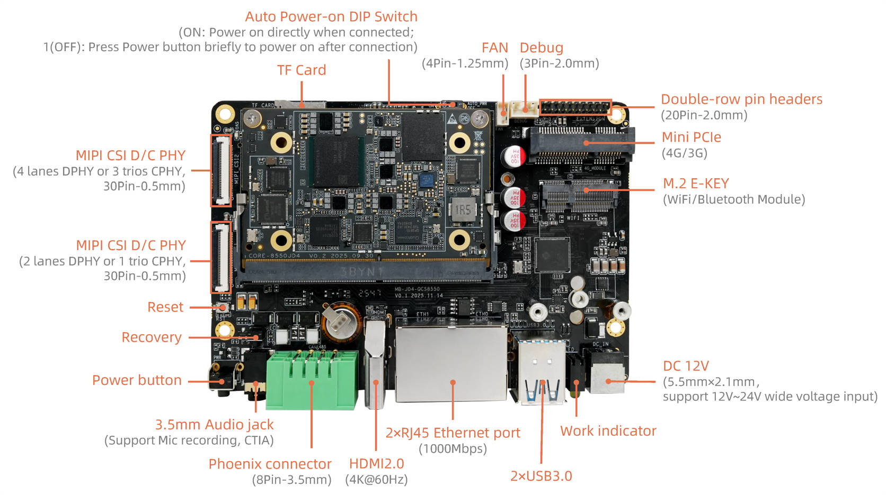
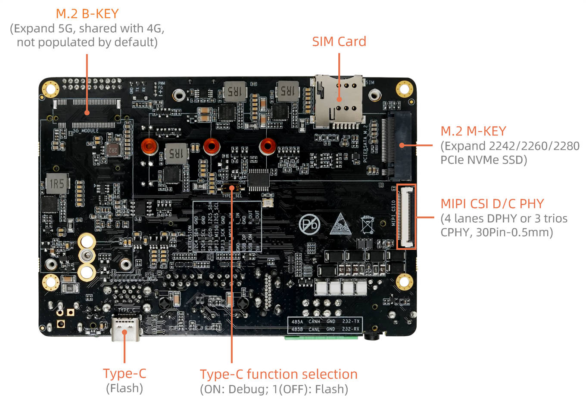
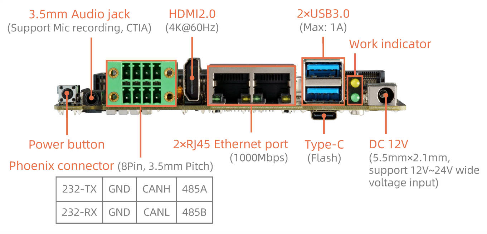

# Interface Definition

AIO-8550JD4 provides these interfaces:

* DC power jack
* 2 x USB3.0
* 1 x Type-C (Download/Debug)
* 1 x Console (Debug)
* 2 x 1000M ethernets
* 1 x TF slot
* 1 x SIM slot
* 1 x HDMI2.0
* 1 x 3.5mm headphone jack
* 3 x MIPI CSI
* 1 x FAN
* 1 x Mini PCIe (4G module)
* 1 x M.2 E-KEY (wifibt module)
* 1 x M.2 M-KE (PCIe NVMe SSD)
* 2 x dip switch
* 1 x EDL key (recovery)
* 1 x Reset key
* Power key

