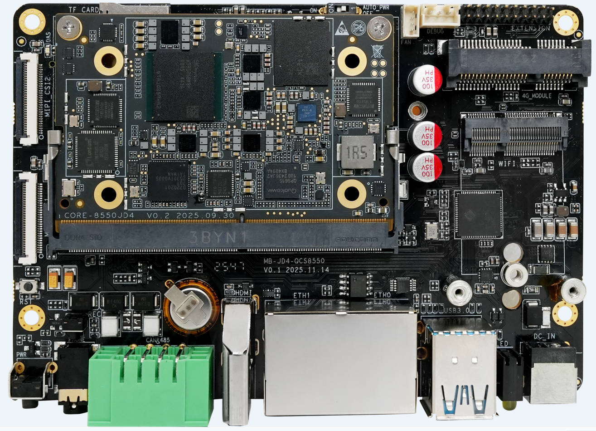

# Introduction

AIO-8550JD4 equipped with the Qualcomm QCS8550 octa-core AI processor with a 48 TOPS NPU, it supports mainstream AI models and frameworks. It also features an Adreno 740 GPU for ray tracing and 8K video, three cognitive ISPs for up to 100MP cameras, and various expand ports. Technical support like AI optimization tools and reference designs enable efficient development.

