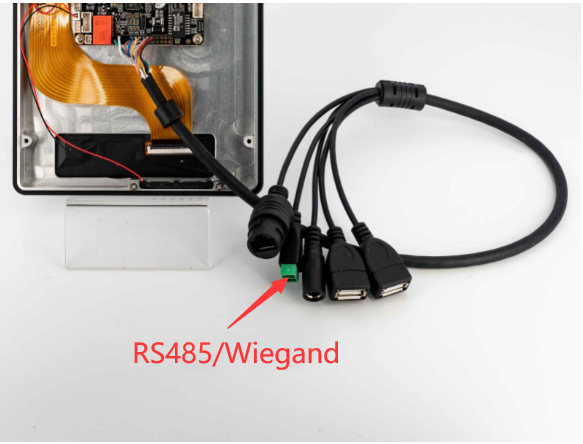
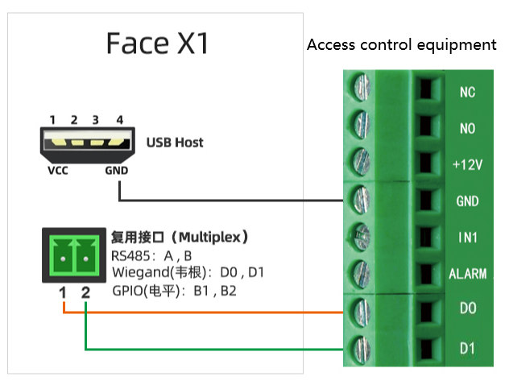

# Wiegand

## Intruduction

Wiegand protocol is a communication protocol developed by Motorola, which is applicable to many aspects of card readers and cards related to access control system; the protocol does not define the baud rate of communication and data length. It mainly defines the data transmission mode: Data0 and data1 are used to transmit 0 and 1 respectively. They are mostly used for 26bit, 34bit, 36bit, 44bit, etc.




## Debugging

The RS485 port of Face-RK3399 can be reused as the sending port of Wiegand protocol for data transmission.

### DTS configuration

The Wiegand node is defined in `kernel/arch/arm64/boot/dts/rockchip/rk3399-firefly-face.dtsi`:

```
wiegand-gpio {
    compatible = "firefly,wiegandout";
    level_effect = <1>;/*0-low effect 1-high effect*/
    gpio_d0 = <&gpio1 9 GPIO_ACTIVE_HIGH>;
    gpio_d1 = <&gpio1 10 GPIO_ACTIVE_HIGH>;
    gpio_mode_switch = <&gpio1 17 GPIO_ACTIVE_HIGH>;
    status = "okay";
};
```

Run commands in device as follow:

```
echo 0 > /sys/devices/platform/wiegand-gpio/mode_switch  # Switch to Wiegand interface function
echo [card number] > /sys/devices/platform/wiegand-gpio/wiegand26 # Send Wiegand 26 data
echo [card number] > /sys/devices/platform/wiegand-gpio/wiegand34 # Send Wiegand 34 data
```

The following is the specific wiring method of Wigan transmission interface. Note that VCC and GND need to be provided through USB.



Wiegand interface can also as GPIO:

```
# Pull up D0
echo 1 > /sys/devices/platform/wiegand-gpio/D0
# Pull up D1
echo 1 > /sys/devices/platform/wiegand-gpio/D1
```

The following is the connection diagram of control relay with D0, D1, IO port. Note that VCC and GND need to be provided through USB.


## V2 Wiegand and relay

In Face-RK3399 V2, the Wiegand interface is updated while it using expansion board. You can lookup by [interface definition](interface_definition.md)

NOTE：GND connectting is needed


### V2 Wiegand output

Run commands in device as follow:

```
echo card number > /sys/devices/platform/wiegand-gpio/wiegand26 # Send Wiegand 26 data
echo card number > /sys/devices/platform/wiegand-gpio/wiegand34 # Send Wiegand 34 data
```

### V2 Wiegand input

File system create the node /dev/wiegand. 

The following example of Wigand input program:

```
#include <stdio.h>
#include <sys/types.h>
#include <sys/stat.h>
#include <fcntl.h>
#include <unistd.h>
#include <errno.h>
#include <asm-generic/ioctl.h>

#define WG_IOC_MAGIC 'k'

#define WG_IOCGETFUN    _IOR(WG_IOC_MAGIC, 1, int)
#define WG_IOC_FUN_IN   _IOR(WG_IOC_MAGIC, 2, int)  //Set to normal input IO
#define WG_IOC_FUN_WG   _IOR(WG_IOC_MAGIC, 3, int)  //Set ti Wiegand input IO
#define WG_IOCGETD0     _IOR(WG_IOC_MAGIC, 4, int)  //Get IO level
#define WG_IOCGETD1     _IOR(WG_IOC_MAGIC, 5, int)
#define WG_IOCGETWG     _IOR(WG_IOC_MAGIC, 6, int)  //Get Wiegand data

int main()
{
    int fd = 0;
    char dst[12] = { 0};
    int val;
    int result =0;
    fd = open("/dev/wiegand", O_RDWR);
    if(fd < 0)
    {
        printf("file open error ! \n");
        return -1;
    }
    while(1)
    {
        //result=read(fd, dst, sizeof(dst));
        ioctl(fd, WG_IOC_FUN_WG, &val);
        result = ioctl(fd, WG_IOCGETWG, &val);
        if(result < 0) {
            printf("Unable to get value: %s\n", strerror(errno));
            close(fd);
            return -1;
        } else
            printf("val is %d, size=%d\n", val,result);
        sleep(1);
    }
    /*close the device*/
    close(fd);

    return 0;
}
```

The above program can receive and print the input data of Wiegand.

### V2 relay

The relay of V2 can control two lines ON/OFF refer to [interface definition](interface_definition.md)


```
echo 0 > /sys/devices/platform/wiegand-gpio/mode_switch # COM and ON connect 
echo 1 > /sys/devices/platform/wiegand-gpio/mode_switch # COM and OFF connect 
```