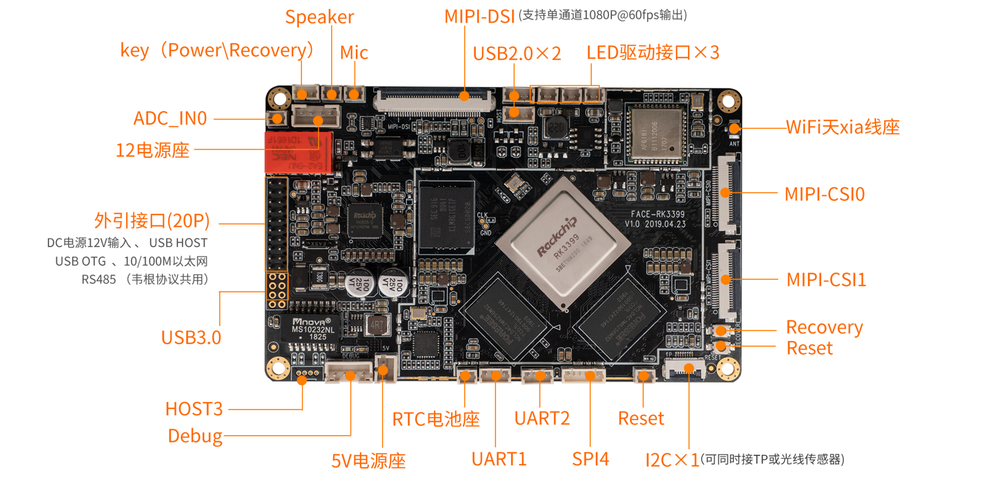
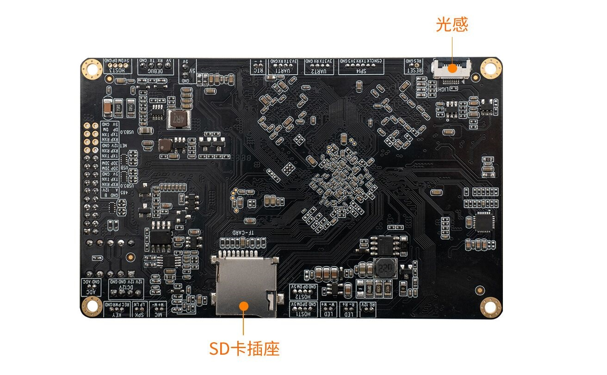
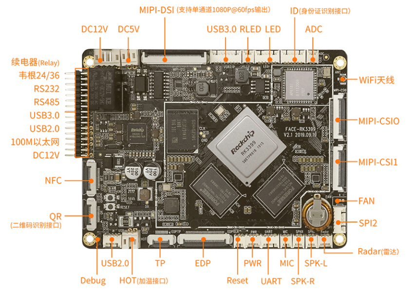
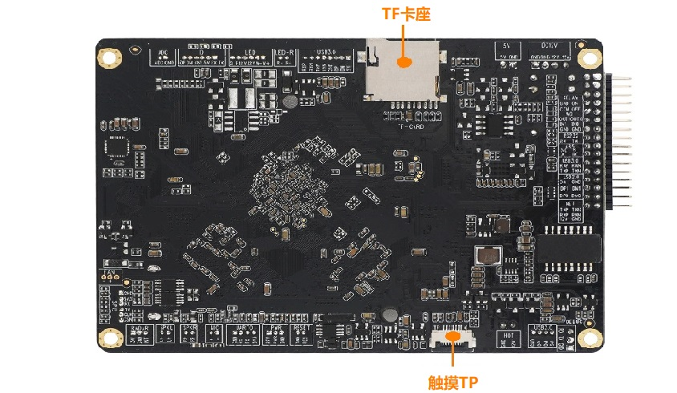
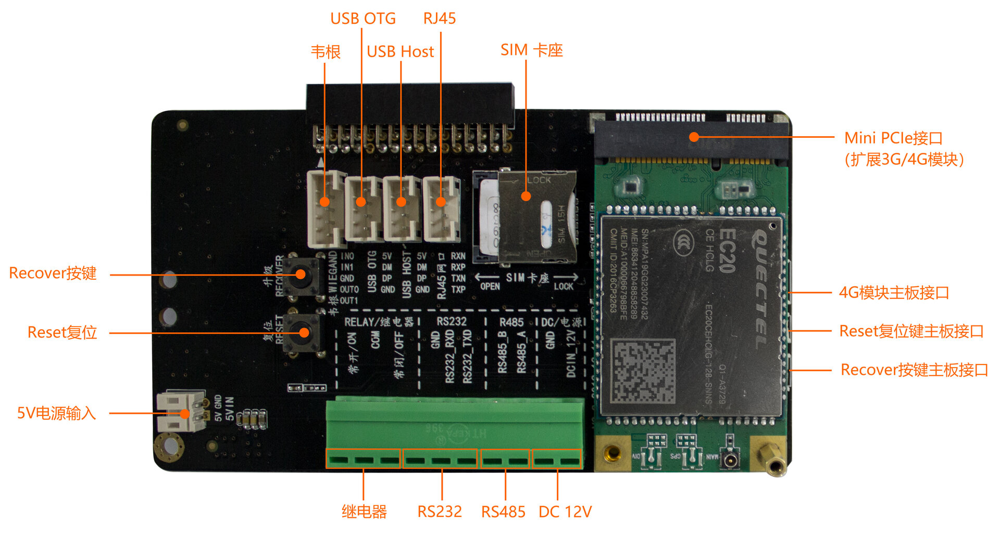

# Interface definition

## Hardware version 1.0

Face-RK3399 V1.0 provides rich interfaces, including:
* Power interface
* USB OTG
* 1 x USB3.0, 2 x USB2.0
* Ethernet
* TP touch interface
* WIFI antenna
* MIC interface
* RTC power interface
* 12V power supply interface
* 5V power supply interface
* TF card slot
* I2C，
* Recovery button
* Debugging serial port
* Industrial serial port (RS485,2TTL)
* MIPI screen interface
* MINI-CSI0, MINI-CSI1
* Linght sencer interface
* 3 x LED

The details are as follows:

## Hardware version 2

Face-RK3399 V2 had changed a lot compared with version 1.0

Major interfaces:

* Speraker audio output (4Ω 2.7W) x 2
* MIC audio input x 1
* 2 channels MIPI camera
* Support 2 channels USB 2.0 camera
* Light compensation interface of LEDs
* MIPI touch screen interface
* EDP screen interface
* EDP touch interface
* RTC, power supply by farad capacitor
* ADC x 1
* USB3.0 x 1, USB2.0 x 2
* NFC interface
* ID card module
* Heating module
* Reset button
* Power button
* TTL serial
* Radar

Tail line:

1. Relay
2. Weigand input & output
3. RS232
4. RS485
5. USB3.0
6. USB2.0
7. 10/100M ethernet
8. DC 12V

The details are as follows:

### 4G module expand board

Face-rk3399 V2 equip with one expand board mainly include:

1） Realy

2） Wiegand send x 1、Wiegand receive x 1

3） RS232

4） RS485

5） USB3.0

6） USB2.0

7） 10/100M ethernet

8） DC 12V

