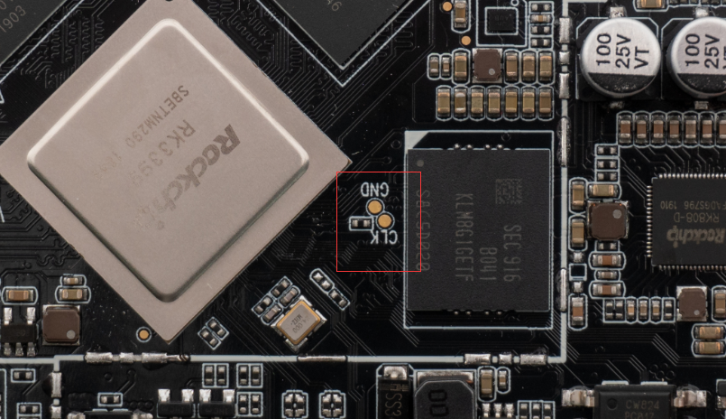
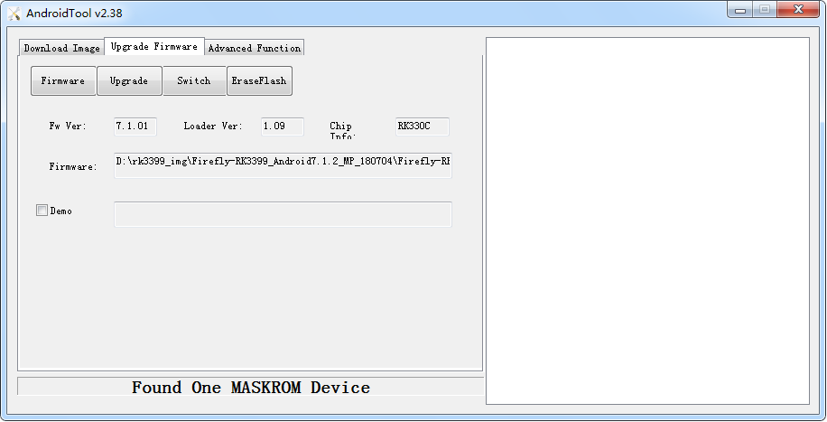

### MaskRom mode

***See startup mode for an introduction [boot mode](bootmode.md#)***

`MaskRom` pattern is the last line of defense equipment burn out. Forced entry `MaskRom` involved hardware operation, have certain risk, so only in the equipment into the `Loader` mode, can try ` MaskRom ` mode.

Please read and operate carefully! 

The operation steps are as follows:

1. Disconnect all power supplies.
2. Unplug the SD card.
3. Connect the equipment and host machine with dual male USB data cable.
4. Use metal tweezers to connect the two test points on the core board as shown in the figure below and hold. 

5. Plug the device into the power supply.
6. Wait a moment, then loosen the tweezers.

At this point, the device should go into `MaskRom mode`.

