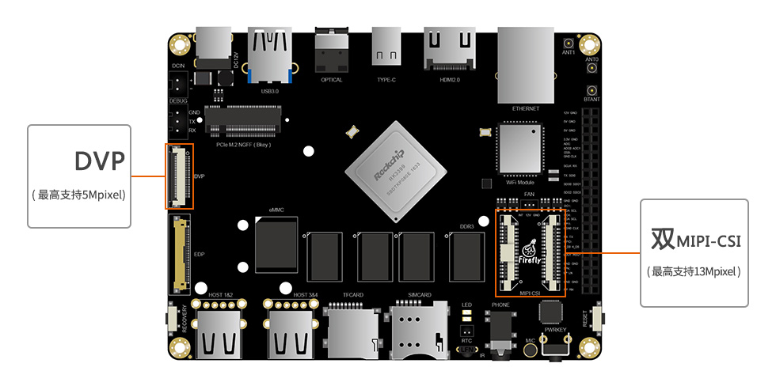
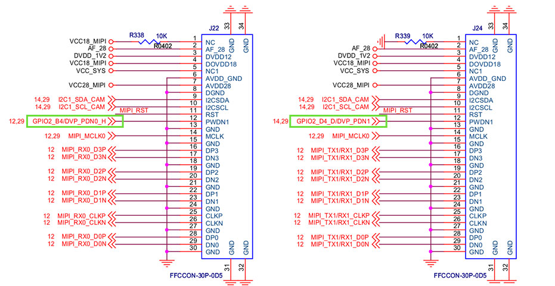
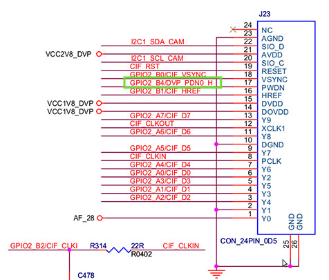
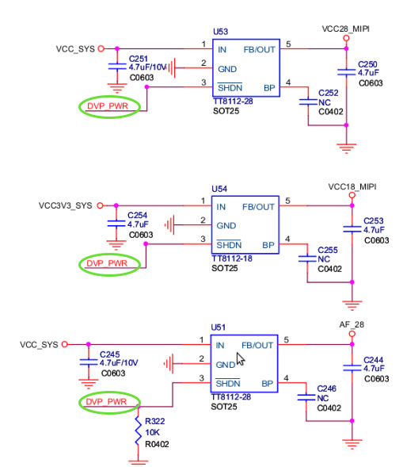
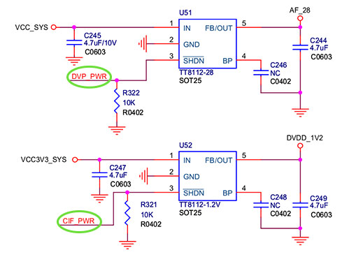
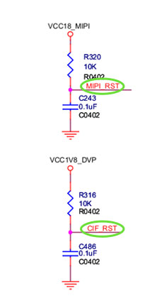

# Camera

## Board Resource
Firefly-RK3399 development board has two MIPIs and a DVP camera interface. MIPI supports up to 4K photography, and supports video recording above 1080P 30fps. In addition, the development board also supports USB cameras.

This article will introduce how to make the camera work properly, using OV13850/OV5640 as an example.

* Board Interface



## DTS Configuration

```
 isp0: isp@ff910000 {
	 …
	 status = "okay";
 }
 isp1: isp@ff920000 {
	 …
	 status = "okay";
 }
```

## Driver

The code directories of camera are shown as followed:

```
Android：
 `- hardware/rockchip/camera/
    |- CameraHal			    # HAL source code for camera
    `- SiliconImage             # SP library, including driver source code for all supporting modules
       `- isi/drv/OV13850       # The source code of OV13850 modules
          `- calib/OV13850.xml  # Adjustment parameters of OV13850 module
 `- device/rockchip/rk3399/
    |- rk3399_firefly_aio_box
    |  `- cam_board.xml         # Adjustment parameters of camera

 Kernel：
 |- kernel/drivers/media/video/rk_camsys  # Driver source code of CamSys
 `- kernel/include/media/camsys_head.h
```

## Configuration Theory

What you need to configure the camera is to make the pins and clock work properly.

According to the schematic diagram below, you need to provide: `AF_VDD28`, `DOVDD18`, `AVDD28`, `DVDD12`, `PWDN1`, `RST` and `MCLK`.

* MIPI interface



* DVP interface



* `AF_VDD28` is provided by hardware connection. No configuration is needed.
* `DOVDD18`,`AVDD28`: Controlled by `DVP_PWR`, `DVP_PWR` corresponds to GPIO1_C7 of RK3399:



* `DVDD12` is controlled by `CIF_PWER`, `CIF_PWER`corresponds to GPIO1_C6 of RK3399:



* `MIPI CIF`: `PWDN0`(share), `PWDN1`, `RST` corresponds to GPIO2_B4, GPIO2_D4, GPIO0_B0:



All the pins are configured in `cam_board.xml`, with the exception of `DVDD12 (CIF_POWER)`, which is configured in DTS and driver.
## Configuration Steps

### Android Layer Configuration

Modify `device/rockchip/rk3399/$(TARGET_PRODUCT)/cam_board.xml` to register camera:

```
<BoardFile>
<BoardXmlVersion version="v0.0xf.0"></BoardXmlVersion>
<CamDevie>
<HardWareInfo>
<Sensor>
<SensorName name="OV13850"/>
<SensorLens name="50013A1"/>
<SensorDevID IDname="CAMSYS_DEVID_SENSOR_1B"/>
<SensorHostDevID busnum="CAMSYS_DEVID_MARVIN"/>
<SensorI2cBusNum busnum="1"/>
<SensorI2cAddrByte byte="2"/>
<SensorI2cRate rate="100000"/>
<SensorAvdd name="NC" min="28000000" max="28000000" delay="0"/>
<SensorDvdd name="NC" min="12000000" max="12000000" delay="0"/>
<SensorDovdd name="NC" min="18000000" max="18000000" delay="5000"/>
<SensorMclk mclk="24000000" delay="1000"/>
<SensorGpioPwen ioname="RK30_PIN1_PC7" active="1" delay="1000"/>
<SensorGpioRst ioname="RK30_PIN0_PB0" active="0" delay="1000"/>
<SensorGpioPwdn ioname="RK30_PIN2_PD4" active="0" delay="0"/>
<SensorFacing facing="back"/>
<SensorInterface interface="MIPI"/>
<SensorMirrorFlip mirror="0"/>
<SensorOrientation orientation="180"/>
<SensorPowerupSequence seq="1234"/>
<SensorFovParemeter h="60.0" v="60.0"/>
<SensorAWB_Frame_Skip fps="15"/>
<SensorPhy phyMode="CamSys_Phy_Mipi" lane="2" phyIndex="1" sensorFmt="CamSys_Fmt_Raw_10b"/>
</Sensor>
<VCM>
<VCMDrvName name="DW9714"/>
<VCMName name="HuaYong6505"/>
<VCMI2cBusNum busnum="1"/>
<VCMI2cAddrByte byte="0"/>
<VCMI2cRate rate="0"/>
<VCMVdd name="NC" min="0" max="0" delay="0"/>
<VCMGpioPower ioname="NC" active="0" delay="1000"/>
<VCMGpioPwdn ioname="NC" active="0" delay="0"/>
<VCMCurrent start="20" rated="80" vcmmax="100" stepmode="13" drivermax="100"/>
</VCM>
<Flash>
<FlashName name="Internal"/>
<FlashI2cBusNum busnum="0"/>
<FlashI2cAddrByte byte="0"/>
<FlashI2cRate rate="0"/>
<FlashTrigger ioname="NC" active="0"/>
<FlashEn ioname="NC" active="0"/>
<FlashModeType mode="1"/>
<FlashLuminance luminance="0"/>
<FlashColorTemp colortemp="0"/>
</Flash>
</HardWareInfo>
<SoftWareInfo>
<AWB>
<AWB_Auto support="1"/>
<AWB_Incandescent support="1"/>
<AWB_Fluorescent support="1"/>
<AWB_Warm_Fluorescent support="1"/>
<AWB_Daylight support="1"/>
<AWB_Cloudy_Daylight support="1"/>
<AWB_Twilight support="1"/>
<AWB_Shade support="1"/>
</AWB>
<Sence>
<Sence_Mode_Auto support="1"/>
<Sence_Mode_Action support="1"/>
<Sence_Mode_Portrait support="1"/>
<Sence_Mode_Landscape support="1"/>
<Sence_Mode_Night support="1"/>
<Sence_Mode_Night_Portrait support="1"/>
<Sence_Mode_Theatre support="1"/>
<Sence_Mode_Beach support="1"/>
<Sence_Mode_Snow support="1"/>
<Sence_Mode_Sunset support="1"/>
<Sence_Mode_Steayphoto support="1"/>
<Sence_Mode_Pireworks support="1"/>
<Sence_Mode_Sports support="1"/>
<Sence_Mode_Party support="1"/>
<Sence_Mode_Candlelight support="1"/>
<Sence_Mode_Barcode support="1"/>
<Sence_Mode_HDR support="1"/>
</Sence>
<Effect>
<Effect_None support="1"/>
<Effect_Mono support="1"/>
<Effect_Solarize support="1"/>
<Effect_Negative support="1"/>
<Effect_Sepia support="1"/>
<Effect_Posterize support="1"/>
<Effect_Whiteboard support="1"/>
<Effect_Blackboard support="1"/>
<Effect_Aqua support="1"/>
</Effect>
<FocusMode>
<Focus_Mode_Auto support="1"/>
<Focus_Mode_Infinity support="1"/>
<Focus_Mode_Marco support="1"/>
<Focus_Mode_Fixed support="1"/>
<Focus_Mode_Edof support="1"/>
<Focus_Mode_Continuous_Video support="0"/>
<Focus_Mode_Continuous_Picture support="1"/>
</FocusMode>
<FlashMode>
<Flash_Mode_Off support="1"/>
<Flash_Mode_On support="1"/>
<Flash_Mode_Torch support="1"/>
<Flash_Mode_Auto support="1"/>
<Flash_Mode_Red_Eye support="1"/>
</FlashMode>
<AntiBanding>
<Anti_Banding_Auto support="1"/>
<Anti_Banding_50HZ support="1"/>
<Anti_Banding_60HZ support="1"/>
<Anti_Banding_Off support="1"/>
</AntiBanding>
<HDR support="1"/>
<ZSL support="1"/>
<DigitalZoom support="1"/>
<Continue_SnapShot support="1"/>
<InterpolationRes resolution="0"/>
<PreviewSize width="1920" height="1080"/>
<FaceDetect support="0" MaxNum="1"/>
<DV>
<DV_QCIF name="qcif" width="176" height="144" fps="10" support="1"/>
<DV_QVGA name="qvga" width="320" height="240" fps="10" support="1"/>
<DV_CIF name="cif" width="352" height="288" fps="10" support="1"/>
<DV_VGA name="480p" width="640" height="480" fps="10" support="0"/>
<DV_480P name="480p" width="720" height="480" fps="10" support="0"/>
<DV_720P name="720p" width="1280" height="720" fps="10" support="1"/>
<DV_1080P name="1080p" width="1920" height="1080" fps="10" support="1"/>
</DV>
</SoftWareInfo>
</CamDevie>
</BoardFile>
```

 The main modifications are as follows:

* Sensor name

```
<SensorName name="OV13850" ></SensorName>
```

This name must match the name of the sensor driver, which has the following format:

```
libisp_isi_drv_OV13850.so
```

* Sensor software identification

```
<SensorDevID IDname="CAMSYS_DEVID_SENSOR_1A"></SensorDevID>
```

Inconsistent registration marks are enough. You can fill with the following values:

```
 CAMSYS_DEVID_SENSOR_1A
 CAMSYS_DEVID_SENSOR_1B
 CAMSYS_DEVID_SENSOR_2
```

* Collector Name

```
<SensorHostDevID busnum="CAMSYS_DEVID_MARVIN" ></SensorHostDevID>
```

Currently only support:

```
CAMSYS_DEVID_MARVIN
```

* I2C channel number

```
<SensorI2cBusNum busnum="3"></SensorI2cBusNum>
```

For the specific channel number, please refer to the camera schematic diagram to connect the main I2C channel number.

* Length of Register Address (in bytes)

```
<SensorI2cAddrByte byte="2"></SensorI2cAddrByte>
```

* Clock of I2C (in Hz). Used to set the frequency of I2C.

```
<SensorI2cRate rate="100000"></SensorI2cRate>
```

* MCLK of Camera (in Hz). Used to set the clock of camera.

```
<SensorMclk mclk="24000000"></SensorMclk>
```

* `PMU LDO` name connected to `Sensor AVDD`. Set to `NC` if not connected.

```
<SensorAvdd name="NC" min="0" max="0"></SensorAvdd>
```

* `PMU LDO` name Connected to `Sensor DOVDD`.

```
<SensorDovdd name="NC" min="18000000" max="18000000"></SensorDovdd>
```

Set to `NC` if not connected to PMU. Note that the `min` and `max` values must be filled in, which determines the IO voltage of the sensor.

* `PMU LDO` name Connected to `Sensor DVDD`.

```
<SensorDvdd name="NC" min="0" max="0"></SensorDvdd>
```

Set to `NC` if not connected to PMU.

* `Sensor PowerDown`.

```
<SensorGpioPwdn ioname="RK30_PIN2_PB6" active="0"></SensorGpioPwdn>
```

Just fill in the name directly and `active` fill in the effective level of dormancy.

* Sensor Reset

```
<SensorGpioRst ioname="RK30_PIN3_PB0" active="0"></SensorGpioRst>
```

Just fill in the name directly, and `active` fill in the effective level of the reset.

* Sensor Power

```
<SensorGpioPwen ioname="RK30_PIN0_PB3" active="1"></SensorGpioPwen>
```

Just fill in the name directly, and `active` fill in the effective level of the power supply.

* Select Sensor as front or back

```
<SensorFacing facing="front"></SensorFacing>
```

Can fill in `front` or `back`.

* Sensor's Interface Mode

```
<SensorInterface mode="MIPI"></SensorInterface>
```

The following values can be filled in:

```
CCIR601
CCIR656
MIPI
SMIA
```

* Sensor's mirror mode

```
<SensorMirrorFlip mirror="0"></SensorMirrorFlip>
```

At present, it is not supported.

* Sensor angle Information

```
<SensorOrientation orientation="0"></SensorOrientation>
```

* Physical interface settings

MIPI

```
<SensorPhy phyMode="CamSys_Phy_Mipi" lane="2" phyIndex="1" sensorFmt="CamSys_Fmt_Raw_10b"></SensorPhy>
```

+ hyMode: Sensor hardware interface connection, for MIPI Sensor, this value is `CamSys_Phy_Mipi`.
+ Lane: The data channel of Sensor MIPI interface.
+ Phyindex: Master MIPI PHY number for Sensor MIPI connection.
+ sensorFmt: Sensor output data format, currently only supports `CamSys_Fmt_Raw_10b`.

DVP

```
<SensorPhy phyMode="CamSys_Phy_Cif" sensor_d0_to_cif_d ="0" cif_num="0" sensorFmt="CamSys_Fmt_Yuv422_8b"></SensorPhy>
```

+ hyMode: Sensor hardware interface connection, for DVP Sensor, this value is `CamSys_Phy_Cif`.
+ Sensor_do_to_cif_d: Data bit number of master control DVP interface connected with Sensor DVP output data bit *D0*.
+ cif_num: Master DVP interface number for Sensor DVP connection.
+ sensorFmt: Sensor output data format, currently only supports `CamSys_Fmt_Yuv422_8b`.

Compiling the kernel requires encoding the `drivers/media/video/rk_camsys` driver source code into the kernel, which is configured as follo`s.

Execute commands in the kernel source directory:

```
make menuconfig
```

Then select the following configuration items:

```
Device Drivers  --->
 Multimedia support  --->
        camsys driver
         RockChip camera system driver  --->
                   camsys driver for marvin isp
                   camsys driver for cif
```

Finally, the following commands are executed to complete the kernel compilation:

```
make ARCH=arm64 rk3399-firefly.img
```

## DEBUG

The `system/etc/cam_board.xml` can be directly modified under the terminal to debug the parameters and reboot for active them.

## FAQs

1. Unable to open the camera, first determine whether sensor I2C is communicating. If not, check the MCLK and whether the power supply is normal. Check Power, PowerDown, Reset, Mclk, I2cBus respectively.
2. support listː

* 13Mː OV13850/IMX214-0AQH5
* 8Mː OV8825/OV8820/OV8858-Z(R1A)/OV8858-R2A
* 5Mː OV5648/OV5640
* 2Mː OV2680

Read SDK/RKDocs for detail.
