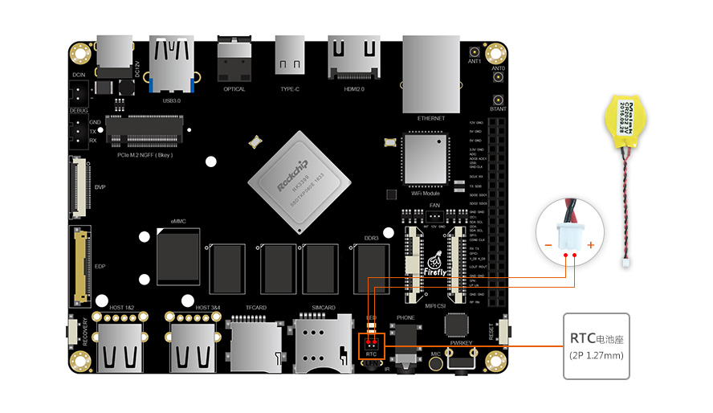

# RTC

## Introduction

The Firefly-RK3399 development board has an RTC (Real Time Clock) integrated into the RK808. The main functions are Clock, calendar, alarm Clock, periodic interrupt, dual channel 32KHz Clock output.

After *J2* is connected with *CR2032* button battery, it can ensure that the RTC can run normally after the power of the board is lost. The location of J2 is as follows:



## RTC drive

DTS configuration information is stored on the rk808 node.

Driver code path : `drivers/rtc/rtc-rk808.c`

## Interface usage

Linux provides three user-space call interfaces. The corresponding path in the Firefly-RK3399 development board is:

*   **SYSFS Interface :** `/sys/class/rtc/rtc0/`
*   **PROCFS Interface :** `/proc/driver/rtc`
*   **IOCTL Interface :** `/dev/rtc0`

### SYSFS Interface

You can directly use the interface below `cat` and `echo` operations `/sys/class/rtc/rtc0/`.

For example, check the date and time of the current RTC:

```
# cat /sys/class/rtc/rtc0/date
2013-01-18
# cat /sys/class/rtc/rtc0/time
09:36:10
```

Set the startup time, such as starting up after 120 seconds:

```
#Start the machine regularly after 120 seconds
echo +120 >  /sys/class/rtc/rtc0/wakealarm
# View boot time
cat /sys/class/rtc/rtc0/wakealarm
#To turn it off
reboot -p
```

### PROCFS Interface

Print RTC related information:

```
# cat /proc/driver/rtc
rtc_time        : 09:34:59
rtc_date        : 2013-01-18
alrm_time       : 08:52:45
alrm_date       : 2013-01-18
alarm_IRQ       : no
alrm_pending    : no
update IRQ enabled      : no
periodic IRQ enabled    : no
periodic IRQ frequency  : 1
max user IRQ frequency  : 64
24hr            : yes
```

### IOCTL Interface

You can use `ioctl` to control `/dev/rtc0`.

Please refer to the document `kernel/Documentation/rtc.txt` for detailed instructions.

## FAQs

#### Q1: The time is out of sync after the development board is powered on ?

**A1 :**  Check that the RTC battery is properly connected
