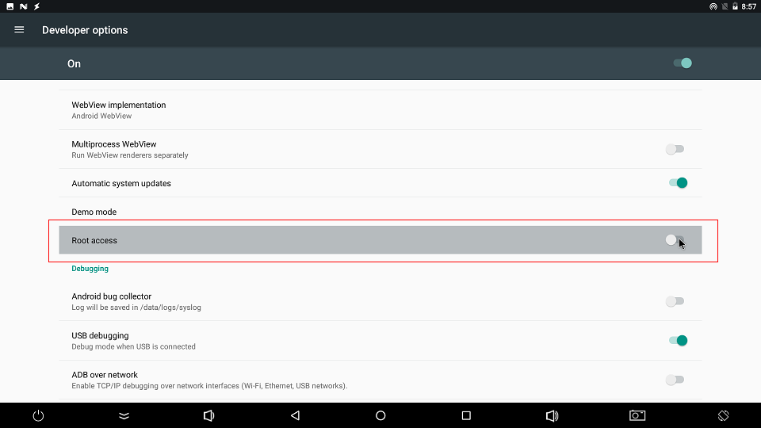

# FAQS

## RK3399 HDMI 4K Resolution

RK3399 firmware default support HDMI 4K resolution output, corresponding UI is 2K resolution stretch to 4K mode,
However, some users need point-to-point 4K UI. 4K UI issue as follows:

1.Is it necessary to use 4K UI?

If you just want 4K video or 4K images, there is no need to configure 
4K UI, as the system's default video player and image browser can support.

2.How to configure 4K UI?

Configure the FrameBuffer to 4K, and then make sure the HDMI resolution is set to 4K, as follows:

android7.1/android8.1 
```
persist.sys.framebuffer.main=3840x2160@60 
```
android9.0 and after
```
persist.vendor.framebuffer.main=3840x2160@60 
```  

3.Flicker appears after configuring the 4K UI

For details, see the [[documentation]](https://drive.google.com/drive/folders/1Q8xOMXW2OUiu641FFFpxlyxe2Q319LYA?usp=sharing)


## Switch recording input source
Firefly-RK3399 The default recording input source is an onboard microphone `Builtin Mic`,You can manually switch to phone recording `Wired Headset`:

1. Find `sound` in `settgins APK` and click it;
2. Click `advanced` and the `audio input` option will appear;
3. Select `wired header`


## How to forcefully enter MaskRom mode

If the board cannot enter the Loader mode, you can try to enter the MaskRom mode forcibly. Please refer to ["MaskRom mode"] (04-maskrom_mode.md) for the operation method.

## PCIE
* What is the difference between the two PCIEs on the development board?
   * The front is PCIe 1.0, M.2, and the back is USB to Mini PCIe. SSD, SATA connect to M.2, LTE/3G connect to Mini PCIe.

* M2 interface type:
   * B-key

* How to connect SSD:
  * The SSDs on the market are basically M-key. If you want to connect to the SSD, you need to go to [Mall](https://www.firefly.store/products) to purchase B-key to M-key Adapter board

* Does SSD support NVME:
    * Support, tested Intel (Intel) 600P series, Samsung EVO series

* How to connect SATA hard disk:
    * If you want to connect to SATA, you need to go to [Mall](https://www.firefly.store/products/pcie-m-2-to-sata3-0-adapter-board) to purchase a PCIE to SATA adapter board


## TYPE-C

* How to connect the monitor?
  * Adapter is required. We have tested adapters for DP and HDMI:
  * Type-C to DP: [Purchase reference link](https://detail.tmall.com/item.htm?id=531442057703&areaId=442000&user_id=1127317597&cat_id=2&is%20_b=1&rn=4eff2fc1aac30e8c67ff74ef5fe76b56)
  * Type-C to HDMI: [Purchase reference link](https://item.taobao.com/item.htm?spm=a1z0d.6639537.1997196601.291.150IpW&id=540645282055&qq-pf-to=pcqq.temporaryc2c)
  * Similar to VGA and DVI are also available, we have not bought a similar adapter, customers can verify by themselves

* Maximum display resolution
  * The default maximum is 2K, if you need 4K, you need to modify the software

* Show is it possible under Linux
  * Currently only supported by Android, the original Linux driver is still under debugging

* Can it be displayed simultaneously with the onboard HDMI
  * Can be displayed at the same time

* Does it support OTG (UFP/DFP)?
  * Support, need to purchase 3.0 adapter cable, purchase [reference link](https://detail.tmall.com/item.htm?spm=a220o.1000855.w5003-14913680624.1.W2eSKK&id=528676463455&scene=taobao_shop&skuId=3173247769269)

## BT (Bluetooth)

* Does the development board support Bluetooth headsets?
  * stand by

## LTE/4G

* Currently supported models:
  * EC20

## Camera

* Does it support dual cameras?
  * Support, currently we have debugged and verified OV13850

* Does it support USB camera?
  * stand by

* How many USB cameras can be supported at most
  * In theory, the USB ports on the board support the camera, but considering the limitation of only one YUV and encoding on a hub, there is no problem with the two

* Supports two MIPI cameras, can one DVP camera be used at the same time?
  * Not supported, due to software architecture issues, currently only supports up to two simultaneous use

## Fan

* Does it support speed control?
  * The current hardware does not support, only supports detection of running status

## RTC

* The time is not synchronized after the development board is powered on
  * Check if the RTC battery is correctly connected.

* Does it support scheduled boot?
  * Support, please see [wiki](http://wiki.t-firefly.com/zh_CN/Firefly-RK3399/driver_rtc.html) for details


### Open Root permissions

There are many powerful functions of the Android system that require root permissions. Developers often encounter permissions problems when using them. How to enable the root permissions of the system on the Firefly platform? Firefly has added the function of starting root privileges in the system. The specific steps are as follows:

1. Find `About device` in `Settgins apk` and click into it;
2. After clicking on `Build number` 5 times, it will prompt (you are now a developer);
3. Then return to the previous level and click the option `Developer options`, and click `ROOT access` in the options to open the root authority function.


## What should I do if the boot is abnormal and restarts cyclically?

It may be that the power supply current is not enough. Please use a power supply with a voltage of 12V and a current of 2.5A~3A.

## What is the default username and password for Ubuntu?

* Username: `firefly`
* Password: `firefly`
* Switch super user `sudo -s`


## How to support RK3399K chip?
The highest frequency of the RK3399K chip can reach 2.016GHz. If the hardware device in your hand uses the RK3399K chip and needs to support RK3399K, manually add the following patch. Take the RK3399K chip supported on the AIO-3399J all-in-one machine as an example:

```
#Before patching, first confirm whether there is a kernel/arch/arm64/boot/dts/rockchip/rk3399k-opp.dtsi file in the SDK source code
#After confirming that the file exists, manually add the following patch to the final dts, as follows, manually add the following in rk3399-firefly-aio.dts:

git diff
diff --git a/kernel/arch/arm64/boot/dts/rockchip/rk3399-firefly-aio.dts b/kernel/arch/arm64/boot/dts/rockchip/rk3399-firefly-aio.dts
index 060e88d..14f9fb3 100644
--- a/kernel/arch/arm64/boot/dts/rockchip/rk3399-firefly-aio.dts
+++ b/kernel/arch/arm64/boot/dts/rockchip/rk3399-firefly-aio.dts
@@ -43,6 +43,7 @@
 /dts-v1/;

 #include "rk3399-firefly-aio.dtsi"
+#include "rk3399k-opp.dtsi"

 / {
        model = "AIO-3399J HDMI (Android)";
```

Check the main frequency list after recompiling and burning the firmware:

```
#Small core highest frequency 1.512GHz
cat /sys/devices/system/cpu/cpufreq/policy0/scaling_available_frequencies
408000 600000 816000 1008000 1200000 1416000 1512000

# Large core maximum frequency 2.016GHz
cat /sys/devices/system/cpu/cpufreq/policy4/scaling_available_frequencies
408000 600000 816000 1008000 1200000 1416000 1608000 1800000 2016000
```

## Git link address?

[https://gitlab.com/TeeFirefly/FireNow-Nougat](https://gitlab.com/TeeFirefly/FireNow-Nougat)

## Where is the RK3399 chip technical manual?

RK3399 chip technical manual link: [Brief](http://www.t-firefly.com/download/Firefly-RK3399/docs/Chip%20Specifications/Rockchip_RK3399_Datasheet_V0.7_20160219.pdf) [Part1](http://www. t-firefly.com/download/Firefly-RK3399/docs/TRM/Rockchip%20RK3399TRM%20V1.3%20Part1.pdf) [Part2](http://www.t-firefly.com/download/Firefly-RK3399/ docs/TRM/Rockchip%20RK3399TRM%20V1.3%20Part2.pdf)


## Write number tool to write SN, MAC address

<font color=red>**Note:**</font> If the eMMC erase operation is performed on the development board, the previously written data will also be cleared.

### Windows way
* Install RKDevInfoWriteTool
    * [Download link](http://en.t-firefly.com/doc/download/3.html#other_297)
* Select "RPMB" in **Settings** of RKDevInfoWriteTool
* Configure "SN", "WIFI MAC", "LAN MAC", "BT MAC", etc. in the **Settings** of RKDevInfoWriteTool as needed
* The development board enters loader mode
* RKDevInfoWriteTool performs **write** or **read** operations

For specific operations, please refer to the PDF document "RKDevInfoWriteTool User Guide" under the RKDevInfoWriteTool installation directory.

### Linux way

How to write the number of the development board itself

* Buildroot enable `BR2_PACKAGE_VENDOR_STORAGE`
* Read and write operations through the vendor_storage command
    * [Download link](http://en.t-firefly.com/doc/download/3.html#other_297)
     * SN
     ```shell
     vendor_storage -w VENDOR_SN_ID -t string -i cad895bedb8ee15f
     vendor_storage -r VENDOR_SN_ID -t hex -i /dev/null
     ```

     * LAN MAC
     ```shell
     vendor_storage -w VENDOR_LAN_MAC_ID -t string -i AABBCCDDEEFF
     vendor_storage -r VENDOR_LAN_MAC_ID -t hex -i /dev/null
     ```

        Others can be operated according to the prompt of `vendor_storage -h`.

For how to read the application, please refer to the `vendor_storage_read` function in `buildroot/package/rockchip/vendor_storage/vendor_storage.c`.

## On Ubuntu system, if there is no sound after plugging in headphones, what should I do?

`Menu` -> `Multimedia` -> `PulseAudio Volume Control` -> `Configuration` -> Select the sound card that is working and turn off the other sound card.

## How to make the system crawl LOG under Android?

`Settings (settings)` -> `About phone (about phone)` -> Click 5 times `Build number (version number)` -> `Developer options (Developer options)` -> `Enable logging to save Save)`. After the function is turned on, the folder `.LOGSAVE` will be generated under the root directory of the system `storage`, which includes the system logcat and kernel kmsg.