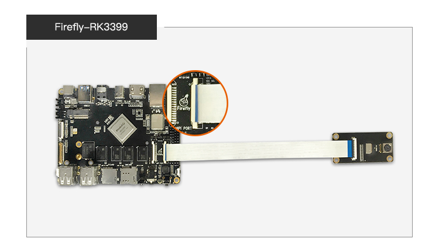

# Camera Module

## [OV13850 Camera Moudle](https://www.firefly.store/products)(Out of production)  

### Product Parameter

* Brand：Omnivision
* Model：CMK-OV13850
* Interface：MIPI
* Pixels：1320W

### Firmware follow

CMK-OV13850 camera module is supported by default in public firmware.

### Datasheet

[DataSheet and schematic of OV13850 Camera Module](http://download.t-firefly.com/product/RK3288/Docs/Peripherals/OV13850%20datasheet/Sensor_OV13850-G04A_OmniVision_SpecificationV1.pdf).

### Picture

### Connection Method

### Renderings

## [S5K4EC Camera Moudle](https://www.firefly.store/products/s5k4ecgx-camera-module)(Out of production)  

### Product Parameter

* Brand：Samsung
* Model：S5K4EC
* Interface：DVP
* Pixels：500W

### Datasheet

[S5K4EC Camera Module DataSheet](https://drive.google.com/drive/folders/1QZhQuF5E_5_4DejY8dl54K2_cGkov7kC?usp=sharing).

### Firmware follow

[The firmware support S5K4EC camera module of Firefly-RK3399](https://drive.google.com/drive/folders/1BX2wDjMEZmO8_ac5l062Yh3W14vov8_5?usp=sharing).

### Patch

After installing the patch in SDK, the S5K4EC camera module can be supported.

In additon, The driver of the S5K4EC camera module can be downloaded directly here: [S5K4EC.zip](https://drive.google.com/drive/folders/1S9UH_otrhtbpPB1XeGKslauUlIiWEXWY?usp=sharing)

### Picture

