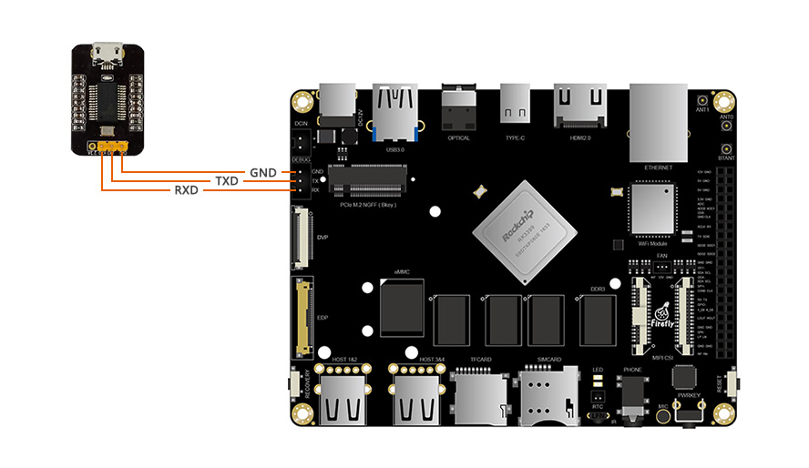
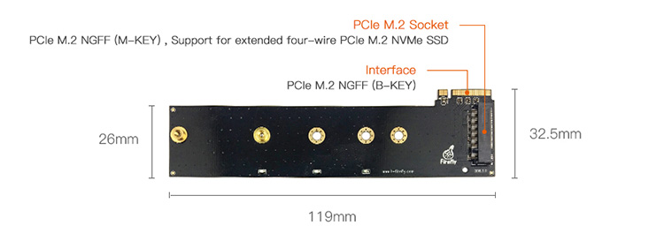
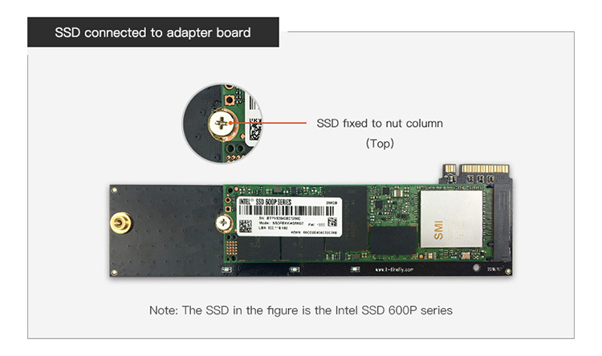
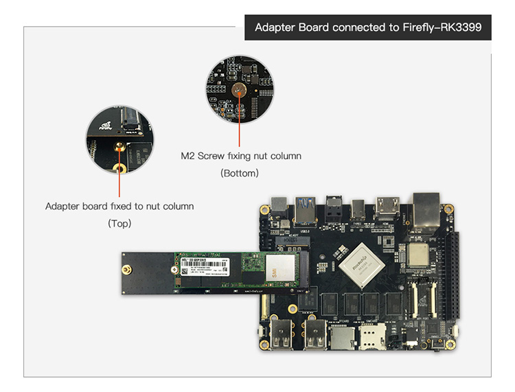
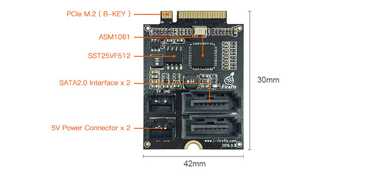
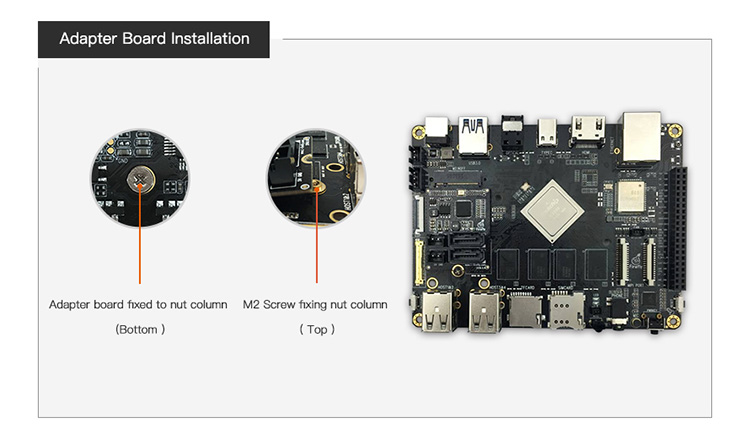
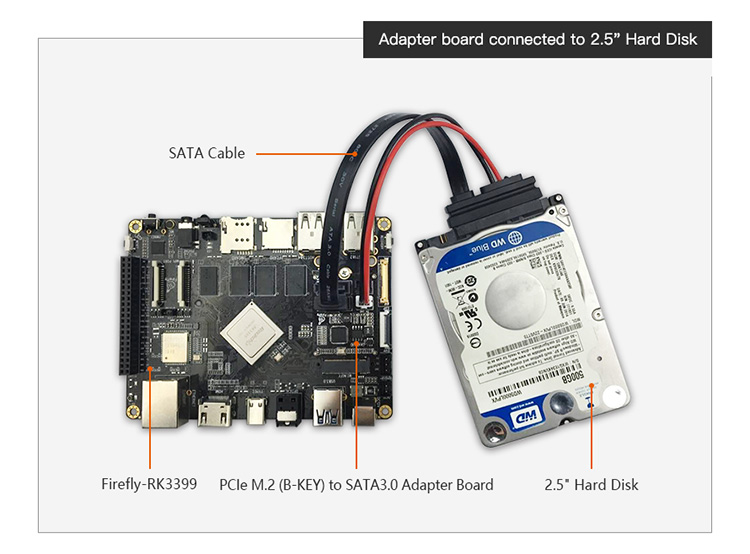

# Conversion module

## [USB to TTL serial module](https://www.firefly.store/products/usb-to-uart-module-cp2104)

### USB to TTL serial module

Product Parameter

* Brand：Firefly
* Size：29mm * 19mm

### Reference material

Download driver：[http://www.prolific.com.tw/US/ShowProduct.aspx?pcid=41](http://www.prolific.com.tw/US/ShowProduct.aspx?pcid=41)

### Picture

### Connection Method

## [PCIe(B-KEY) to SSD Adapter board](https://www.firefly.store/products)

### Product Parameter
Brand：Firefly

Specifications：

Bandwidth：up to 4GB / s

Description:Suitable for Firefly-RK3399 or devices with PCIe M.2 (B-KEY)

### Connection Method

## [PCIe M.2(B-KEY) to SATA3.0 Adapter Board](https://www.firefly.store/products/pcie-m-2-to-sata3-0-adapter-board)

### Product Parameter

Brand：Firefly

Specifications：

Interface: Two SATA3.0 interface for 2.5 "SSD or HDD hard drive

Description: Suitable for Firefly-RK3399 or devices with PCIe M.2 (B-KEY)

### Connection Method

