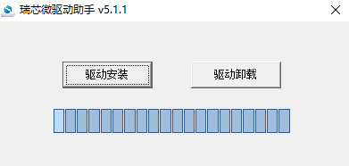
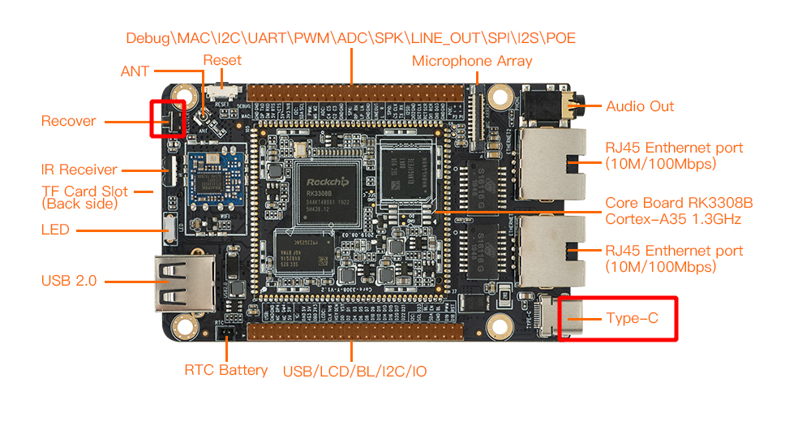
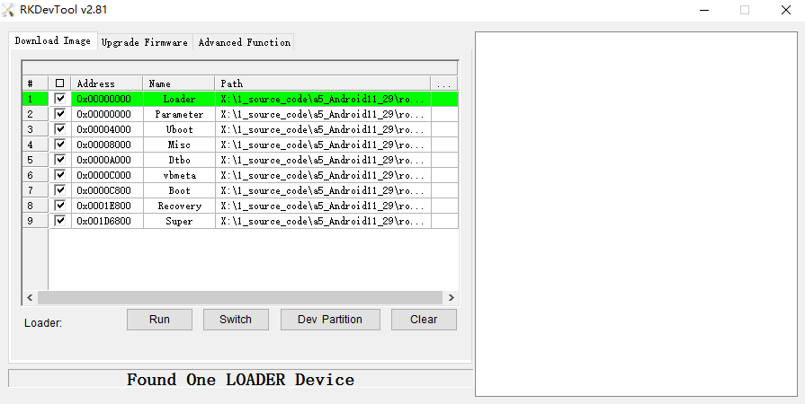
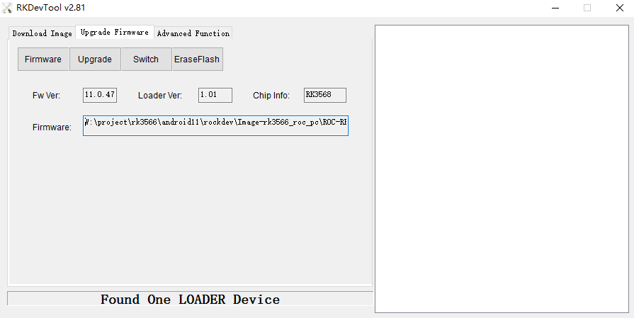

# Upgrade the firmware via USB cable

## Introduction

This article describes how to upgrade the firmware file on the host to the flash memory of the development board through the Type-C data cable. When upgrading, you need to choose the appropriate upgrade mode according to the host operating system and firmware type.

## Preparatory Tools

* ROC-RK3308B-CC-PLUS development board
* Firmware
* host computer
* Type-C data cable

There are two types of firmware files:

* A single unified firmware

	The unified firmware is a single file packaged and merged by all files such as the partition table, bootloader, uboot, kernel, system and so on. The firmware officially released by Firefly adopts a unified firmware format. Upgrading the unified firmware will update the data and partition table of all partitions on the motherboard, and erase all data on the motherboard.

* Multiple partition images

	That is, files with independent functions, such as partition table, bootloader, and kernel, are generated during the development phase. The independent partition image can only update the specified partition, while keeping other partition data from being destroyed, it will be very convenient to debug during the development process.

> Through the unified firmware unpacking / packing tool, the unified firmware can be unpacked into multiple partition images, or multiple partition images can be merged into a unified firmware.


## Windows

* Tool: [Androidtool_xxx (version number)](https://en.t-firefly.com/doc/download/84.html#other_294)

### Install RK USB drive

Download [Release_DriverAssistant.zip](https://en.t-firefly.com/doc/download/84.html#other_11), extract, and then run the DriverInstall.exe inside .
In order for all devices to use the updated driver, first select `Driver uninstall`(`驱动卸载`) and then select `Driver install`(`驱动安装`).

<center>


</center>


### Connected devices

we can put the device into upgrade mode by hardware as follows:

* Disconnect the power adapter first:
* Dual male usb data cable connects one end to the host and the other end to the development board.

* Press the `RECOVERY` button on the device and hold.


* Connect to the power supply.
* About two seconds later, release the `RECOVERY` button.
put the device into upgrade mode by software as follows:

Type-C data cable is connected, use the command in the serial debugging terminal or adb shell

```shell
reboot loader
```


The host should prompt for new hardware and configure the driver. Open Device manager and you will see the new Device `Rockusb Device` appear as shown below. If not, you need to go back to the previous step and [reinstall the driver](03-upgrade_firmware.html#install-rk-usb-drive).


### Upgrade the firmware

Download [Androidtool_xxx (version number)](https://en.t-firefly.com/doc/download/84.html#other_294). AndroidTool defaults to display in Chinese. We need to change it to English. Open `config.ini` with an text editor (like notepad). The starting lines are:


```
#Language Selection: Selected=1(Chinese); Selected=2(English)
[Language]
Kinds=2
Selected=1
LangPath=Language\
```

Change `Selected=1` to `Selected=2`, and save. From now on, AndroidTool will display in English.Now, run AndroidTool.exe: (Note: If using Windows 7/8, you’ll need to right click it, select to run it as Administrator)



#### Upgrade unified firmware - update.img


The steps to update the unified firmware `update.img` are as follows:

1. Switch to the "upgrade firmware" page.
2. Press the "firmware" button to open the firmware file to be upgraded. The upgrade tool displays detailed firmware information.
3. Press the "upgrade" button to start the upgrade.
4. <font color=#ff0000 >If the upgrade fails, you can try to erase the Flash by pressing the `EraseFlash` button first, and then upgrade. </font>

**Note: if the firmware loadder you wrote is inconsistent with the original one, please execute `EraseFlash` before upgrading the firmware.**



#### Upgrade Partition image
The steps to upgrade the partition image are as follows:
1. Switch to the "download image" page.

2. Check the partition to be burned, and select multiple.

3. Make sure the path of the image file is correct. If necessary, click the blank table cell on the right side of the path to select it again.

4. Click "Run" button to start the upgrade, and the device will restart automatically after the upgrade.


## Linux

There is no need to install device driver under Linux. Please refer to the Windows section to connect the device.

* Tool : [upgrade_tool_xxx (version number)](https://en.t-firefly.com/doc/download/84.html#other_367)


### Upgrade_tool

Download [Linux_Upgrade_Tool](https://en.t-firefly.com/doc/download/84.html#other_367), And install it into the system as follows for easy invocation:

```
unzip Linux_Upgrade_Tool_xxxx.zip
cd Linux_UpgradeTool_xxxx
sudo mv upgrade_tool /usr/local/bin
sudo chown root:root /usr/local/bin/upgrade_tool
sudo chmod a+x /usr/local/bin/upgrade_tool
```

### Upgrade unified firmware - *update.img*：

```
sudo upgrade_tool uf update.img
```

<font color=#ff0000 >If the upgrade fails, try erasing before upgrading. </font>

```
# erase flash : Using the ef parameter requires the loader file or the corresponding update.img to be specified.
# update.img :The ubuntu firmware you need to upgrade.
sudo upgrade_tool ef update.img
# upgrade again
sudo upgrade_tool uf update.img
```

**pgrade Partition image**

```
sudo upgrade_tool di -b /path/to/boot.img
sudo upgrade_tool di -r /path/to/recovery.img
sudo upgrade_tool di -m /path/to/misc.img
sudo upgrade_tool di -u /path/to/uboot.img
sudo upgrade_tool di -dtbo /path/to/dtbo.img
sudo upgrade_tool di -p paramater   #upgrade parameter
sudo upgrade_tool ul bootloader.bin #upgrade bootloader
```


## FAQs

### 1. How to forcibly enter MaskRom mode

**A1 :** If the board does not enter Loader mode, you can try to force your way into MaskRom mode. See operation method ["How to enter MaskRom mode"](04-maskrom_mode.md).


### 2. Analysis of programming failure

If Download Boot Fail occurs during the programming process, or an error occurs during the programming process, as shown in the figure below, it is usually caused by the poor connection of the USB cable, the inferior cable, or the insufficient drive capability of the USB port of the computer. Troubleshoot the computer USB port.


[烧写须知]: 02-upgrade_table.md
[ROC-RK3308B-CC-PLUS firmware]: https://en.t-firefly.com/doc/download/84.html
[Androidtool_xxx (version number)]: https://en.t-firefly.com/doc/download/84.html#windows_12
[Release_DriverAssistant.zip]: https://en.t-firefly.com/doc/download/84.html#windows_341
[Linux_Upgrade_Tool]: https://en.t-firefly.com/doc/download/84.html#linux_12
[upgrade_tool_xxx (version number)]: https://en.t-firefly.com/doc/download/84.html#linux_12
