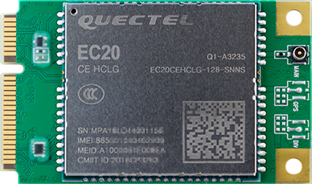
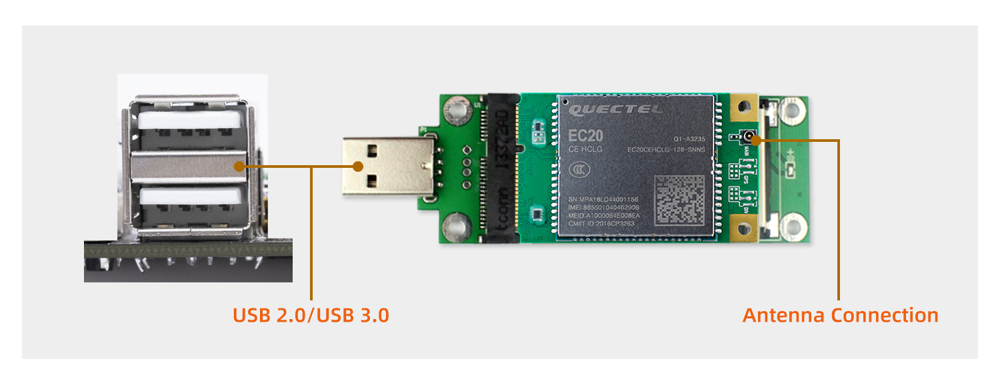

# Wireless module

## [EC20 4G Module suite](https://www.firefly.store/products)
### Product parameters
* **Model**
  * EC20-C R2.0 Mini PCIe-C
* **Supply voltage**
  * 3.3V~ 3.6V, Typical values: 3.3V
* **Working frequency band**
  * TDD-LTE: B38/B39/B40/B41
  * FDD-LTE: B1/B3/B8
  * WCDMA: B1/B8
  * TD-SCDMA: B34/B39
  * GSM: 900/1800
* **Data transmission**
  * TDD-LTE： Max 130Mbps (DL) Max 35Mbps (UL)
  * FDD-LTE： Max 150Mbps (DL) Max 50Mbps (UL)
  * DC-HSPA+： Max 42Mbps (DL) Max 5.76Mbps (UL)
  * UMTS： Max 384Kbps (DL) Max 384Kbps (UL)
  * TD-SCDMA： Max 4.2Mbps (DL) Max 2.2Mbps (UL)
  * CDMA： Max 3.1Mbps (DL) Max 1.8Mbps (UL)
  * EDGE： Max 236.8Kbps (DL) Max 236.8Kbps (UL)
  * GPRS： Max 85.6Kbps (DL) Max 85.6Kbps (UL)
* **Interface connector**
  * USB: USB 2.0 high-speed interface, 480Mbps
  * digital voice: 1 digital voice interface (optional)
  * USIM：1.8V/3V
  * network indicator: ×2, NET_STATUS 和 NET_MODE
  * UART：×1 UART
  * reset: low level
  * PWRKEY: low level
  * antenna interface: 3 (main antenna, diversity antenna and GNSS antenna interface)
  * ADC：×2
* **Structure size**
  * 51.0mm × 30.0mm × 4.9mm
* **Weight**
  * about 10.5g
* **Certification**
  * CCC/ NAL*/ TA

### Real figure

### Connection

* USB connection

* SIM card Connection

### Reference firmware

The official website of the public version of the default firmware support EC20 4G dongle module, EC200T 4G module 

