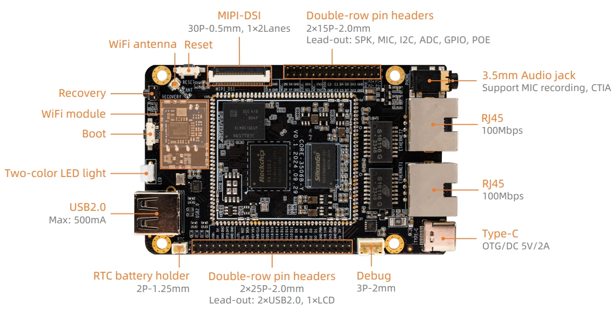
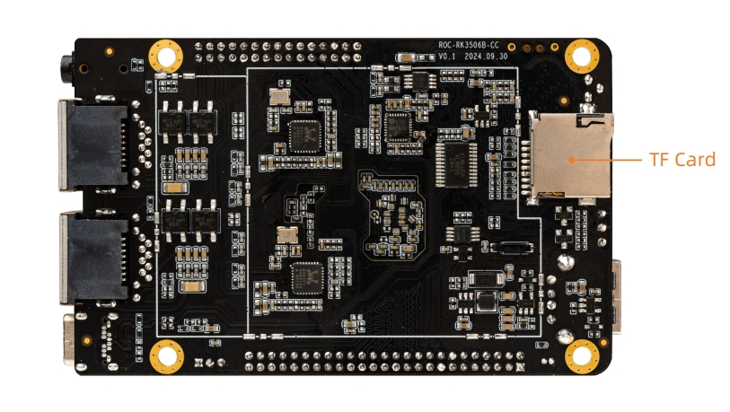

# Interface definition

## Machine interface definition

**ROC-RK3506B-CC V1.0** The interfaces used mainly include:

* 1 x Recovery key
* 1 x Boot key
* 1 x Reset key
* 2 x LED
* 1 x RTC Battery Holder
* 1 x DEBUG serial port (UART0)
* 1 x USB2.0 OTG(Type-C)
* 1 x MIPI-DSI
* 1 x TF Card(Reused with EMMC interface, not attached by default)
* 1 x USB2.0
* 1 x WIFI(Only supports 2.4G band, not 5G band)
* 2 x RJ45(Supports 100Mbps)
* 1 × 3.5mm headphone jack

The details are as follows:

