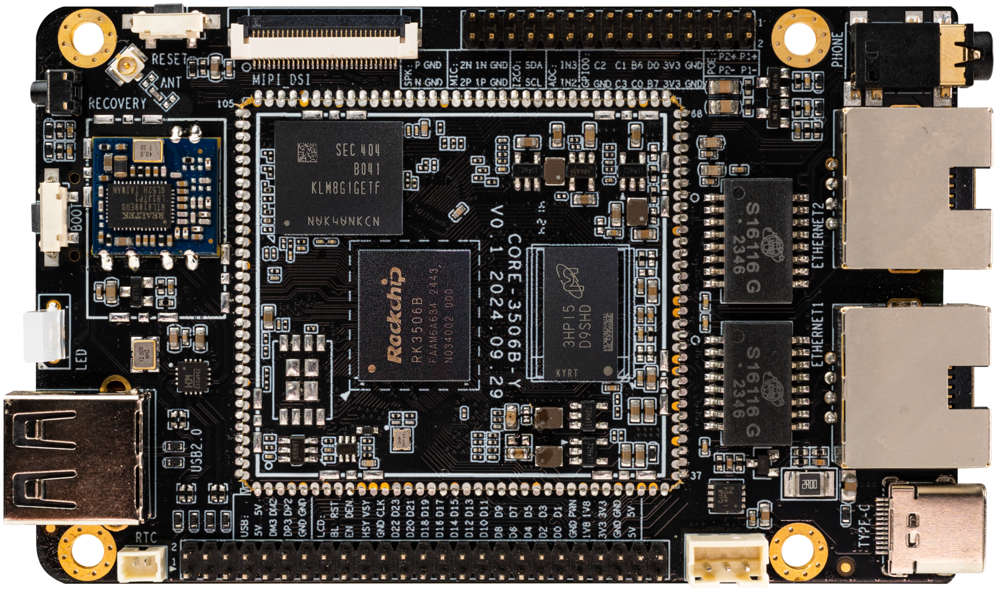

# Introduction
**ROC-RK3506B-CC** is equipped with Rockchip's new chip RK3506B, 22nm advanced process technology, integrating three-core ARM Cortex-A7 and single-core Cortex-M0, with a main frequency of up to 1.5GHz. It supports AMP multi-core heterogeneous architecture, and one chip can support flexible combinations of Linux, RTOS, and Bare-metal, such as 2×Cortex-A7 Linux + 1×Cortex-A7 RTOS + Cortex-M0 HAL or 3×Cortex-A7 RTOS + Cortex-M0 HAL, etc., using the standard RPMsg inter-core communication mechanism. The SDK natively supports the LVGL lightweight UI framework, and combined with the chip's internal 2D hardware acceleration, LVGL runs more smoothly, from hardware power-on to boot program loading and kernel loading, and finally to UI display, full-link startup optimization.

 
 