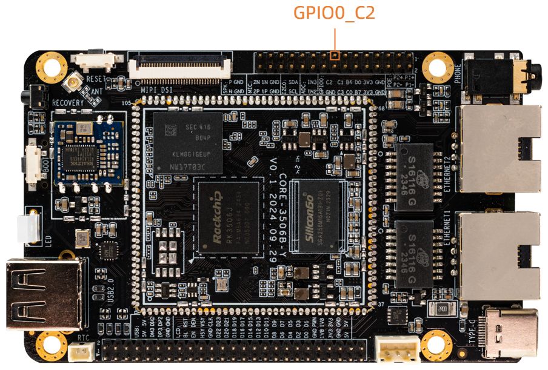

# GPIO

## Introduction

GPIO (General-Purpose Input/Output) is a General pin that can be dynamically configured and controlled during software operation.The initial state of all GPIOs after power-on is input mode, which can be set as pull-up or pull-down or interrupt pin by software. The driving intensity is programmable, and the core of which is to fill the methods and parameters of GPIO bank and register them in the kernel by calling gpiochip_add.

### Rockchip Matrix IO Function List

ROC-RK3506B-CC supports a Rockchip Matrix IO (RM_IO), which is designed to allow many function signals to share limited pin interfaces. In the same matrix, any function signal can be mapped to any pin interface through software configuration. RM_IO supports 98 function signals mapped to 32 pin interfaces (GPIO0_A0~GPIO0_C7, GPIO1_B1~GPIO1_B3, GPIO1_C2~GPIO1_C3, GPIO1_D1~GPIO1_D3).

For the specific RM_IO function list, please refer to the chip Datasheet document: `/path/to/sdk/docs/en/Socs/Datasheet/Rockchip RK3506B Datasheet V1.0-20240816.pdf`

ROC-RK3506B-CC The development board provides GPIO ports for user debugging and development. GPIO0_C2 can be used.




## GPIO Pin to calculate
ROC-RK3506B-CC have 4  GPIO bank：GPIO0~GPIO3，Each group was numbered A0~A7, B0~B7, C0~C7, and D0~D7, the following formulas are often used to calculate GPIO Pin:

```
GPIO pin calculation formula：pin = bank * 32 + number 

GPIO group number calculation formula：number = group * 8 + X
```
The following demonstrates the GPIO0_C2 pin calculation method:

bank = 0;  &nbsp;&nbsp;&nbsp;&nbsp;&nbsp;//GPIO<font color=red>0</font>_C2 => 0,  bank ∈ [0,4]

group = 2;  &nbsp;&nbsp;&nbsp;&nbsp;&nbsp;//GPIO0_<font color=red>C</font>2 => 2,  group ∈ {(A=0), (B=1), (C=2), (D=3)}

X = 2;    &nbsp;&nbsp;&nbsp;&nbsp;&nbsp;&nbsp;//GPIO0_C<font color=red>2</font> => 2, X ∈ [0,7]

number = group * 8 + X = 2 * 8 + 2 = 18

pin = bank*32 + number= 0 * 32 + 18 = 18;

The device tree properties corresponding to GPIO0_C2 are described as <&gpio0 18 GPIO_ACTIVE_HIGH>. From the macro definition of `kernel/include/dt-bindings/pinctrl/rockchip.h`, we can also describe GPIO0_C2 as <&gpio0 RK_PC2 GPIO_ACTIVE_HIGH>.


```
#define RK_PA0    0
#define RK_PA1    1
#define RK_PA2    2
#define RK_PA3    3
#define RK_PA4    4
#define RK_PA5    5
#define RK_PA6    6
#define RK_PA7    7
#define RK_PB0    8
#define RK_PB1    9
#define RK_PB2    10
#define RK_PB3    11
......
```
When the GPIO0_C2 pin is not reused by other peripherals, we can export the pin to use it.

```shell
root@rk3506-buildroot:/# ls /sys/class/gpio/
export  gpiochip0  gpiochip128  gpiochip32  gpiochip503  gpiochip511  gpiochip64  gpiochip96  unexport
root@rk3506-buildroot:/# echo 18 > /sys/class/gpio/export
root@rk3506-buildroot:/# ls /sys/class/gpio/
export  gpio18  gpiochip0  gpiochip128  gpiochip32  gpiochip503  gpiochip511  gpiochip64  gpiochip96  unexport
root@rk3506-buildroot:/# ls /sys/class/gpio/gpio18
active_low  device  direction  edge  power  subsystem  uevent  value
```

## Input And Output

### Application Layer Settings

After exporting the pins above, you can directly set the gpio to input mode or output mode

* View the current gpio mode
```shell
root@rk3506-buildroot:/# cat /sys/class/gpio/gpio18/direction
in
```

* Set to input mode

```shell
root@rk3506-buildroot:/# echo in > /sys/class/gpio/gpio18/direction
```

* In input mode, directly view the value of the value file to know the input level

```shell
root@rk3506-buildroot:/# cat /sys/class/gpio/gpio18/value
0
```

* Set to output mode

```shell
root@rk3506-buildroot:/# echo out > /sys/class/gpio/gpio18/direction
```

* Set the output high level

```shell
root@rk3506-buildroot:/# echo 1 > /sys/class/gpio/gpio18/value
```

* Set the output low level

```shell
root@rk3506-buildroot:/# echo 0 > /sys/class/gpio/gpio18/value
```


### Driver Layer Settings

`of_get_named_gpio_flags` reads the GPIO configuration numbers and flags of `firefly-gpio` and `firefly-irq-gpio` from the device tree, `gpio_is_valid` judges whether the GPIO number is valid, and `gpio_request` applies to occupy the GPIO. If there is an error in the initialization process, you need to call `gpio_free` to release the previously applied and successful GPIO. Call `gpio_direction_output` in the driver to set the output high or low level. Here the default output is the active level `GPIO_ACTIVE_HIGH` obtained from DTS, which is high level. If the drive works normally, you can use a multimeter to measure the corresponding The pin should be high. In practice, if you want to read GPIO, you need to set it to input mode first, and then read the value:

```
int val;
gpio_direction_input(your_gpio);
val = gpio_get_value(your_gpio);
```

The following are commonly used GPIO API definitions:

```
#include <linux/gpio.h>
#include <linux/of_gpio.h>

enum of_gpio_flags {
     OF_GPIO_ACTIVE_LOW = 0x1,
};
int of_get_named_gpio_flags(struct device_node *np, const char *propname,
int index, enum of_gpio_flags *flags);
int gpio_is_valid(int gpio);
int gpio_request(unsigned gpio, const char *label);
void gpio_free(unsigned gpio);
int gpio_direction_input(int gpio);
int gpio_direction_output(int gpio, int v);
```

## Interrupt

IRQ_TYPE_EDGE_RISING indicates that the interrupt is triggered by the rising edge, and the interrupt function can be triggered when the pin receives the rising edge signal.This can also be configured as follows：

```
IRQ_TYPE_NONE           //Default value, no defined interrupt trigger type
IRQ_TYPE_EDGE_RISING    //Rising edge trigger
IRQ_TYPE_EDGE_FALLING   //Falling edge trigger
IRQ_TYPE_EDGE_BOTH      //Trigger on both rising and falling edges
IRQ_TYPE_LEVEL_HIGH     //High level trigger
IRQ_TYPE_LEVEL_LOW      //Low level trigger
```

Then analyze the resources added by DTS in the probe function, and then apply for interrupted registration, the code is as follows:

```
static int firefly_gpio_probe(struct platform_device *pdev)
{
	int ret;
	int gpio;
	enum of_gpio_flags flag;
	struct firefly_gpio_info *gpio_info;
	struct device_node *firefly_gpio_node = pdev->dev.of_node;
	...

	gpio_info->firefly_irq_gpio = gpio;
	gpio_info->firefly_irq_mode = flag;
	gpio_info->firefly_irq = gpio_to_irq(gpio_info->firefly_irq_gpio);
	if (gpio_info->firefly_irq)
	{
		if (gpio_request(gpio, "firefly-irq-gpio"))
		{
			dev_err(&pdev->dev, "firefly-irq-gpio: %d request failed!\n", gpio);
			gpio_free(gpio);
			return IRQ_NONE;
		}

		ret = request_irq(gpio_info->firefly_irq, firefly_gpio_irq,
							flag, "firefly-gpio", gpio_info);
		if (ret != 0)
		{
			free_irq(gpio_info->firefly_irq, gpio_info);
			dev_err(&pdev->dev, "Failed to request IRQ: %d\n", ret);
		}
	}
	printk("Firefly irq gpio finish \n");
	return 0;
}

static irqreturn_t firefly_gpio_irq(int irq, void *dev_id) //interrupt function
{
	printk("Enter firefly gpio irq test program!\n");
	return IRQ_HANDLED;
}
```

Call `gpio_to_irq` to convert the PIN value of the GPIO to the corresponding IRQ value, call `gpio_request` to apply for the IO port, call `request_irq` to apply for an interrupt, if it fails, call `free_irq` to release, in this function `gpio_info-firefly_irq` Is the hardware interrupt number to be applied for, `firefly_gpio_irq` is the interrupt function, `gpio_info->firefly_irq_mode` is the attribute of interrupt processing, `firefly-gpio` is the name of the device driver, and `gpio_info` is the `device` structure of the device. It is used when registering shared interrupts.

## Reuse

`For reference only, the actual hardware interfaces prevail.`

In addition to general input and output and interrupt functions, GPIO ports may also have other multiplexing functions. Taking GPIO0_C3 as an example, there are several functions as follows:

|  func0  |  func1  |  func2  |
| --- | --- | --- |
| RM_IO18 | SPI0_MISO | REF_CLK1_OUT |

Check `/sys/kernel/debug/pinctrl/pinctrl-rockchip-pinctrl/pinmux-pins` to see the function of each pin. If you find that GPIO0_C2 is multiplexed as SPI0_MISO, you need to turn it off in dts.

## Debugging Method

### IO Instruction

A very useful tool for GPIO debugging is the IO command. The Android system of ROC-RK3506B-CC has built-in IO commands by default. Using IO commands, you can read or write the status of each IO port in real time. Here is a brief introduction The use of IO instructions. First check the help of IO instruction:

```
root@rk3506-buildroot:/# io --help
Unknown option: ?
Raw memory i/o utility - $Revision: 1.5 $

io -v -1|2|4 -r|w [-l <len>] [-f <file>] <addr> [<value>]

    -v         Verbose, asks for confirmation
    -1|2|4     Sets memory access size in bytes (default byte)
    -l <len>   Length in bytes of area to access (defaults to
               one access, or whole file length)
    -r|w       Read from or Write to memory (default read)
    -f <file>  File to write on memory read, or
               to read on memory write
    <addr>     The memory address to access
    <val>      The value to write (implies -w)

Examples:
    io 0x1000                  Reads one byte from 0x1000
    io 0x1000 0x12             Writes 0x12 to location 0x1000
    io -2 -l 8 0x1000          Reads 8 words from 0x1000
    io -r -f dmp -l 100 200    Reads 100 bytes from addr 200 to file
    io -w -f img 0x10000       Writes the whole of file to memory

Note access size (-1|2|4) does not apply to file based accesses.
```

As you can see from the help, if you want to read or write a register, you can use:

```
io -4 -r 0x1000 //Read the value of 4-bit register starting from 0x1000
io -4 -w 0x1000 //Write the value of the 4-bit register from 0x1000
```

### GPIO Debug Interface

The purpose of the Debugfs file system is to provide developers with more kernel data to facilitate debugging. Here GPIO debugging can also use the Debugfs file system to get more kernel information. The interface of GPIO in the Debugfs file system is `/sys/kernel/debug/gpio`, the information of this interface can be read like this:

```
root@rk3506-buildroot:/# cat /sys/kernel/debug/gpio
gpiochip0: GPIOs 0-31, parent: platform/ff940000.gpio, gpio0:
 gpio-1   (                    |wd-en               ) in  lo
 gpio-18  (                    |sysfs               ) out lo
 gpio-24  (                    |hp-det              ) in  lo IRQ

gpiochip1: GPIOs 32-63, parent: platform/ff870000.gpio, gpio1:

gpiochip2: GPIOs 64-95, parent: platform/ff1c0000.gpio, gpio2:

gpiochip3: GPIOs 96-127, parent: platform/ff1d0000.gpio, gpio3:

gpiochip4: GPIOs 128-159, parent: platform/ff1e0000.gpio, gpio4:

gpiochip5: GPIOs 272-287, parent: i2c/0-0021, 0-0021, can sleep:
 gpio-272 (                    |enable              ) out hi
 gpio-273 (                    |enable              ) out hi
 gpio-274 (                    |reset               ) out hi ACTIVE LOW
 gpio-276 (                    |:user               ) out hi
 gpio-277 (                    |vcc5v0-otg0-otg1-reg) out hi
 gpio-281 (                    |vcc-wifi-pwren-regul) out lo ACTIVE LOW
 gpio-282 (                    |spk-con             ) out lo
 gpio-284 (                    |vcc-hub-reset-regula) out hi
 gpio-285 (                    |vcc-host1-pwr-en-reg) out hi
 gpio-286 (                    |:power              ) out hi
 gpio-287 (                    |hp-con              ) out lo
 ...
```

From the information read, we can know that the kernel lists the current status of GPIO. Taking the GPIO0 group as an example, gpio-18 (GPIO0_C2) outputs a low level (out lo).

### pinmux-pins
Command: 
```
root@rk3506-buildroot:/# cat /sys/kernel/debug/pinctrl/pinctrl-rockchip-pinctrl/pinmux-pins
```

Result:
```
Pinmux settings per pin
Format: pin (name): mux_owner gpio_owner hog?
pin 0 (gpio0-0): (MUX UNCLAIMED) (GPIO UNCLAIMED)
pin 1 (gpio0-1): (MUX UNCLAIMED) gpio0:1
pin 2 (gpio0-2): (MUX UNCLAIMED) (GPIO UNCLAIMED)
pin 3 (gpio0-3): ff932000.pwm (GPIO UNCLAIMED) function rm_io3 group rm-io3-pwm0-ch2
pin 4 (gpio0-4): ff040000.i2c (GPIO UNCLAIMED) function rm_io4 group rm-io4-i2c0-scl
pin 5 (gpio0-5): ff040000.i2c (GPIO UNCLAIMED) function rm_io5 group rm-io5-i2c0-sda
pin 6 (gpio0-6): (MUX UNCLAIMED) (GPIO UNCLAIMED)
pin 7 (gpio0-7): 0-0051 (GPIO UNCLAIMED) function hym8563 group hym8563-int
pin 8 (gpio0-8): 0-0011 (GPIO UNCLAIMED) function rm_io8 group rm-io8-sai1-mclk
pin 9 (gpio0-9): ff310000.sai (GPIO UNCLAIMED) function rm_io9 group rm-io9-sai1-sclk
pin 10 (gpio0-10): ff310000.sai (GPIO UNCLAIMED) function rm_io10 group rm-io10-sai1-lrck
pin 11 (gpio0-11): ff310000.sai (GPIO UNCLAIMED) function rm_io11 group rm-io11-sai1-sdi
pin 12 (gpio0-12): ff310000.sai (GPIO UNCLAIMED) function rm_io12 group rm-io12-sai1-sdo0
...
```
Analysis:
The column `pin 0` indicates the pin number, the column `gpio0-0` indicates the gpio group number, the column `MUX UNCLAIMED` indicates the owner of the data selector, and the column `GPIO UNCLAIMED` indicates the owner of the gpio.

Among them, `MUX UNCLAIMED` indicates that the pin has not been controlled by the node using pinctrl. `GPIO UNCLAIMED` indicates that no registered gpio uses the pin.

## FAQs

### Q1: How to switch the MUX value of PIN to normal GPIO?

A1: When using GPIO request, the MUX value of the PIN will be forcibly switched to GPIO, so when using the PIN pin as a GPIO function, make sure that the PIN pin is not used by other modules.

### Q2: Why is the value I read out with the IO instruction is 0x00000000?

A2: If you use the IO command to read the register of a GPIO, the value read is abnormal, such as 0x00000000 or 0xffffffff, etc., please confirm whether the CLK of the GPIO is turned off. The CLK of the GPIO is controlled by the CRU. You can read the datasheet Next, use the CRU_CLKGATE_CON* register to check whether the CLK is turned on. If it is not turned on, you can use the io command to set the corresponding register to turn on the corresponding CLK. After turning on the CLK, you should be able to read the correct register value.

### Q3: How to check if the voltage of the PIN pin is wrong?

A3: When measuring the voltage of the PIN pin is incorrect, if external factors are excluded, you can confirm whether the IO voltage source where the PIN is located is correct and whether the IO-Domain configuration is correct.

### Q4: What is the difference between gpio_set_value() and gpio_direction_output()?

A4: If you do not dynamically switch input and output when using this GPIO, it is recommended to set the GPIO output direction at the beginning, and use the gpio_set_value() interface when pulling it up and pulling it down later. It is not recommended to use gpio_direction_output() because of the gpio_direction_output interface There is a mutex lock inside, there will be an error exception when calling the interrupt context, and compared to gpio_set_value, gpio_direction_output does more and is wasteful.
