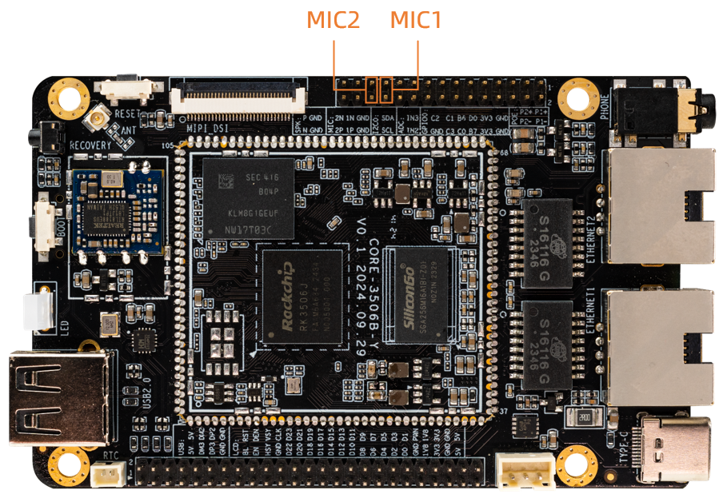

## Sound Card

### EarPhone && Speak

EarPhone and Speak both use dual-channel interfaces


* The interface of Speak is as follows:


Use aplay command to play wav format audio
```
#path-to indicates the absolute path where the audio is stored
aplay /path-to/audio-name.wav
```
### Mic

* The interface of Mic is as follows:



* Mic is turned off by default. You need to turn it on when you use it. To do this, follow the steps below.
```
#Command sets the default recording sound card channel 1 and channel 2 to be open
i2cset -f -y 0 0x11 0x73 0x3e
```
* Mic to record audio
```
arecord -l					#查看所有可用的MIC设备
arecord -Dhw:0,0 -f cd -d 10 /path-to/audio.wav	#选择声卡并录制音频
```