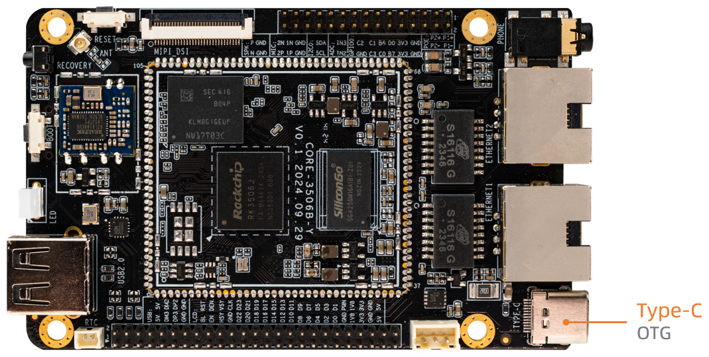
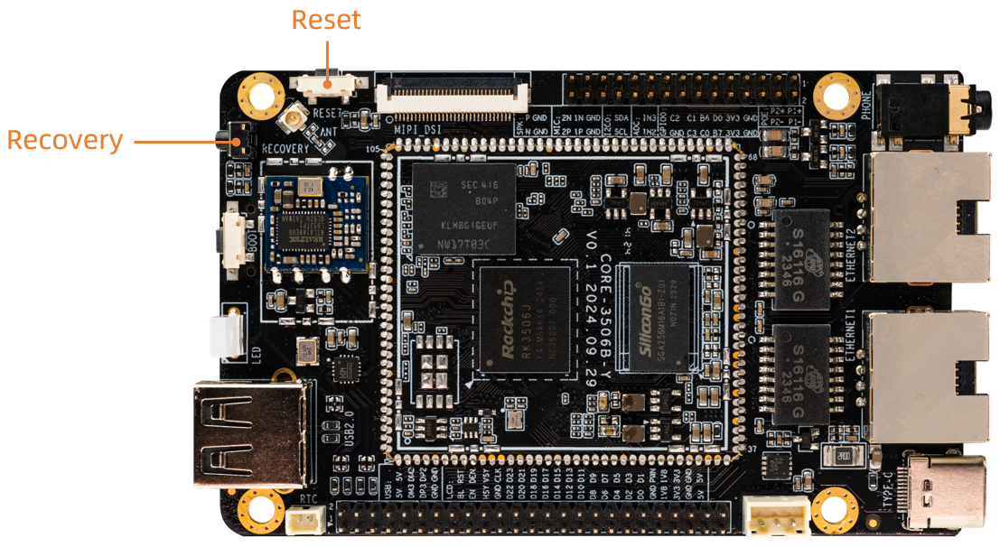

* Disconnect the power adapter first
* Use Type-C data cable to connect one end to the host and the other end to the development board

* Press and hold the RECOVERY button on the device

* Connect the power supply
* After about two seconds, release the RECOVERY button

