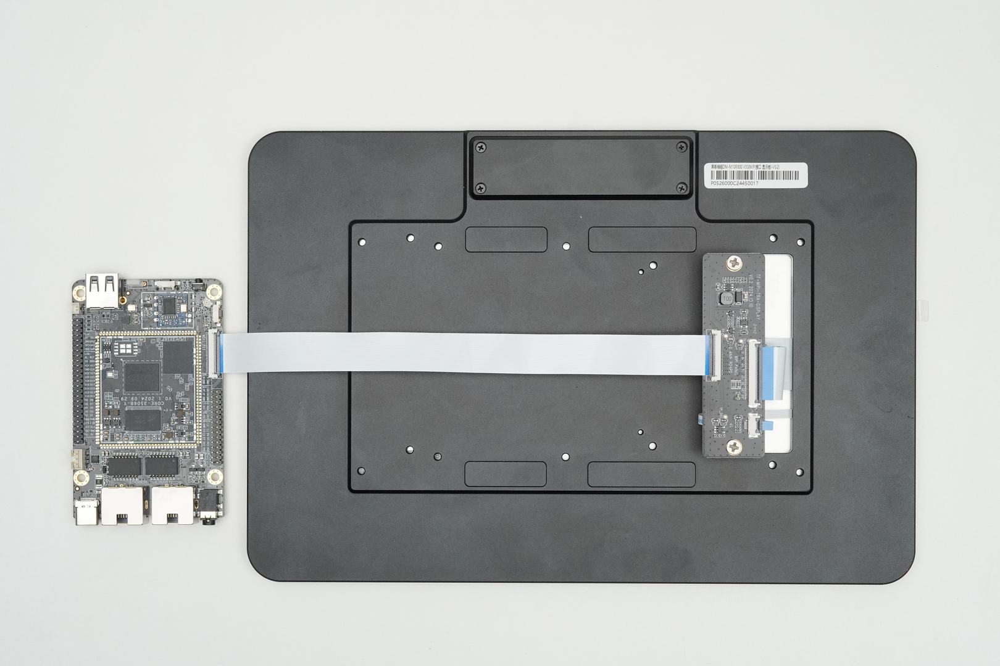

# Display

RK3506 has 1 video output port. The maximum resolution that the video port can output is: 1280x1280@60Hz.

## ROC-RK3506J-CC Display interface configuration

The following is a basic introduction to the configuration and use of each display output interface. For details, please refer to the document:  
* `kernel/arch/arm/boot/dts/rk3506b-firefly-roc-rk3506b-cc.dts`  
* `kernel/arch/arm/boot/dts/rk3506b-firefly-roc-rk3506b-cc-mipi101-BSD1218-A101KL68.dtsi`  

### MIPI DSI

ROC-RK3506J-CC has one MIPI DSI display output interface, supports 2 Lane data output, and can output up to 1280x1280@60Hz.

#### Software Configuration

The external screen is [DM-M10R800 V3S Monitor Module](https://wiki.t-firefly.com/en/DM-M10R800-V3S/dm-m10r800-v3s.html)，

* DSI interface


Add to the device tree:

```
//Set the screen backlight
backlight: backlight {
...
	compatible = "pwm-backlight";
	enable-gpios = <&pca9555 PCA_IO0_1 GPIO_ACTIVE_HIGH>;
	pwms = <&pwm0_4ch_2 0 50000 1>;
	status = "okay";
...
}

&pwm0_4ch_2 {
	pinctrl-names = "active";
	pinctrl-0 = <&rm_io3_pwm0_ch2>;
	status = "okay";
};

//Set the dsi boot logo
&dsi_dphy {
	status = "okay";
};

&dsi_in {
	status = "okay";
};

&dsi_in_vop {
	status = "okay";
};

&route_dsi {
	status = "okay";
};

// Turn on dsi (note that this part is important, as it involves the power-on timing of the screen)
&dsi {
	status = "okay";
	//rockchip,lane-rate = <1000>;
	dsi_panel: panel@0 {
		status = "okay";
		compatible = "simple-panel-dsi";
		reg = <0>;
		backlight = <&backlight>;
		
		enable-gpios = <&pca9555 PCA_IO0_0 GPIO_ACTIVE_HIGH>;
		reset-gpios = <&pca9555 PCA_IO0_2 GPIO_ACTIVE_LOW>;
		enable-delay-ms = <50>;
		prepare-delay-ms = <200>;
		reset-delay-ms = <50>;
		init-delay-ms = <55>;
		unprepare-delay-ms = <50>;
		disable-delay-ms = <20>;
		mipi-data-delay-ms = <200>;
		size,width = <120>;
		size,height = <170>;
                dsi,flags = <(MIPI_DSI_MODE_VIDEO | MIPI_DSI_MODE_VIDEO_BURST | MIPI_DSI_MODE_LPM | MIPI_DSI_MODE_NO_EOT_PACKET)>;
		dsi,format = <MIPI_DSI_FMT_RGB888>;
		dsi,lanes  = <2>;

		panel-init-sequence = [
			39 00 04 FF 98 81 03
			15 00 02 01 00
			15 00 02 02 00
			15 00 02 03 55
			15 00 02 04 55
			15 00 02 05 03 
			15 00 02 06 06 
			15 00 02 07 00 
			15 00 02 08 07 
			15 00 02 09 00 
			15 00 02 0a 00 
			15 00 02 0b 00 
			15 00 02 0c 00 
			15 00 02 0d 00 
			15 00 02 0e 00 
			15 00 02 0f 00 
			
			15 00 02 10 00 
			15 00 02 11 00 
			15 00 02 12 00
			15 00 02 13 00
			15 00 02 14 00
			15 00 02 15 00
			15 00 02 16 00
			15 00 02 17 00
			15 00 02 18 00
			15 00 02 19 00
			15 00 02 1a 00
			15 00 02 1b 00
			15 00 02 1c 00
			15 00 02 1d 00
			15 00 02 1e C0
			15 00 02 1f 80
			
			15 00 02 20 04
			15 00 02 21 03
			15 00 02 22 00
			15 00 02 23 00
			15 00 02 24 00
			15 00 02 25 00
			15 00 02 26 00
			15 00 02 27 00
			15 00 02 28 33
			15 00 02 29 33
			15 00 02 2a 00
			15 00 02 2b 00
			15 00 02 2c 00
			15 00 02 2d 00
			15 00 02 2e 00
			15 00 02 2f 00
			
			15 00 02 30 00
			15 00 02 31 00
			15 00 02 32 00
			15 00 02 33 00
			15 00 02 34 04
			15 00 02 35 00
			15 00 02 36 00
			15 00 02 37 00
			15 00 02 38 3C
			15 00 02 39 00
			15 00 02 3a 00
			15 00 02 3b 00
			15 00 02 3c 00
			15 00 02 3d 00
			15 00 02 3e 00
			15 00 02 3f 00
			
			15 00 02 40 00
			15 00 02 41 00
			15 00 02 42 00
			15 00 02 43 00
			15 00 02 44 00

			15 00 02 50 00
			15 00 02 51 11
			15 00 02 52 44
			15 00 02 53 55
			15 00 02 54 88
			15 00 02 55 AB
			15 00 02 56 00
			15 00 02 57 11
			15 00 02 58 22
			15 00 02 59 33
			15 00 02 5a 44
			15 00 02 5b 55
			15 00 02 5c 66
			15 00 02 5d 77
			15 00 02 5e 00
			15 00 02 5f 02
			
			15 00 02 60 02
			15 00 02 61 0A
			15 00 02 62 09
			15 00 02 63 08
			15 00 02 64 13
			15 00 02 65 12
			15 00 02 66 11
			15 00 02 67 10
			15 00 02 68 0F
			15 00 02 69 0E
			15 00 02 6a 0D
			15 00 02 6b 0C
			15 00 02 6c 06
			15 00 02 6d 07
			15 00 02 6e 02  
			15 00 02 6f 02
			
			15 00 02 70 02
			15 00 02 71 02
			15 00 02 72 02
			15 00 02 73 02 
			15 00 02 74 02
			15 00 02 75 02
			15 00 02 76 02  
			15 00 02 77 0A
			15 00 02 78 06
			15 00 02 79 07
			15 00 02 7a 10
			15 00 02 7b 11
			15 00 02 7c 12
			15 00 02 7d 13
			15 00 02 7e 0C
			15 00 02 7f 0D
			
			15 00 02 80 0E
			15 00 02 81 0F
			15 00 02 82 09
			15 00 02 83 08
			15 00 02 84 02
			15 00 02 85 02
			15 00 02 86 02
			15 00 02 87 02
			15 00 02 88 02
			15 00 02 89 02
			15 00 02 8A 02
			
			39 00 04 FF 98 81 04
			15 00 02 6E 2A
			15 00 02 6F 37
			15 00 02 3A 24
			15 00 02 8D 19
			15 00 02 87 BA
			15 00 02 B2 D1
			15 00 02 88 0B
			15 00 02 38 01
			15 00 02 39 00
			15 00 02 B5 02
			15 00 02 31 25
			15 00 02 3B 98
			39 00 04 FF 98 81 01
			
			15 00 02 22 0A
			15 00 02 31 0C
			15 00 02 53 40
			15 00 02 55 45
			15 00 02 50 B7
			15 00 02 51 B2
			15 00 02 60 07
			
			15 00 02 B7 03
			15 00 02 A0 22
			15 00 02 A1 3F
			15 00 02 A2 4E
			15 00 02 A3 17
			15 00 02 A4 1A
			15 00 02 A5 2D
			15 00 02 A6 21
			15 00 02 A7 22
			15 00 02 A8 C4
			15 00 02 A9 1B
			15 00 02 AA 25
			15 00 02 AB A7
			15 00 02 AC 1A
			15 00 02 AD 19
			15 00 02 AE 4B
			15 00 02 AF 1F
			
			15 00 02 B0 2A
			15 00 02 B1 59
			15 00 02 B2 64
			15 00 02 B3 3F
			
			15 00 02 C0 22
			15 00 02 C1 48
			15 00 02 C2 59
			15 00 02 C3 15
			15 00 02 C4 15
			15 00 02 C5 28
			15 00 02 C6 1C
			15 00 02 C7 1E
			15 00 02 C8 C4
			15 00 02 C9 1C
			15 00 02 CA 2B
			15 00 02 CB A3
			15 00 02 CC 1F
			15 00 02 CD 1E
			15 00 02 CE 52
			15 00 02 CF 24

			15 00 02 D0 2A
			15 00 02 D1 58
			15 00 02 D2 68
			15 00 02 D3 3F      
			39 00 04 FF 98 81 00
			05 78 01 11             //Delay 120ms
			05 14 01 29             //Delay 20ms
		];

		panel-exit-sequence = [
			39 00 04 FF 98 81 00        //page0
			05 14 01 28                //Delay 20ms
			05 78 01 10                //Delay 120ms
		];

		dis1_timings0: display-timings {
			native-mode = <&dsi_timing0>;
			dsi_timing0: timing0 {
				clock-frequency = <70000000>;//<80000000>;
				hactive = <800>;//<768>;
				vactive = <1280>;
				hsync-len = <20>;   //20, 50,10
				hback-porch = <20>; //50, 56,10
				hfront-porch = <40>;//50, 30,180
				vsync-len = <4>;//4
				vback-porch = <20>;//4
				vfront-porch = <20>;//8
				hsync-active = <0>;
				vsync-active = <0>;
				de-active = <0>;
				pixelclk-active = <0>;
			};
		};

		ports {
			#address-cells = <1>;
			#size-cells = <0>;

			port@0 {
				reg = <0>;
				panel_in_dsi: endpoint {
					remote-endpoint = <&dsi_out_panel>;
				};
			};
		};
	};

	ports {
		#address-cells = <1>;
		#size-cells = <0>;

		port@1 {
			reg = <1>;
			dsi_out_panel: endpoint {
				remote-endpoint = <&panel_in_dsi>;
			};
		};
	};
};

//Enable the touch function of the screen
&i2c0 {
	//clock-frequency = <400000>;
	pinctrl-names = "default";
	status = "okay";

	goodix_ts@14 {
		status = "okay";
		compatible = "goodix,gt9xxx";
		reg = <0x14>;
		interrupt-parent = <&gpio0>;
		interrupts = <RK_PB6 IRQ_TYPE_LEVEL_LOW>;
		//goodix,pwr-gpio = <&pca9555 PCA_IO0_7 GPIO_ACTIVE_HIGH>;
		reset-gpios = <&pca9555 PCA_IO0_3 GPIO_ACTIVE_HIGH>;
		irq-gpios = <&gpio0 RK_PB6 IRQ_TYPE_LEVEL_LOW>;
		irq-flags = <2>; /* 1 rising, 2 falling */
		touchscreen-size-x = <800>;
		touchscreen-size-y = <1280>;
		goodix,slide-wakeup = <0>;
		goodix,type-a-report = <0>;
		goodix,driver-send-cfg = <1>;
		goodix,resume-in-workqueue = <0>;
		goodix,int-sync = <1>;
		//goodix,swap-x2y = <0>;
		goodix,esd-protect = <1>;
		goodix,auto-update-cfg = <0>;
		goodix,auto-update = <0>;
		goodix,power-off-sleep = <0>;
		goodix,pen-suppress-finger = <0>;

                goodix,cfg-group2 = [
                        62 20 03 00 05 0A 35 00 01
                        0A 28 0F 50 3C 03 05 00 00
                        00 00 00 00 06 18 1A 1E 14
                        90 30 AA 37 39 12 0C 00 00
                        00 1A 02 2D 00 00 00 00 00
                        00 00 00 07 00 00 28 4B 94
                        D5 02 07 00 00 04 9A 2A 00
                        8C 30 00 81 36 00 76 3E 00
                        6E 46 00 6E 00 00 00 00 00
                        00 00 00 00 00 00 00 00 00
                        00 00 00 00 00 00 00 00 00
                        00 00 00 00 00 02 00 00 00
                        00 00 00 00 19 18 17 16 15
                        14 11 10 0F 0E 0D 0C 09 08
                        07 06 05 04 01 00 00 00 00
                        00 00 00 00 00 00 00 14 13
                        12 11 10 0F 0E 0D 0C 0A 08
                        07 06 04 02 00 19 1B 1C 1E
                        1F 20 21 22 23 24 25 26 27
                        28 29 2A 00 00 00 00 00 00
                        00 00 00 00 D8 01];

		};
};
```

When configuring MIPI DSI, if abnormal phenomena occur, such as black screen, image stretching, display noise, etc., you need to pay attention to troubleshooting:

1. Whether the display timing is configured correctly, especially the DCLK configuration.

2. Check whether the power-on and power-off sequence is correct. In the `panel_simple_prepare` and `panel_simple_unprepare` functions in the file `kernel/drivers/gpu/drm/panel/panel-simple.c`, the power-on and power-off sequence and gpio ports configured in the device tree are called.

If you choose to enable the boot logo in the uboot stage, you also need to check the `panel_simple_prepare` and `panel_simple_unprepare` functions in the `u-boot/drivers/video/drm/rockchip_panel.c` file.

3. Use an oscilloscope to check whether the power-on timing is correct, mainly to confirm whether the timing between the LCD enable pin, reset pin and screen power-on command is correct.

## Debugging Methods

* Get the information of the Video Port (and the connected display controller) currently in use in the system
```
root@rk3506-buildroot:/# cat /sys/kernel/debug/dri/0/summary
VOP [ff600000.vop]: ACTIVE
    Connector: DSI-1
        bus_format[100a]: RGB888_1X24
        overlay_mode[0] output_mode[0]color-encoding[1] color-range[1]
    Display mode: 800x1280p60
        dclk[70000 kHz] real_dclk[69475 kHz] aclk[294912 kHz] type[48] flag[a]
        H: 800 840 860 880
        V: 1280 1300 1304 1324
    win1-0: ACTIVE
        format: XR24 little-endian (0x34325258) SDR[0] color-encoding[0] color-range[0]
        csc: y2r[0] r2r[0] r2y[0] csc mode[0]
        zpos: 0
        src: pos[0x0] rect[800x1280]
        dst: pos[0x0] rect[800x1280]
        buf[0]: addr: 0x1e000000 pitch: 3200 offset: 0
    post: sdr2hdr[0] hdr2sdr[0]
    pre : sdr2hdr[0]
    post CSC: r2y[0] y2r[0] CSC mode[2]
```

Generally, if you encounter a problem where the screen cannot display, you need to execute the above command first to check whether the connection status and resolution are correct.