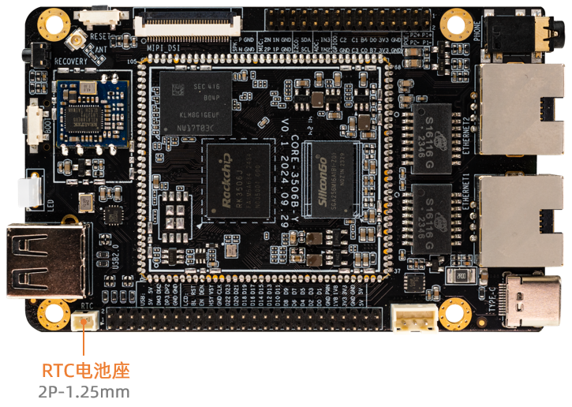

# RTC

## Introduction

ROC-RK3506J-CC development BOARD uses TT8563RH as RTC(*Real Time Clock*), TT8563RH is a low power CMOS real-time Clock/calendar chip, it provides a programmable Clock output, an interrupt Output and a power down detector, all addresses and data are passed serially through the I2C bus interface.

* Timing can be based on 32.768kHz crystals in seconds, minutes, hours, weeks, days, months and years
* Wide working voltage range :1.0~5.5V
* Low resting current: Typical 0.25μA(VDD =3.0V, TA =25°C)
* Internal integrated oscillating capacitor
* drain open circuit interrupt pin


ROC-RK3506J-CC needs to be connected to the RTC battery to power the RTC chip to ensure that the RTC can operate normally after a short system power outage.




## Driver RTC

DTS Reference: `kernel/arch/arm/boot/dts/rk3506b-firefly-roc-rk3506b-cc.dtsi`

Driver Reference: `kernel/drivers/rtc/rtc-hym8563.c`

## Interface usage

Linux provides three user-space call interfaces. The corresponding path in the ROC-RK3506J-CC development board is:

*   **SYSFS Interface :** `/sys/class/rtc/rtc0/`
*   **PROCFS Interface :** `/proc/driver/rtc`
*   **IOCTL Interface :** `/dev/rtc0`

### SYSFS Interface

You can directly use the interface below `cat` and `echo` operations `/sys/class/rtc/rtc0/`.

For example, check the date and time of the current RTC:

```
root@rk3506-buildroot:/# cat /sys/class/rtc/rtc0/date
2021-01-01

root@rk3506-buildroot:/# cat /sys/class/rtc/rtc0/time
17:18:14
```

Set the startup time, such as starting up after 120 seconds:

```
#Start the machine regularly after 120 seconds
echo +120 >  /sys/class/rtc/rtc0/wakealarm
# View boot time
cat /sys/class/rtc/rtc0/wakealarm
#To turn it off
reboot -p
```


<font color=red>**Attention: ROC-RK3506J-CC not support scheduled power-on.**</font>


### PROCFS Interface

Print RTC related information:

```
root@rk3506-buildroot:/# cat /proc/driver/rtc
rtc_time        : 17:20:04
rtc_date        : 2021-01-01
alrm_time       : 16:31:00
alrm_date       : 2021-01-02
alarm_IRQ       : no
alrm_pending    : no
update IRQ enabled      : no
periodic IRQ enabled    : no
periodic IRQ frequency  : 1
max user IRQ frequency  : 64
24hr            : yes
```

### IOCTL Interface

You can use `ioctl` to control `/dev/rtc0`.

For detailed instructions, please refer to the document `kernel/Documentation/admin-guide/rtc.rst`.

## FAQs

#### Q1: The time is out of sync after the development board is powered on ?

**A1 :**  Check that the RTC battery is properly connected

