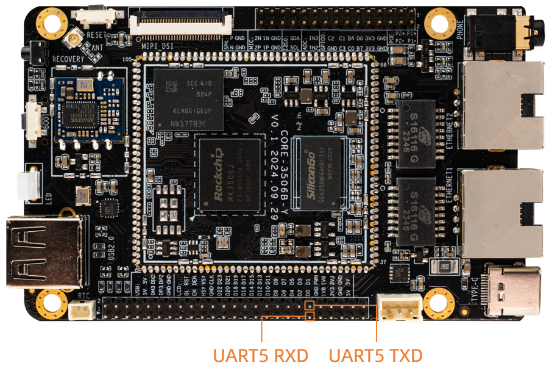

# UART

## Hardware

The serial port 5 interface diagram of the ROC-RK3506J-CC hardware version is as follows:



## DTS Configuration

UART5 is not enabled by default. Add the following content to the end of the file path `kernel/arch/arm/boot/dts/rk3506b-firefly-roc-rk3506b-cc.dtsi` and compile the kernel and burn it to the board:
```
/* uart5 */
&uart5 {
	pinctrl-0 = <&uart5m1_xfer_pins &uart5m1_ctsn_pins &uart5m1_rtsn_pins>;
	status = "okay";
};
```

After configuring the serial port, the hardware interface corresponds to the node on the software:
```
UART5:   /dev/ttyS5
```

## UART send and receive verification

The easiest way is to short the UART5 TX RX pins, and then use the command to execute the command in the debug serial port or ADB

```
busybox  stty -echo -F /dev/ttyS5         # Disable echo
cat /dev/ttyS5 &                          # Get /dev/ttyS5 input string in the background
echo "firefly uart test..." > /dev/ttyS5  # Input string
```

Finally, the debugging serial terminal can receive the string "firefly uart test..."