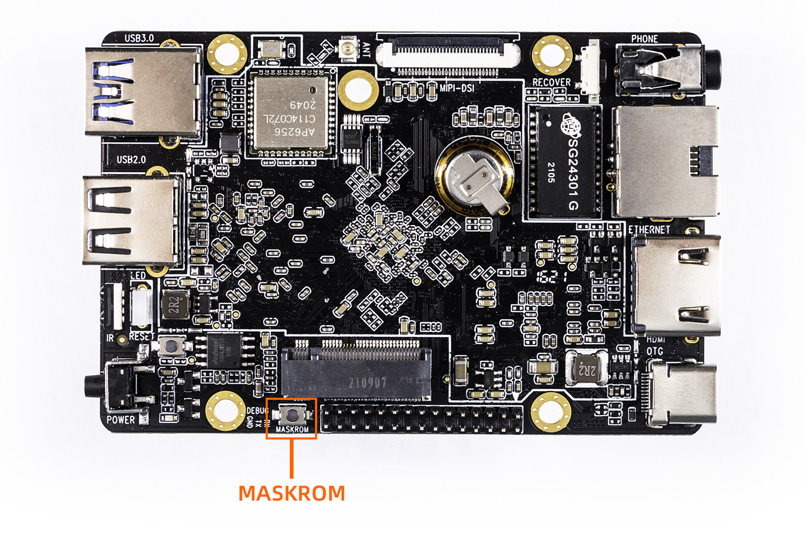
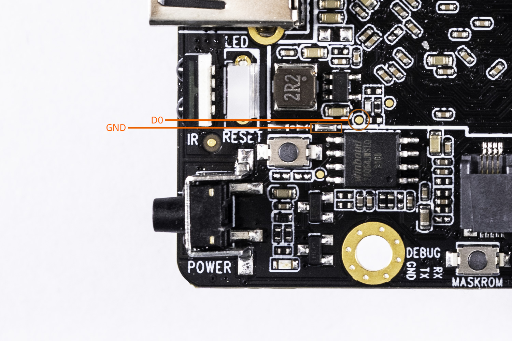

# MaskRom mode

***See startup mode for an introduction [startup mode](01-bootmode.md)***

`MasRrom` mode is the last line of defense against device being bricked. Forced entry `MaskRom` involved hardware operation, have certain risk, so only in the situation that deivce failed entering the `Loader` mode, you can try `MaskRom` mode.

**Please read carefully and operate carefully!**

The operation steps are as follows:

1. Disconnect the Type-C data cable.
1. Hold down the `Maskrom` button
1. Connect the device and host PC with Type-C data cable.
1. Wait a few seconds, release the button.

When the board has NOR flash at the same time, if EMMC is empty and there are burned files in NOR flash, it is necessary to short circuit the D0 and GND test points near NOR flash to enter Maskrom mode. And now we have to  refer to the chapter "[Switching Upgrade Storage](03-upgrade_firmware_with_flash)" for upgrade

At this point, the device should go into `MaskRom mode`.

