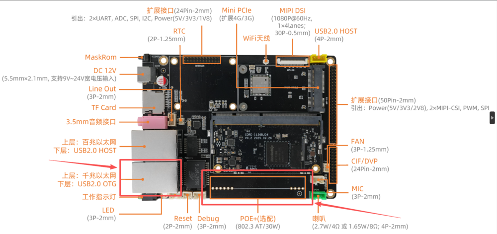

## POE
* The network port where `POE` function can be added is `1000M`, as shown in the figure below:
<center>


</center>
The `POE` module needs to be connected to the `POE` interface of the bottom plate
```
#Check whether 1000M POE port exists
ifconfig eth1 
```