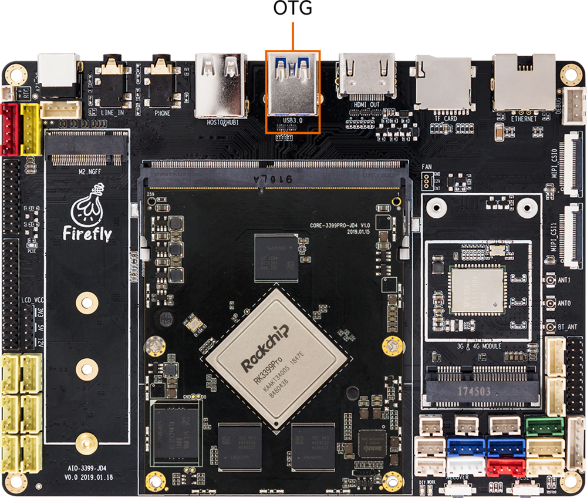
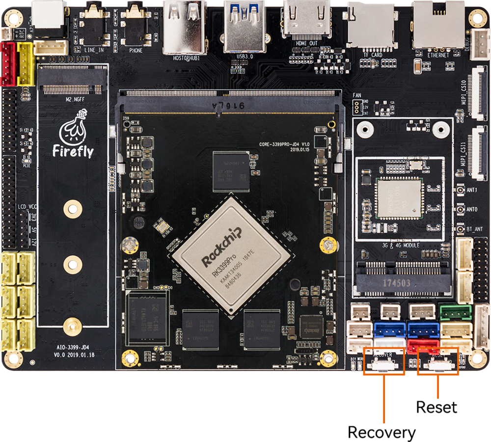

# Upgrade the firmware via USB cable

## Introduction

This article describes how to upgrade the firmware file on the host to the flash memory of the development board through the USB cable. When upgrading, you need to choose the appropriate upgrade mode according to the host operating system and firmware type.

## Prepare Tools

* AIO-3399Pro-JD4 development board
* Firmware
* host computer
* Double male USB data cable

## Prepare Firmware

The firmware can be obtained by compiling the SDK, or you can download the public firmware (unified firmware) from the [Resource download](https://community.t-firefly.com/en/doc/download/76).There are two types of firmware files:

* A single unified firmware

The unified firmware is a single file packaged and merged by all files such as the partition table, bootloader, uboot, kernel, system and so on. The firmware officially released by Firefly adopts a unified firmware format. Upgrading the unified firmware will update the data and partition table of all partitions on the motherboard, and erase all data on the motherboard.

* Multiple partition images

That is, files with independent functions, such as partition table, bootloader, and kernel, are generated during the development phase. The independent partition image can only update the specified partition, while keeping other partition data from being destroyed, it will be very convenient to debug during the development process.

>    Through the unified firmware unpacking / packing tool, the unified firmware can be unpacked into multiple partition images, or multiple partition images can be merged into a unified firmware.

## Install the Upgrade Tool
### Windows Operating System

* Install RK USB driver

Download [Release_DriverAssistant.zip](https://community.t-firefly.com/en/doc/download/76#windows_341), extract, and then run the DriverInstall.exe inside . In order for all devices to use the updated driver, first select `Driver uninstall`(`驱动卸载`) and then select `Driver install`(`驱动安装`).

<center>


</center>

* Download and run [AndroidTool](https://community.t-firefly.com/en/doc/download/76#other_343)'s RKDevTool.exe

**<font color=#ff0000 >Note :</font>** Different firmware may use different versions of tools, please download the corresponding version according to the [Instructions for writing with USB cable (important)](02-upgrade_table.md).

<center>


</center>

### Linux Operating System

There is no need to install device driver under Linux. Please refer to the Windows section to connect the device.

* [Linux_Upgrade_Tool](https://community.t-firefly.com/en/doc/download/76#other_367)

**<font color=#ff0000 >Note :</font>** Different firmware may use different versions of tools, please download the corresponding version according to the [Instructions for writing with USB cable (important)](02-upgrade_table.md).

Download [Linux_Upgrade_Tool](https://community.t-firefly.com/en/doc/download/76#other_367), And install it into the system as follows for easy invocation:

```
unzip Linux_Upgrade_Tool_xxxx.zip
cd Linux_UpgradeTool_xxxx
sudo mv upgrade_tool /usr/local/bin
sudo chown root:root /usr/local/bin/upgrade_tool
sudo chmod a+x /usr/local/bin/upgrade_tool
```

## Enter Upgrade mode

Usually we upgrade firmware in two modes, namely `Loader` mode and `MaskRom` mode. Before we can write the firmware, we need to connect the device and put the board into upgradable mode.

### Loader mode
#### Hardware way into Loader mode

Connect the device and press the **RECOVERY** button to enter the Loader mode. The steps are as follows:

* Disconnect the power adapter first
* Double male USB data cable connect the device and the host.

    <center>

    
    </center>
* Press and hold the RECOVERY button on the device.

    <center>

    
    </center>
* plug in
* After about two seconds, release the RECOVERY button.

#### Software way into Loader mode

After Double male USB data cable is connected, run the following command on the serial debugging terminal or `adb shell` to the board:

```
reboot loader
```

#### Check the Loader mode

How to determine whether the board is in Loader mode, we can check through the tool

**Windows Operating System**

The AndroidTool displays the prompt `Found One LOADER Device` at the bottom

<center>


</center>

if the "Enter Loader mode" operation is performed, and the LOADER prompted by the upgrade tool is not displayed, check whether the Windows host computer you to discover new hardware and configure the driver. Open the Device manager and a new device `Rockusb Device` will appear, as shown below. If not, you can go back to the previous step to [reinstall the driver](loader_mode.html#windows-operating-system).

<center>


</center>

**Linux Operating System**

After running `upgrade_tool`, you can see a `Loader` prompt in the connected device

```
firefly@T-chip:~/severdir/down_firmware$ sudo upgrade_tool
List of rockusb connected
DevNo=1 Vid=0x2207,Pid=0x330c,LocationID=106    Loader
Found 1 rockusb,Select input DevNo,Rescan press <R>,Quit press <Q>:q
```

### MaskRom mode

To enter MaskRom mode, please refer to [MaskRom mode](04-03-upgrade_firmware.html).

## Upgrade the firmware
### Windows Operating System
#### Upgrade unified firmware - update.img

The steps to update the unified firmware `update.img` are as follows:

1.Switch to the `Upgrade Firmware` page.

2.Press the `Firmware` button to open the firmware file to be upgraded. The upgrade tool displays detailed firmware information.

3.Press the `Upgrade` button to start the upgrade.

4.<font color=#ff0000 >If the upgrade fails, you can try to erase the Flash by pressing the `EraseFlash` button first, and then upgrade.Be sure to erase the upgrade according to [Instructions for writing with USB cable (important)](02-upgrade_table.md)</font>

<center>


</center>


### Linux Operating System
#### Upgrade unified firmware - update.img

```
sudo upgrade_tool uf update.img
```

<font color=#ff0000 >If the upgrade fails, try erasing before upgrading. Be sure to erase and upgrade according to [Instructions for writing with USB cable (important)](02-upgrade_table.md).</font>

```
# erase flash : Using the ef parameter requires the loader file or the corresponding update.img to be specified.
# update.img :The ubuntu firmware you need to upgrade.
sudo upgrade_tool ef update.img
# upgrade again
sudo upgrade_tool uf update.img
```
