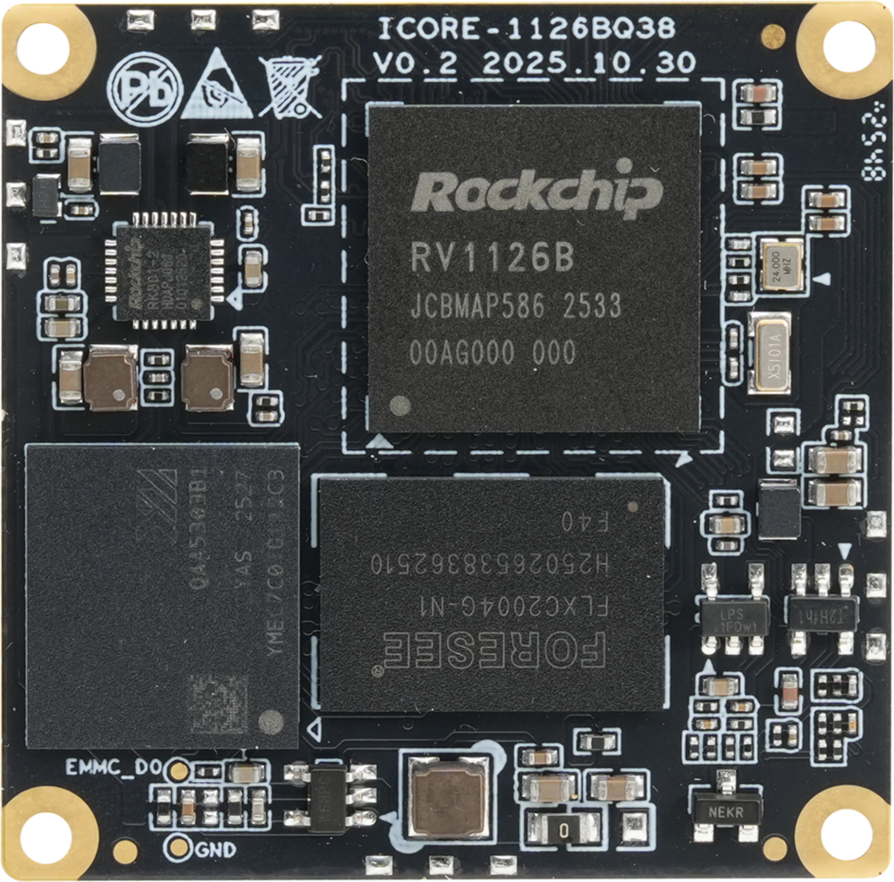
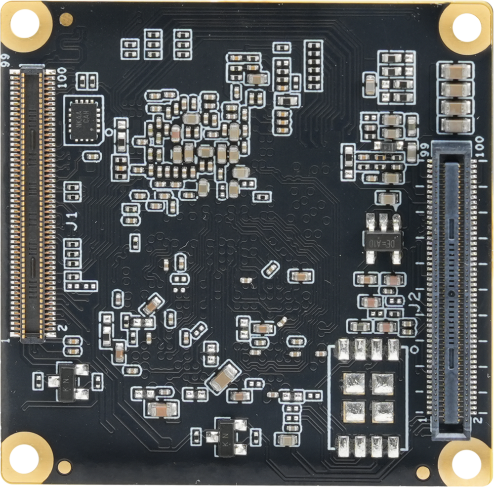
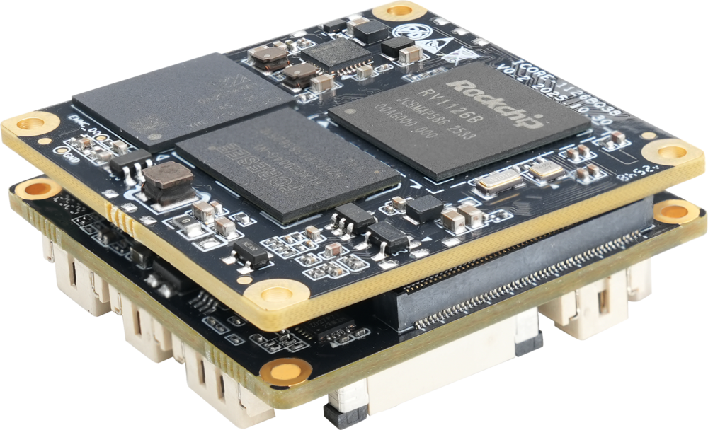
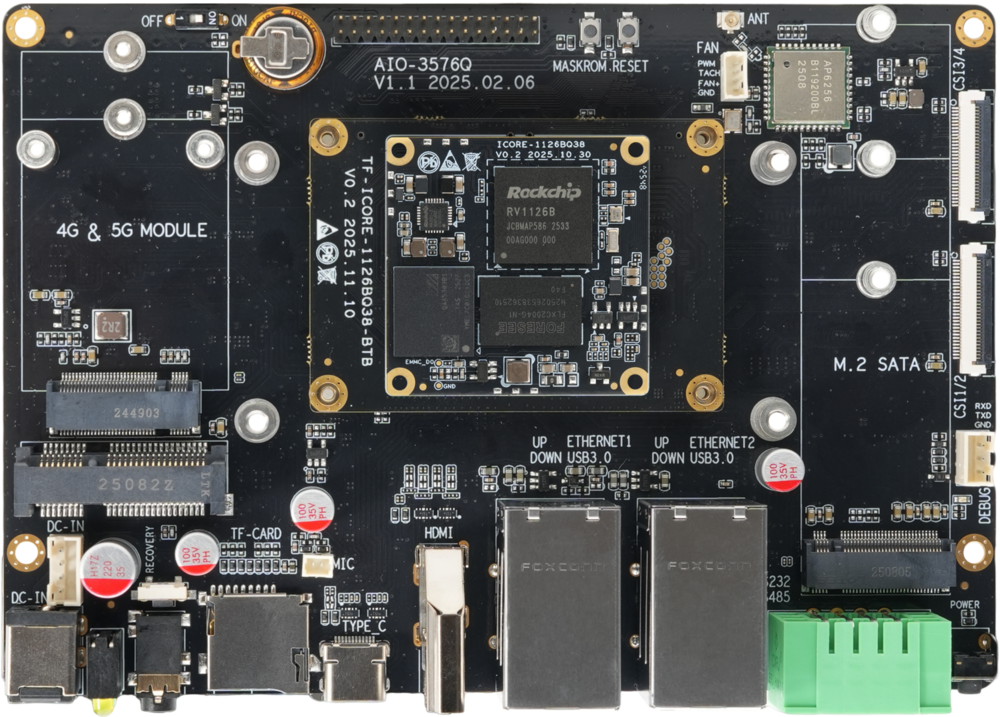
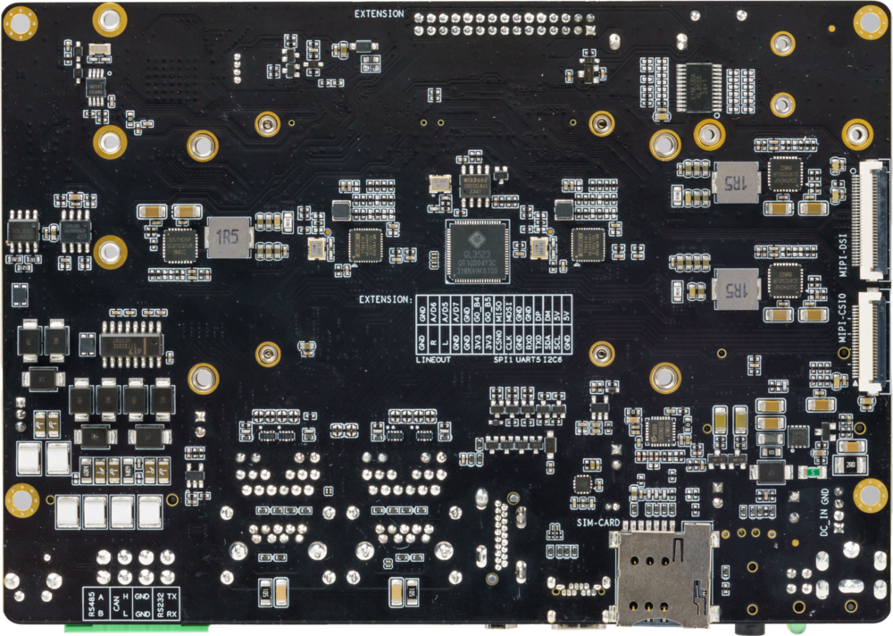

## Introduction

The **ICORE-1126BQ38** utilizes the Rockchip quad-core AI vision processor RV1126B, integrating a 3 TOPS NPU and supporting 2B multimodal large models and deep learning frameworks.  It supports 12M video encoding and 4K video decoding. It features a built-in 12M ISP / 8MP AI-ISP with low power consumption. Hardware AI Remosaic provides ultra-high definition during the day and ultra-low light performance at night. It supports multi-camera AI dynamic stitching for smooth and seamless image merging, AI video 6-axis digital image stabilization, and multi-source fusion (RGB and infrared thermal imaging fusion, visible light and structured light, ToF fusion). It supports AOA low-power sound event detection and has built-in secure SM2/SM3/SM4 encryption algorithms. With a size of only 38mm × 38mm, it is widely applicable to industries such as facial recognition, access control gates, smart security, and smart network cameras.

The **ICORE-1126BQ38** can be combined with different baseboards to form various product configurations, including the CAM-1126BQ38 and AIO-1126BQ38 development kits.

**ICORE-1126BQ38** front：

**ICORE-1126BQ38** back：

### CAM-1126BQ38

This wiki introduces the use of the CAM-1126BQ38 development board.

CAM-1126BQ38 Front:

CAM-1126BQ38 Back:

### AIO-1126BQ38

The AIO-1126BQ38 development board consists of the ICORE-1126BQ38 core board + BTB adapter board + MB-Q-RK3576 baseboard.

Click to jump to the AIO-1126BQ38 development board wiki tutorial:[AIO-1126BQ38 Wiki](../../Motherboard/AIO-1126BQ38/started.md)

AIO-1126BQ38 Front:

AIO-1126BQ38 Back:

 