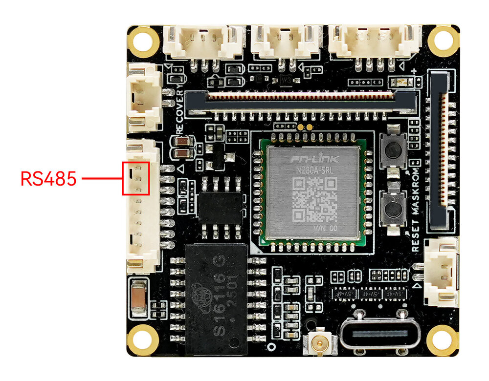
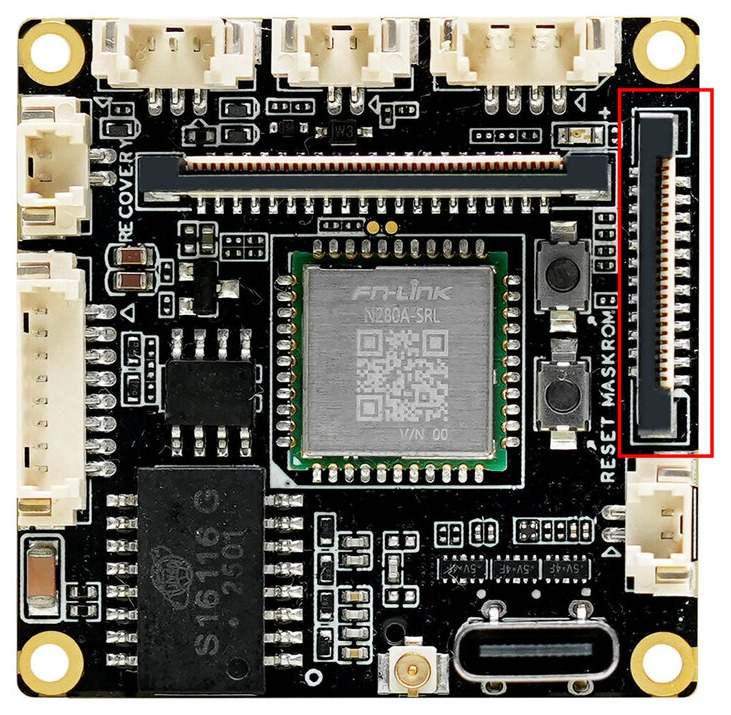

# UART Usage

## Description

EXT-iCore-3576Q38 use `UART11` for `RS485`, which is `/dev/ttyS11` in system. Extended interface using `UART8` for common uart,which is `/dev/ttyS8` in system.

Interfaces:

<center>


</center>

<center>


</center>

## RS485 Usage
```
# close echo
sudo stty -F /dev/ttyS11 -echo
# transmit
sudo echo "firefly uart test..." > /dev/ttyS11
# receive
sudo cat /dev/ttyS11
```
