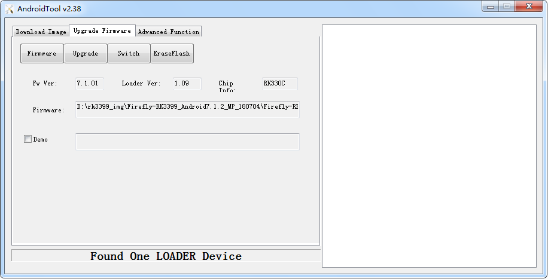
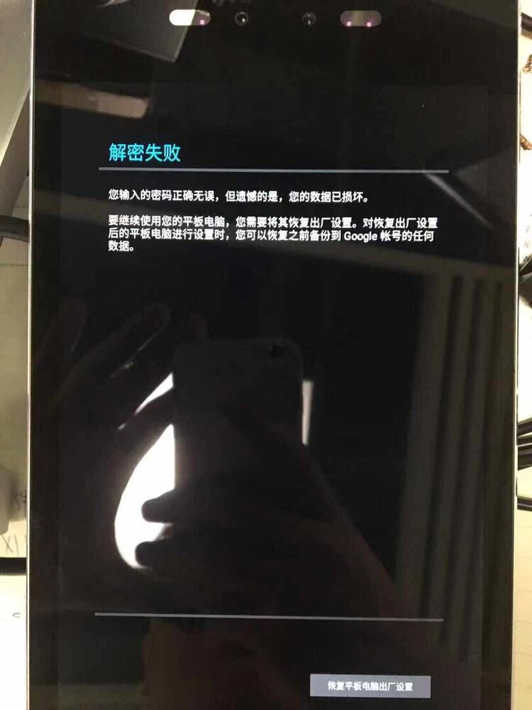

# Upgrade firmware

## Introduction

This article describes how to upgrade the firmware by follow ways:

1. Upgrade through the USB data cable. When upgrading, you need to choose the appropriate upgrade mode according to the host operating system and firmware type.
2. Upgrade through U Disk.

## Upgrade through the USB data cable
### Preparatory work

* Face-RK3399 development board
* Firmware
* Host computer
* Dual male USB date cable
* 20pin integrated transfer cable

There are two types of firmware files:

* A single unified firmware `update.img` that packs the boot loader, parameters, and all partition images together for firmware publishing.
* Multiple partition images, such as `kernel.img`, `rootfs.img`, `recovery.img`, etc. are generated in the development stage.
* You can find the compiled unified [Face-RK3399 firmware](https://community.t-firefly.com/en/doc/download/72) here, download it and unpack it. You can also refer to the instructions for compiling firmware to compile by yourself.

Host operating system support:

> * Windows XP（32/64 bits）
> * Windows 7 (32/64 bits)
> * Windows 8 (32/64 bits)
> * Linux (32/64 bits)

### Windows

* Tool: [AndroidTool_Release_v2.63](https://community.t-firefly.com/en/doc/download/72)

#### Install RK USB drive

Download [Release_DriverAssistant.zip](https://community.t-firefly.com/en/doc/download/72), extract, and then run the `DriverInstall.exe` inside .

In order for all devices to use the updated driver, first select `驱动卸载(Driver uninstall)` and then select `驱动安装(Driver install)`.


#### Connect device

You can put the device into upgrade mode as follows:

* Disconnect the power adapter first:
   * Dual male data cable connects one end to the host and the other end to the development board.
   * Press the `RECOVERY` button on the device and hold.
   * Connect to the power supply.
   * About two seconds later, release the `RECOVERY` button.

The host should prompt for new hardware and configure the driver. Open Device manager and you will see the new Device `Rockusb Device` appear as shown below. If not, you need to go back to the previous step and reinstall the driver.


### Upgrade firmware

Download [AndroidTool](https://community.t-firefly.com/en/doc/download/72). AndroidTool defaults to display in Chinese. We need to change it to English. Open `config.ini` with an text editor (like notepad). The starting lines are:

```
#选择工具语言:Selected=1(Chinese);Selected=2(English)
[Language]
Kinds=2
Selected=1
LangPath=Language\
```

Change `Selected=1` to `Selected=2`, and save. From now on, AndroidTool will display in English.Now, `run AndroidTool.exe`: (Note: If using Windows 7/8, you’ll need to right click it, select to run it as Administrator)


#### Upgrade unified firmware - update.img

The steps to update the unified firmware `update.img` are as follows:

1. Switch to the `upgrade firmware` page.
2. Press the `firmware` button to open the firmware file to be upgraded. The upgrade tool displays detailed firmware information.
3. Press the `upgrade` button to start the upgrade.
4. <font color=#ff0000 >If the upgrade fails, you can try to erase the Flash by pressing the `erase Flash` button first, and then upgrade. Be sure to erase and upgrade according to [Upgrade instructions](upgrade_table.md).</font>

**Note: if the firmware laoder you wrote is inconsistent with the original one, please execute `wipe Flash` before upgrading the firmware.**



#### Upgrade Partition image

Each firmware partition may be different, please note the following point:

* The default configuration can be used when upgrading Ubuntu(MBR), Ubuntu(GPT) and Android 7.1 with Androidtool_2.58.
* Execute follow operation when upgrading Android 8.1:

<font color=#ff0000 >
	1. Switch to `Download Image` tab page.
	2. Right click on the table and select `Load Config`.
	3. Select `rk3399-Android81.cfg`.
</font>

The steps to upgrade the partition image are as follows:
	1. Switch to the "Download Image" page.
	2. Check the partition to be burned, and select multiple.
	3. Make sure the path of the image file is correct. If necessary, click the blank table cell on the right side of the path to select it again.
	4. Click "Run" button to start the upgrade, and the device will restart automatically after the upgrade.


### Linux

There is no need to install device driver under Linux. Please refer to the Windows section to connect the device.

#### Upgrade_tool

Download [Linux_Upgrade_Tool](https://community.t-firefly.com/en/doc/download/72), And install it into the system as follows for easy invocation:

```
unzip Linux_Upgrade_Tool_xxxx.zip
cd Linux_UpgradeTool_xxxx
sudo mv upgrade_tool /usr/local/bin
sudo chown root:root /usr/local/bin/upgrade_tool
sudo chmod a+x /usr/local/bin/upgrade_tool
```

### Upgrade unified firmware - *update.img*：

```
sudo upgrade_tool uf update.img
```

Try to erase first before upgrade if upgrade failed.

```
# erase flash : Using the ef parameter requires the loader file or the corresponding update.img to be specified.
# update.img :The ubuntu firmware you need to upgrade.
sudo upgrade_tool ef update.img
# upgrade again
sudo upgrade_tool uf update.img
```

### Upgrade Partition image

Ubuntu(MBR)、Android7.1、Android8.1: Using the following methods:

```
sudo upgrade_tool di -b /path/to/boot.img
sudo upgrade_tool di -k /path/to/kernel.img
sudo upgrade_tool di -s /path/to/system.img
sudo upgrade_tool di -r /path/to/recovery.img
sudo upgrade_tool di -m /path/to/misc.img
sudo upgrade_tool di resource /path/to/resource.img
sudo upgrade_tool di -p paramater   # upgrade parameter
sudo upgrade_tool ul bootloader.bin # upgrade bootloader
```

Ubuntu(GPT): Using the following methods:

```
sudo upgrade_tool ul $LOADER
sudo upgrade_tool di -p $PARAMETER
sudo upgrade_tool di -uboot $UBOOT
sudo upgrade_tool di -trust $TRUST
sudo upgrade_tool di -b $BOOT
sudo upgrade_tool di -r $RECOVERY
sudo upgrade_tool di -m $MISC
sudo upgrade_tool di -oem $OEM
sudo upgrade_tool di -userdata $USERDATA
sudo upgrade_tool di -rootfs $ROOTFS
```

If the upgrade fails due to flash problems, you can try low-level formatting and erase nand flash:

```
sudo upgrade_tool lf update.img	# low-level formatting
sudo upgrade_tool ef update.img	# erase
```

### Enter MaskRom mode

If the development board cannot enter recovery mode. You can try to enter MakRom mode. For the operation method, see [How to enter MaskRom mode](maskrom_mode.md)


## Upgrade through U Disk

### Preparatory work

* Face-RK3399 development board
* OTA firmware
* A FAT32 format U Disk

### Generate OTA upgrade firmware

* After compiling the uboot, kernel in  downloaded SDK, execute the following command in the root directory:

```
make -j8 && ./mkimage.sh ota && make otapackage -j8 && ./FFTools/mkupdate/mkupdate.sh
```

The OTA upgrade firmware `xxx.zip` will generate in `out/target/product/rk3399_firefly_face`.

### Upgrade steps

1. Rename OTA upgrade firmware `xxx.zip` to `update.zip`.
2. Copy `update.zip` to the root directory of the FAT32 format U Disk.
3. After the machine is powered on, insert the U Disk into the USB interface of the non OTG port.
4. Wait a few seconds, an indicator box will pop up on the screen and click the Install button.
5. Wait for the machine to restart. This process will take you a few minutes.

### Note

1. A U Disk in FAT32 format is required, which is not supported in other formats.
2. The U Disk need insert into the USB interface of the non TOG port.
3. Ensure that the firmware before upgrade is also generate by method `./mkimage ota`.
4. OTA firmware is limited by timestamps. You can only upgrade the old timestamped firmware with the new one.
5. After the upgrade is completed, you will be prompted whether to delete the OTA firmware of the U Disk. Please be careful.
6. Because it is OTA's way of packaging firmware,  if the customer wants to replace the `kernel.img` and `resource.img`, you need to execute `./mkimage.sh ota` to package the `kernel.img` and `resource.img` into `boot.img`, and then burn `boot.img` again.
7. The indicator box will pop up after waiting no more than 1 minute in step 4 of upgrade. If not, you need to execute follow step:
	* a. Enter resource manager and enter U Disk, copy `update.zip` into the root directory of `sdcard(Internal Memory)`.
	* b. Reboot machine after copying. After power on, wait for a few seconds, and the upgrade indicator box will pop up. Click to continue upgrading.
8. If there is an error message of decryption failure in the process of upgrading machine, please click "restore factory settings" and wait for the restart.

