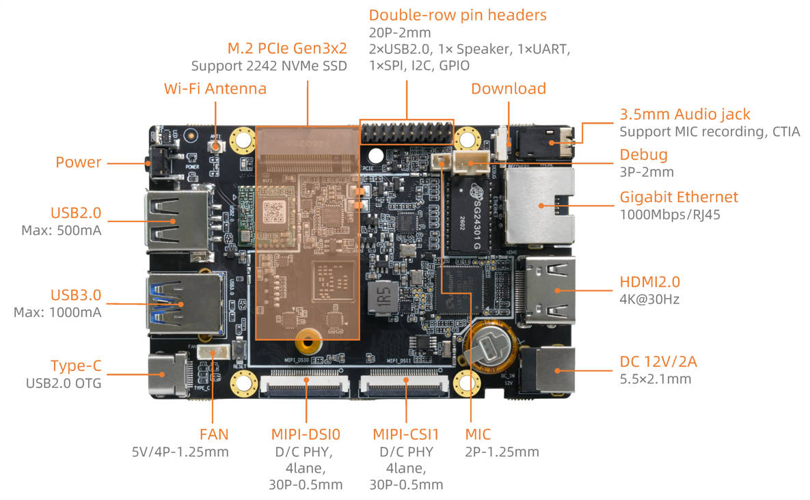

# Interface Definition

## Device Interface Definition

Firefly-Q6490A provides these interfaces:

* Power Port
* 1 x Type-C (For firmware download)
* 1 x USB3.0
* 1 x USB2.0
* 1 x 1000M Ethernet RJ45
* 1 x HDMI 2.0
* 1 x TF Card slot
* 1 x 3.5mm headphone jack
* 1 x M.2 PCIE
* 1 x MIPI-DSI
* 2 x MIPI-CSI
* Download Key
* Power Key
* Expansion Pin Header

As shown in the figure below:

