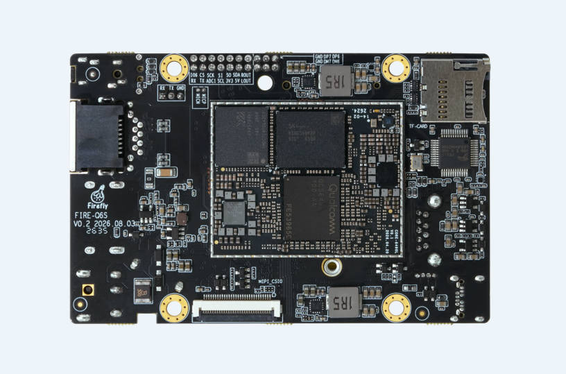

# Introduction

Firefly-Q6490A is powered by the Qualcomm QCS6490 octa-core 64-bit processor, with a maximum CPU frequency of 2.7GHz. It integrates an Adreno 643 GPU and a Hexagon 770 NPU, delivering 12 TOPS of dense AI computing power. It has on-board LPDDR5 memory and eMMC storage, supports 4K@60fps decoding and 4K@30fps encoding, and can be connected to MIPI CSI cameras. It is equipped with a Gigabit Ethernet port and WiFi6 / Bluetooth 5.2, and provides high-speed expansion interfaces such as PCIE, MIPI and USB. It is adapted to Qualcomm Linux and Ubuntu 24 systems, supports mainstream AI frameworks and on-device private deployment of large models, and is suitable for edge computing, intelligent surveillance, machine vision, embedded AI and other scenarios.

