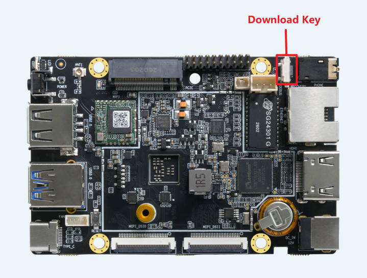
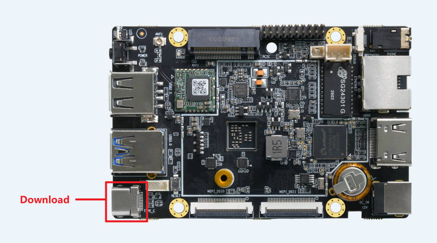
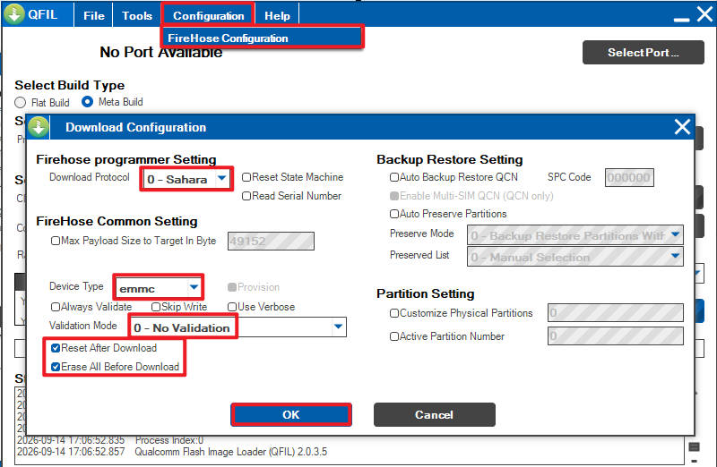

# Upgrade Complete Firmware

## Before Upgrade

### Intro

This tutorial introduces how to download firmware to device through Type-A to C USB cable.

### Prepare
* Firefly-Q6490A
* Windows PC with x86_64 arch cpu.
* Type-A to C USB cable

### Get Firmware

You can build firmware from SDK, or download from [Resources Download](TODO) (complete firmware).

* Complete firmware

    Complete firmware is an archive with every part (like parameter, bootloader, kernel, system, etc.) in it. Complete firmware will be an archive contains lots of files. Firmwares released officially by Firefly Team will all be complete firmwares. Download complete firmware to device will erase all data and partitions.

* Partition image

    A partition image only contains the content of a single partition. The most commonly used ones are boot.img and dtbo.img. Download partition images is often used for partial upgrades, functional verification, and comparative analysis. The prerequisite for using partition images is that the device is operating normally. If the device cannot boot up, only the complete firmware can be used.

### Install Tools
* Install USB drivers

Please download from [USB Driver](TODO).

There are two drivers. First install Qualcomm USB Driver, double click the exe file to run, accept the EULA and always click "next", finally click "finish".

Then install Google USB driver, extract `usb_driver_r13-windows.zip`, right click the `android_winusb.inf` and click "install", always click "confirm".

* Install QTSP

Please download form [QTSP Tool](TODO).

Extract, then double click `QPST.2.7.496.1.exe`, accept the EULA and always click "next", then click "install", finally click "finish".

After installation, the tool we need is C:\Program Files (x86)\Qualcomm\QPST\bin\QFIL.exe

Double click QFIL.exe to open it.

* Install Android SDK Platform-Tools

Download from [Platform Tools](TODO).

Extract it after download, you will find adb.exe and fastboot.exe


## Enter EDL (Emergency Download) mode

### Hardware Way

1. First, make sure the device is completely disconnected from the power supply.

2. Use Type-A to C USB cable to connect the Download port of the device to the PC.

3. Use a needle or other thin object to insert into the headphone jack, press and hold the download button inside.

4. Connect the power supply.

5. Release the download button after 2 seconds.

<center>

</center>
### Software Way

While the device is running normally, connect device's download port with PC through Type-A to C USB cable, run this command on device terminal or debug console:

```shell
sudo systemctl reboot edl
```

<center>


</center>

### Check EDL

If the device entered EDL mode, QFIL tool will show "Qualcomm HS-USB QDLoader 9008".

<center>


</center>

Or it could show "Please Select an Existing Port", then you have to click "SelectPort", also can see "Qualcomm HS-USB QDLoader 9008", select it and click "OK".

<center>


</center>

## Download Firmware

1 Click "Configuration", then click "FireHose Configuration", in the pop-up window, config it according to the following pictrue, then click "OK".

<center>

</center>

2 In the main page, select "Flat Build", then click "Browse"

<center>


</center>

3 Navigate to your firmware location, choose "All Files" in file type, then find "xbl_s_devprg_ns.melf" (or maybe "prog_firehose_ddr.elf", different SOCs very in filenames)and click "open".

<center>


</center>

4 In the main page, click "Load XML", in the pop-up window, select all xml files and click "open", then the same window will pop-up again, and select all xml files again and click "open".

<center>


</center>

<center>


</center>

5 Finally click "Download", wait it to finish, it will take few minutes. Download success will be like:

<center>


</center>

6 After the download is complete, wait for a while and the device will automatically reboot.