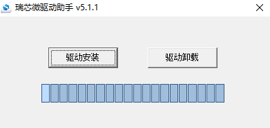
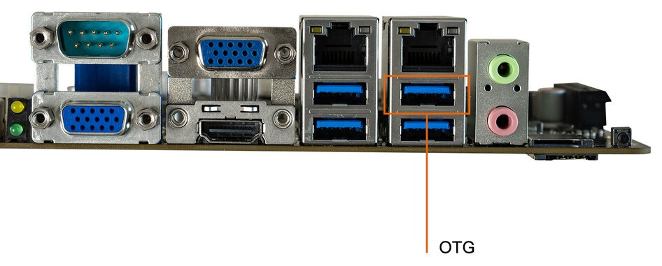
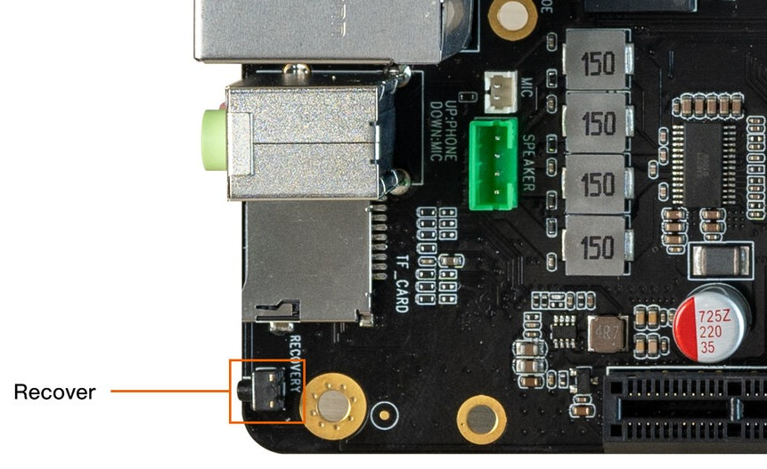
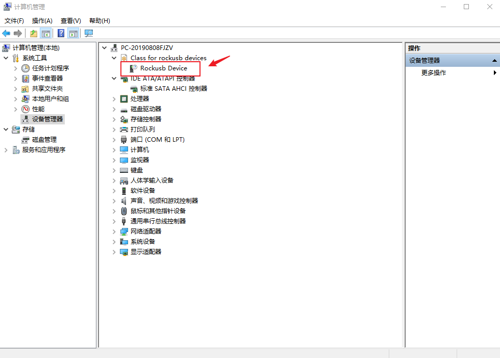
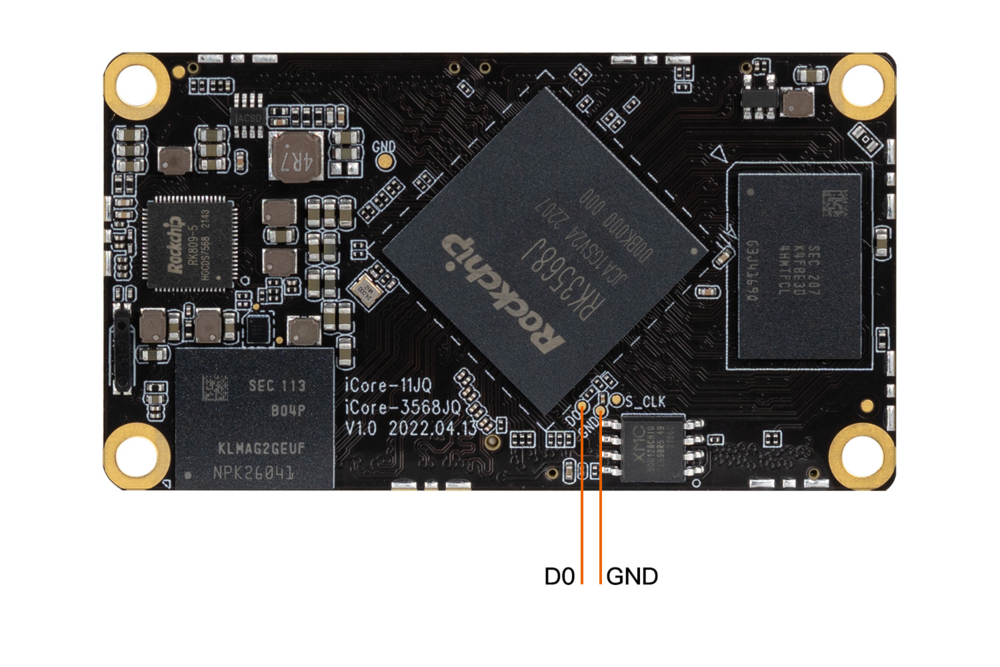
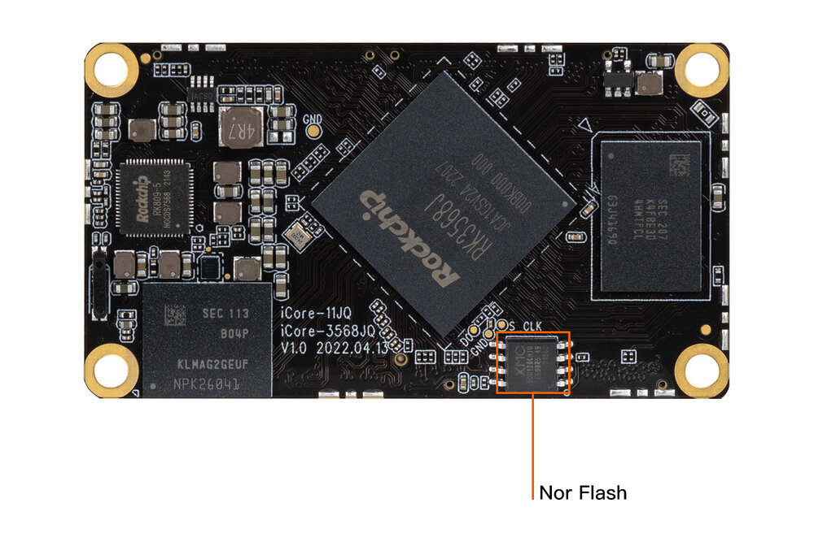

# Upgrade the firmware via USB cable

## Introduction

This article describes how to upgrade the firmware file on the host to the flash memory of the development board through the Double male USB data cable. When upgrading, you need to choose the appropriate upgrade mode according to the host operating system and firmware type.

## Preparatory Tools

* ITX-3568Q development board
* Firmware
* host computer
* Double male USB data cable

There are two types of firmware files:

* A single unified firmware

	The unified firmware is a single file packaged and merged by all files such as the partition table, bootloader, uboot, kernel, system and so on. The firmware officially released by Firefly adopts a unified firmware format. Upgrading the unified firmware will update the data and partition table of all partitions on the motherboard, and erase all data on the motherboard.

* Multiple partition images

	That is, files with independent functions, such as partition table, bootloader, and kernel, are generated during the development phase. The independent partition image can only update the specified partition, while keeping other partition data from being destroyed, it will be very convenient to debug during the development process.

> Through the unified firmware unpacking / packing tool, the unified firmware can be unpacked into multiple partition images, or multiple partition images can be merged into a unified firmware.

In order to avoid the burning problem caused by the upgrade tool version, it is recommended to use the tool packaged inside the public firmware package for burning. After decompressing the public firmware package, it is as follows:
```shell
XXXX_Android11_HDMI_XXXX
├── XXXX_Android11_HDMI_XXXX.img
├── linux
│   └── Linux_Upgrade_Tool_v1.59.zip
└── windows
    ├── DriverAssitant_v5.1.1.zip
    └── RKDevTool_Release_v2.81.zip
```

### Windows

* Tool: Use tools in the firmware package or download here [Androidtool_xxx (version number)](https://community.t-firefly.com/en/doc/download/163)

AndroidTool defaults to display in Chinese. We need to change it to English. Open `config.ini` with an text editor (like notepad). The starting lines are:

```
#Language Selection: Selected=1(Chinese); Selected=2(English)
[Language]
Kinds=2
Selected=1
LangPath=Language\
```

Change `Selected=1` to `Selected=2`, and save. From now on, AndroidTool will display in English.Now, run AndroidTool.exe: (Note: If using Windows 7/8, you’ll need to right click it, select to run it as Administrator)

<center>


</center>

#### Install RK USB drive

Download [Release_DriverAssistant.zip](https://community.t-firefly.com/en/doc/download/163), extract, and then run the DriverInstall.exe inside .
In order for all devices to use the updated driver, first select `Driver uninstall`(`驱动卸载`) and then select `Driver install`(`驱动安装`).

<center>


</center>

#### Connect devices

we can put the device into upgrade mode by hardware as follows:

* Disconnect the power adapter first:
* Dual male usb data cable connects one end to the host and the other end to the development board.
<center>


</center>

* Press the `RECOVERY` button on the device and hold.
<center>


</center>

* Connect to the power supply.
* About two seconds later, release the `RECOVERY` button.
put the device into upgrade mode by software as follows:

Double male USB data cable is connected, use the command in the serial debugging terminal or adb shell

```shell
reboot loader
```


The host should prompt for new hardware and configure the driver. Open Device manager and you will see the new Device `Rockusb Device` appear as shown below. If not, you need to go back to the previous step and [reinstall the driver](03-upgrade_firmware.md).

<center>


</center>

### Linux

There is no need to install device driver under Linux. Please refer to the Windows section to connect the device.

* Tool : Use tools in the firmware package or download here [upgrade_tool_xxx (version number)](https://community.t-firefly.com/en/doc/download/163)
* Tool : [Linux_adb_fastboot]


#### Upgrade_tool

Install it into the system as follows for easy invocation:

```
unzip Linux_Upgrade_Tool_xxxx.zip
cd Linux_UpgradeTool_xxxx
sudo mv upgrade_tool /usr/local/bin
sudo chown root:root /usr/local/bin/upgrade_tool
sudo chmod a+x /usr/local/bin/upgrade_tool
```

## MaskRom Mode
`MasRrom` mode is the last line of defense against device being bricked. Forced entry `MaskRom` involved hardware operation, have certain risk, so only in the situation that deivce failed entering the `Loader` mode, you can try `MaskRom` mode.

**Please read carefully and operate carefully!**

The operation steps are as follows:

1. Disconnect all power supplies.
1. Connect device and host PC with Double male USB data cable.
1. Use a metal tweezer to short and hold the two test points as shown in the following figure on iCore-3568JQ (as shown in the figure below).
1. Connect the power.
1. Wait a few seconds, stop shorting.

Short circuit the D0 and GND test points near EMMC 
<center>


</center>

At this point, the device should go into `MaskRom mode`.

<center>


</center>


## Upgrade the firmware

Determine the board ITX-3568Q before upgrading unified firmware update.img whether has Nor Flash, as shown in the figure below: 

<center>


</center>

If the board has Nor Flash, please refer to chapter [Switching Upgrade Storage](03-upgrade_firmware_with_flash.md) for upgrading, else please follow the steps below to continue: 

### Windows

#### Upgrade unified firmware - update.img

The steps to update the unified firmware `update.img` are as follows:

1. Switch to the "upgrade firmware" page.
2. Press the "firmware" button to open the firmware file to be upgraded. The upgrade tool displays detailed firmware information.
3. Press the "upgrade" button to start the upgrade.
4. If the upgrade fails, you can try methods in [Switching Upgrade Storage](03-upgrade_firmware_with_flash.md)

### Linux

#### Upgrade unified firmware - update.img

```
sudo upgrade_tool uf update.img
```
If the upgrade fails, you can try methods in [Switching Upgrade Storage](03-upgrade_firmware_with_flash.md)

[烧写须知]: 02-upgrade_table.md
[iCore-3568JQ firmware]: https://community.t-firefly.com/en/doc/download/163
[Androidtool_xxx (version number)]: https://community.t-firefly.com/en/doc/download/163#windows_12
[Release_DriverAssistant.zip]: https://community.t-firefly.com/en/doc/download/163#windows_341
[Linux_Upgrade_Tool]: https://community.t-firefly.com/en/doc/download/163#linux_12
[upgrade_tool_xxx (version number)]: https://community.t-firefly.com/en/doc/download/163#linux_12
