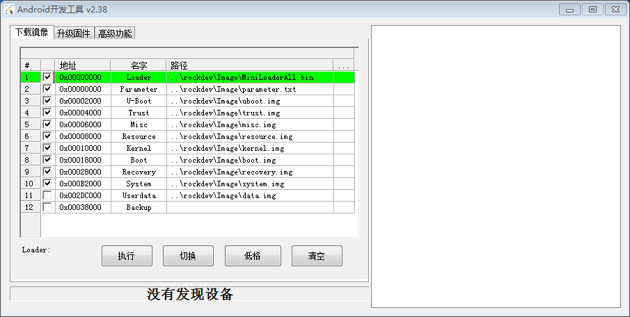
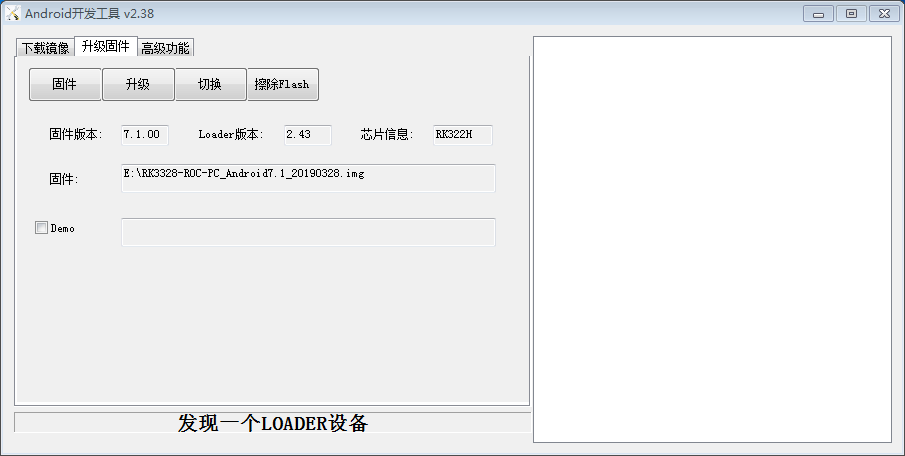

# Flash Image
## Introduction
This page describes how to flash the image file from the host to the development board's eMMC, via the Type-C cable or USB OTG + Type-C adapter(Hereinafter referred as Type-C).

Please choose the right way according to the host OS and the type of image file .
## Preparatory Work

### Board and Host OS
 * ROC-RK3328-CC development board
 * Image file
 * Host PC
 * Type-C Cable / Dual male usb data cable  

There are two types of image file:  

 * Packed image, often known as update.img, which contains the bootloader, parameter and all the partition image files. It is used for firmware release.
 * Partition image, like kernel.img, boot.img, recovery.img, etc, which are created during development.  

You can find the compiled unified [ROC-RK3328-CC firmware](https://community.t-firefly.com/en/doc/download/65) here, and extract it after downloading. You can also compile it yourself by referring to the instructions for compiling the firmware.  

Supported host OS:
 * Windows XP （32/64bit
 * Windows 7 (32/64bit)
 * Windows 8 (32/64bit)
 * Linux (32/64bit)

<a id="androidtool"></a>

### Install RK USB Driver
Download [Release_DriverAssistant.zip](https://community.t-firefly.com/en/doc/download/65), then "驱动安装"(Driver install).), uncompress it, then run DriverInstall.exe inside.  

In order to use new driver for all the rockchip devices, please select "驱动卸载"(Driver uninstall), then "驱动安装"(Driver install).  


### Device Mode
There are two ways to switch the device to upgrade mode.  

The first one, device is cut off all the power sources, such as power adapter and Type-C connection:
 1. Keep Type-A cable connected with host PC.
 2. Press and hold RECOVERY key.
 3. Connect Type-C cable to the device.
 4. After around two seconds, release RECOVERY key.    

The other way:

 1. Use Type-C cable to connect host and device together.
 2. Press and hold RECOVERY key.
 3. Shortly press RESET key.
 4. After around two seconds, release RECOVERY key.
  
The host will prompt to have new device detected and configured. Open the Device Management, you'll find a new device name "Rockusb Device", as shown below. Return to previous step to reinstall driver if it is not shown.


### Download Firmware

* [Firmware Download Page](https://community.t-firefly.com/en/doc/download/65)

### Download Tool for upgrade
Windows OS:
1. Flash Linux(GPT) or Android8.1 [AndroidTool_v2.58](http://download.t-firefly.com/product/RK3328/Tools/AndroidTool/AndroidTool_Release_V2.58.zip)
2. Flash Android7.1 [AndroidTool_v2.38](http://download.t-firefly.com/product/RK3328/Tools/AndroidTool/AndroidTool_Release_v2.38.rar)
3. Flash Android10  [AndroidTool_v2.71](http://download.t-firefly.com/product/RK3328/Tools/AndroidTool/AndroidTool_Release_v2.71.zip)

Linux OS:
1. Flash Linux(GPT) or Android8.1 [Upgrade_tool_v1.34](http://download.t-firefly.com/product/RK3328/Tools/Linux_Upgrade_Tool/Linux_Upgrade_Tool_1.34.zip)
2. Flash Android7.1 [Upgrade_tool_v1.24](http://download.t-firefly.com/product/RK3328/Tools/Linux_Upgrade_Tool/Linux_Upgrade_Tool_v1.24.zip)
3. Flash Android10  [Upgrade_Tool_v1.49](http://download.t-firefly.com/product/RK3328/Tools/Linux_Upgrade_Tool/Linux_Upgrade_Tool_v1.49.zip)

## Flash on windows
Download AndroidTool,and Uncompress it . AndroidTool defaults to display in Chinese. We need to change it to English. Open config.ini with an text editor (like notepad). The starting lines are:
```
#选择工具语言:Selected=1(Chinese);Selected=2(English)
[Language]
Kinds=2
Selected=1
LangPath=Language\
```
Change "Selected=1" to "Selected=2", and save. From now on,  AndroidTool will display in English.  
Now, run AndroidTool.exe: (Note: If using Windows 7/8, you'll need to right click it, select to run it as Administrator)



### Flash update.img
Steps of flashing update.img:
1. Switch to "Upgrade Firmware" tab page.
2. Click "Firmware" button and open the image file. Detail information of the image file, like version and chip, is shown.
3. Click "Upgrade" button to start flash.



<font color=#ff0000>If the upgrade fails, Maybe the version of firmware you flash is different from version of the original machine, you can try to erase the Flash by pressing the "EraseFlash" button before upgrading. .</font>

* WARNING:"EraseFlash" Be sure to erase and upgrade according to the [Flashing Notes]

### Flash partition image
The partition of each firmware may be different. Please note the following two points:
* Use Androidtool_2.38 to upgrade Android7.1 firmware using the default configuration;
* Use Androidtool_2.58 to upgrade ubuntu (GPT) to use the default configuration. To upgrade Android8.1 firmware, please do the following:
* Use Androidtool_2.71 to upgrade Android10 firmware using the default configuration;

<font color=#ff0000>Switch to “Download Page”; right click on the form and select “Load Config”; select rk3328-Android81.cfg.</font>

Steps of flashing partition images:
 
 1. Switch to "Download Image" tab page.
 2. Check the partitions you want.
 3. Make sure the image file's path is correct. Click the rightmost empty table cell to select new path if needed.
 4. Click "Run" button to start flashing. Device will reboot automatically when finish.


<a id="upgrade-tool"></a>

## Flash on linux
There is no need to install a device driver under Linux. You can connect to the device by referring to the Windows chapter.

Download Upgrade_Tool and install it follow the command to host filesystem :
```
   unzip Linux_Upgrade_Tool_xxxx.zip
   cd Linux_UpgradeTool_xxxx
   sudo mv upgrade_tool /usr/local/bin
   sudo chown root:root /usr/local/bin/upgrade_tool
   sudo chmod a+x /usr/local/bin/upgrade_tool
```
<font color=#ff0000>NOTE: If you are prompted with the following error:</font>
```
upgrade_tool: error while loading shared libraries: libudev.so.1: cannot open shared object file: No such file or directory
```
You can use the following command to solve：
```
sudo ln -sf /lib/i386-linux-gnu/libudev.so.1 /lib/i386-linux-gnu/libudev.so.0
```
### Flashing firmware:
```
sudo upgrade_tool uf update.img #update.img:Firmware to be upgraded
```
If the upgrade fails, you can try to erase and then upgrade. Be sure to erase and upgrade according to the table of [Flashing Notes].
```
# erase flash
sudo upgrade_tool ef update.img #update.img:Firmware to be upgraded
# flashing
sudo upgrade_tool uf update.img 
```
### Flashing partition images
Android7.1 use the following way:
```
sudo upgrade_tool di -b boot.img
sudo upgrade_tool di -k kernel.img
sudo upgrade_tool di -s system.img
sudo upgrade_tool di -r recovery.img
sudo upgrade_tool di -m misc.img
sudo upgrade_tool di resource resource.img
sudo upgrade_tool di -p paramater   #flash parameter
sudo upgrade_tool ul bootloader.bin #flash bootloader
sudo upgrade_tool di trust trust.img #flash trust
```
Android8.1 use the following way:
```
sudo upgrade_tool ul bootloader.bin # flash bootloader
sudo upgrade_tool di -p paramater   # flash parameter
sudo upgrade_tool di -uboot uboot.img
sudo upgrade_tool di -trust trust.img
sudo upgrade_tool di -m misc.img
sudo upgrade_tool di -baseparameter baseparameter.img
sudo upgrade_tool di -b boot.img
sudo upgrade_tool di -k kernel.img
sudo upgrade_tool di -resource resource.img
sudo upgrade_tool di -r recovery.img
sudo upgrade_tool di -s system.img
sudo upgrade_tool di -vendor vendor.img
sudo upgrade_tool di -oem oem.img
```

Android10 use the following way:
```
sudo upgrade_tool di -b boot.img
sudo upgrade_tool di -dtbo dtbo.img  
sudo upgrade_tool di -misc misc.img
sudo upgrade_tool di -parameter parameter.txt
sudo upgrade_tool di -r recovery.img
sudo upgrade_tool di -super super.img
sudo upgrade_tool di -trust trust.img
sudo upgrade_tool di -uboot uboot.img
sudo upgrade_tool di -vbmeta vbmeta.img

```

Ubuntu(GPT) use the following way:
```
sudo upgrade_tool ul $LOADER
sudo upgrade_tool di -p $PARAMETER
sudo upgrade_tool di -uboot $UBOOT
sudo upgrade_tool di -trust $TRUST
sudo upgrade_tool di -b $BOOT
sudo upgrade_tool di -r $RECOVERY
sudo upgrade_tool di -m $MISC
sudo upgrade_tool di -oem $OEM
sudo upgrade_tool di -userdata $USERDATA
sudo upgrade_tool di -rootfs $ROOTFS
```
If errors occur due to flash problem, you can try to low format, or erase the flash:
```
upgrade_tool lf update.img # low format flash
upgrade_tool ef update.img # erase flash
```
## FAQS
### How to enter MaskRom mode
If Loader mode is not available , you might need to enforce the device into MaskRom mode.

[Getting Started]: getting_started.md
[FAQ]: faqs.md
[Serial Debug]: debug.md
[Building Linux Root Filesystem]: linux_build_ubuntu_rootfs.md
[Contact]: resource.md#community
[Raw Firmware]: getting_started.md#raw-firmware-format
[RK Firmware]: getting_started.md#rk-firmware-format
[Partition Image]: getting_started.md#partition-image
[SDCard Installer]: flash_sd.md#sdcard-installer
[Etcher]: flash_sd.md#etcher
[dd]: flash_sd.md#dd
[SD Firmware Tool]: flash_sd.md#sd-firmware-tool
[AndroidTool]: flash_emmc.md#androidtool
[upgrade_tool]: flash_emmc.md#upgrade-tool
[rkdeveloptool]: flash_emmc.md#rkdeveloptool
[Rockusb Mode]: flash_emmc.md#rockusb-mode
[Maskrom Mode]: flash_emmc.md#maskrom-mode
[Rockusb Driver]: flash_emmc.md#rockusb-driver
[ROC-RK3328-CC]: http://en.t-firefly.com/product/rocrk3328cc.html "ROC-RK3328-CC Official Website"
[Download Page]: https://community.t-firefly.com/en/doc/download/34
[Forum]: http://bbs.t-firefly.com/
[Facebook]: https://www.facebook.com/TeeFirefly
[Google+]: https://plus.google.com/u/0/communities/115232561394327947761
[Youtube]: https://www.youtube.com/channel/UCk7odZvUrTG0on8HXnBT7gA
[Twitter]: https://twitter.com/TeeFirefly
[USB Serial Adapter]: https://www.firefly.store/products/usb-to-uart-module-cp2104 
[5V2A US Adapter]: https://www.firefly.store/products/5v2a-us-adapter-3c-fcc-ce 
[eMMC Flash]: https://www.firefly.store/products
[Storage Map]: http://opensource.rock-chips.com/wiki_Partitions#Default_storage_map