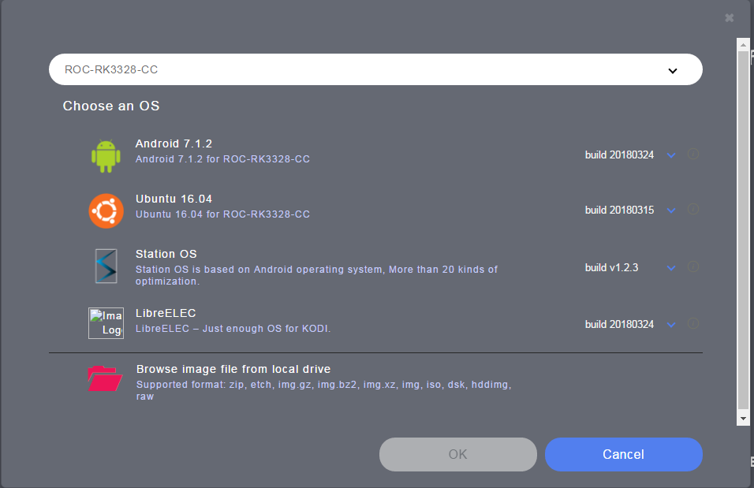
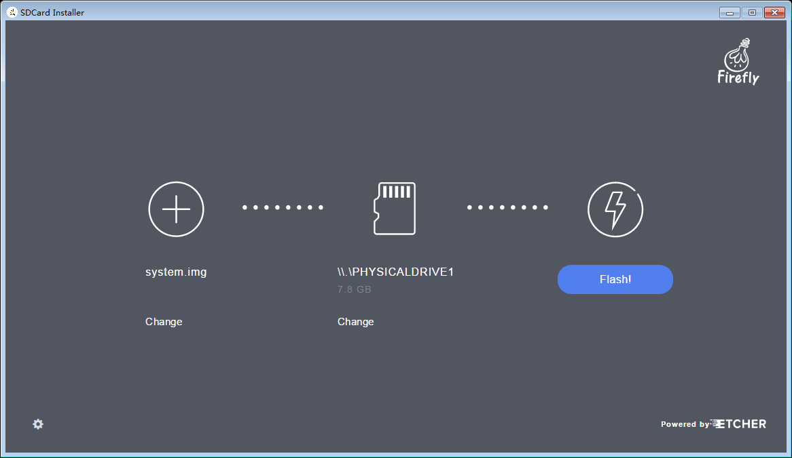
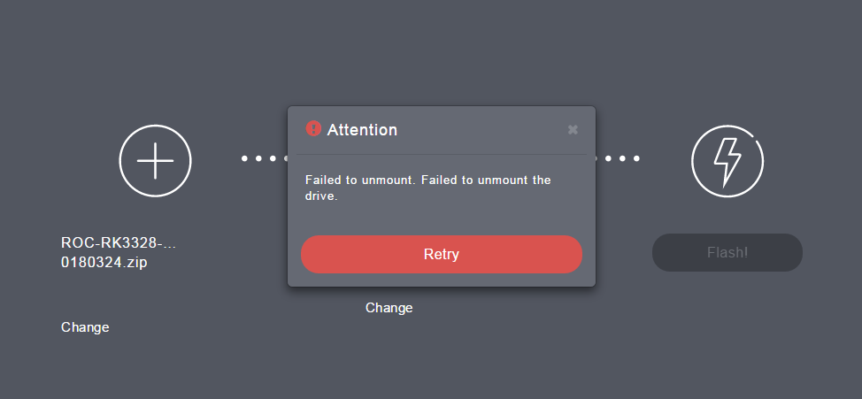
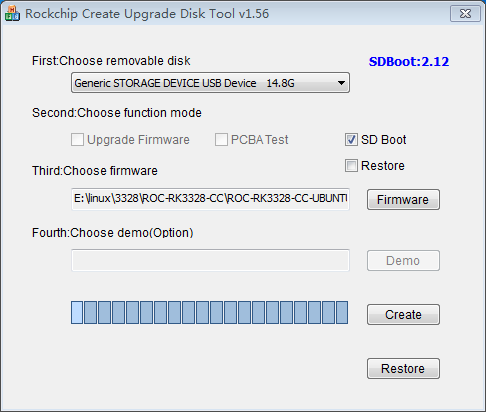
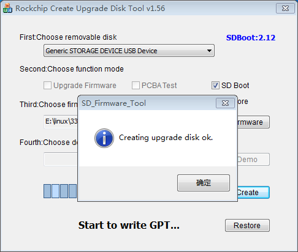

# Flashing to the SD Card

We will introduce how to flash the firmware to the SD card. Read about [firmware format](getting_started.md#firmware-format) if of any doubt.

We recommend using [SDCard Installer] to flash the [Raw Firmware], and [SD Firmware Tool] to flash the [RK Firmware].

Here's the available OS list of firmware:

- Android 7.1.2
- Ubuntu 16.04
- Ubuntu 18.04
- Debian 9
- LibreELEC 9.0

## Preparing the SD Card

Please read this good article about [how to prepare a SD card](https://docs.armbian.com/User-Guide_Getting-Started/#how-to-prepare-a-sd-card) first, to make sure that you have a **good, reliable and fast** SD card, which is of essential importance for system stability.

## Download Firmware

[Firmware Download Page](https://community.t-firefly.com/en/doc/download/34)

***Firmware description***: the firmware is divided into [Raw Firmware] and [RK Firmware], which has been classified into different folders. The latest firmware is the one with the latest date, which is often more stable. Please choose the correct tool according to the type of firmware you need.

## Flashing Tools

Please choose the flashing tool according to your host PC OS:

- Flash the [Raw Firmware]
    + GUI:
        * [SDCard Installer] (Linux/Windows/Mac)
        * [Etcher] (Linux/Windows/Mac)
        * [SD Firmware Tool] (Windows)
    + CLI:
        * [dd] (Linux)

- Flash the [RK Firmware]
    + GUI:
        * [SD Firmware Tool] (Windows)
    + CLI:
        * [dd] (Linux)

    
### SDCard Installer

The easiest way to flash the [Raw Firmware] is to use the official [SDCard Installer], a handy firmware flashing tool derived from Etcher / Rock64 Installer. It saves time to search for available firmwares for your device. You just need to select the board, choose firmware, plugin in the SD card, and finally click the flash button, which is simple and straightforward.

**Instructions**:

1. Download [SDCard Installer] from the [Download Page].
2. Install and run:
    + Windows: Extract the archive file and run the setup executable inside. After installation, run [SDCard Installer] **as administrator** from the start menu.
    + Linux: Extract the archive file and run the `.AppImage` file inside.
    + Mac: Double click the `.dwg` file, install to the system or run directly.
3. Click the "Choose an OS" button, and select "ROC-RK3328-CC" in the "Please select your device" combobox.
4. A list of available firmware is updated from the network and presented to you, as illustrated below:

    

5. Choose an firmware OS, and click "OK" button. To flash local firmware, drag it from your local drive and drop to [SDCard Installer].
6. Plug in the SD card. It should be automatically selected. If there are multiple SD cards, click the "Change" button to choose one.
7. Click the "Flash!" button. [SDCard Installer] will start to download the firmware, flash to the SD card, and verify the content. Please wait patiently.

    

**Note**:

- To run [SDCard Installer] with proper permission in Windows, you need to right click the shortcut and select **Run as administrator**.
- Sometimes, when the progress reaches to 99% or 100%, an error of unmounting the SD card may occur, which can be ignored and does no harm to the data flashed to the SD card.

    

- The downloaded firmware will be saved to the local directory, which will be reused the next time you flash the same firmware again. The download directory can be set by clicking the setting icon in the bottom left of the main window and changing the "Download Location:" field.

### Etcher

Compared with [SDCard Installer], [Etcher] lacks of firmware list and download. But its code is newer. If you have any flashing problem with the [SDCard Installer], you can try [Etcher], reusing the firmware file in the download directory of [SDCard Installer].

[Etcher] can be downloaded from the [Etcher official site](https://etcher.io). Installation and usage are similiar with [SDCard Installer].

### dd

[dd] is a commonly used command line tool in Linux, which is suitable for flashing [Raw Firmware].

First, plug in the SD card, and unmount it if it is automatically mounted by the file manager.

Then find the device file of the SD card by checking kernel log:

    dmesg | tail

If the device file is `/dev/mmcblk0`, use the following command to flash:

    sudo dd if=/path/to/your/raw/firmware of=/dev/mmcblk0 conv=notrunc

Flashing takes lots time and the command above does not show the progress. We can use another tool `pv` to do this job.

First install `pv`:

    sudo apt-get install pv

Then add `pv` to the pipe to report progress:

    pv -tpreb /path/to/your/raw/firmware | sudo dd of=/dev/mmcblk0 conv=notrunc

### SD Firmware Tool

**NOTE**: This section is about how to flash [RK Firmware] to the SD card.

**Tool**: [SD Firmwware Tool v1.56](http://download.t-firefly.com/product/RK3328/Tools/SD_Firmware_Tool/SD_Firmware_Tool1.56.zip)

After extraction, in the directory of [SD Firmware Tool], edit `config.ini` by changing the 4th line from `Selected=1` to `Selected=2`, in order to select English as the default user interface language.

Run `SD_Firmware_Tool.exe`:

1. Plug in the SD card.
2. Select the SD card from the combo box.
3. Check on the "SD Boot" option.
4. Click "Firmware" button, and select the firmware in the file dialog.
5. Click "Create" button.
6. A warning dialog will show up. By making sure you have the right SD card device selected, select "Yes" to continue.
7. Wait for the operation to complete, until the info dialog shows up.

    

8. Plug out the SD card.

[Getting Started]: getting_started.md
[FAQ]: faqs.md
[Serial Debug]: debug.md
[Building Linux Root Filesystem]: linux_build_ubuntu_rootfs.md
[Contact]: resource.md#community
[Raw Firmware]: getting_started.md#raw-firmware-format
[RK Firmware]: getting_started.md#rk-firmware-format
[Partition Image]: getting_started.md#partition-image
[SDCard Installer]: flash_sd.md#sdcard-installer
[Etcher]: flash_sd.md#etcher
[dd]: flash_sd.md#dd
[SD Firmware Tool]: flash_sd.md#sd-firmware-tool
[AndroidTool]: flash_emmc.md#androidtool
[upgrade_tool]: flash_emmc.md#upgrade-tool
[rkdeveloptool]: flash_emmc.md#rkdeveloptool
[Rockusb Mode]: flash_emmc.md#rockusb-mode
[Maskrom Mode]: flash_emmc.md#maskrom-mode
[Rockusb Driver]: flash_emmc.md#rockusb-driver
[ROC-RK3328-CC]: http://en.t-firefly.com/product/rocrk3328cc.html "ROC-RK3328-CC Official Website"
[Download Page]: https://community.t-firefly.com/en/doc/download/34
[Forum]: http://bbs.t-firefly.com/
[Facebook]: https://www.facebook.com/TeeFirefly
[Google+]: https://plus.google.com/u/0/communities/115232561394327947761
[Youtube]: https://www.youtube.com/channel/UCk7odZvUrTG0on8HXnBT7gA
[Twitter]: https://twitter.com/TeeFirefly
[USB Serial Adapter]: https://www.firefly.store/products/usb-to-uart-module-cp2104 
[5V2A US Adapter]: https://www.firefly.store/products/5v2a-us-adapter-3c-fcc-ce 
[eMMC Flash]: https://www.firefly.store/products
[Storage Map]: http://opensource.rock-chips.com/wiki_Partitions#Default_storage_map