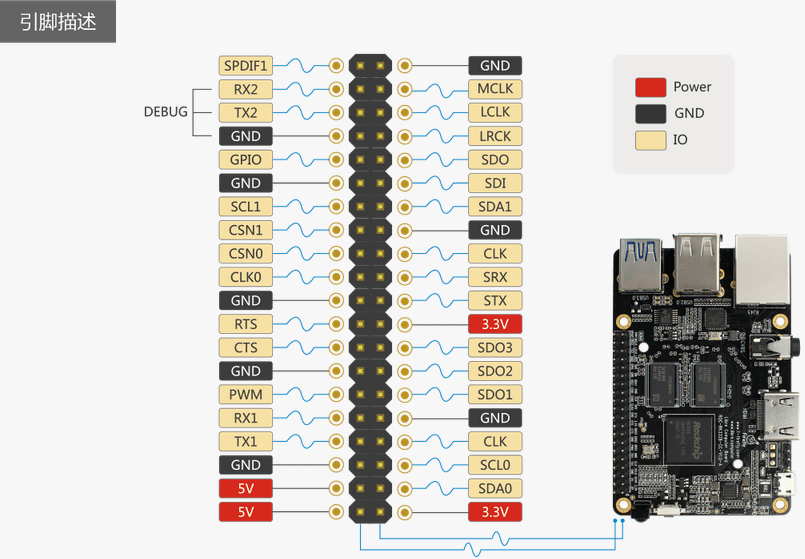
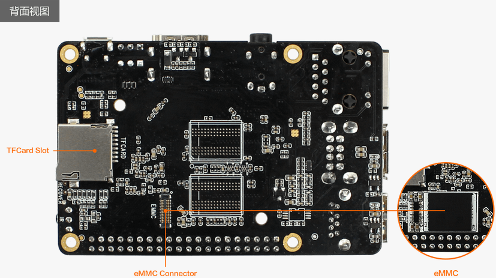

# Firmware and Tools

- [Firmware Download Page][Download Page]

Firmware Flashing Tools:

- To flash to the SD card:
    + GUI:
        * [SDCard Installer] (Linux/Windows/Mac)
        * [Etcher] (Linux/Windows/Mac)
        * [SD Firmware Tool] (Windows)
    + CLI:
        * [dd] (Linux)
- To flash to the eMMC:
    + GUI:
        * [AndroidTool] (Windows)
    + CLI:
        * [upgrade_tool] (Linux)
        * [rkdeveloptool] (Linux)

# Documents and Reference

- [Partition and Storage Map](http://opensource.rock-chips.com/wiki_Partitions)

# Hardware Datasheets and Interfaces

Datasheets:

V1.0:
- [ROC-RK3328-CC Schematic](http://www.t-firefly.com/download/ROC-RK3288-CC/ROC-RK3328-CC-V1.0-A_yl.pdf)
- [ROC-RK3328-CC Components Position Reference](http://www.t-firefly.com/download/ROC-RK3288-CC/ROC-RK3328-CC-V1.0-A_tp.pdf)

V1.3:
- [ROC-RK3328-CC Schematic](https://download.t-firefly.com/product/RK3328/Docs/ROC-RK3328-CC/roc-rk3328-cc-v13-b.pdf)
- [ROC-RK3328-CC Components Position Reference](https://download.t-firefly.com/product/RK3328/Docs/ROC-RK3328-CC/ROC-RK3328-CC-V1.3-B%E8%B4%B4%E7%89%87%E5%9B%BE.pdf)

- [Rockchip RK3328 Datasheet](http://www.t-firefly.com/download/ROC-RK3288-CC/Rockchip%20RK3328%20Datasheet%20V1.0-20170117.pdf)
- [Rockchip RK805 Datasheet V1.1](http://files.pine64.org/doc/rock64/Rockchip_RK805_Datasheet_V1.1%C2%A020160921.pdf)

Expansion Interface:

Board Top:

Board Bottom:

# Community

Firefly:

- [Forum]
- [Facebook]
- [Google+]
- [Youtube]
- [Twitter]
- [Shop]

[Getting Started]: getting_started.md
[FAQ]: faqs.md
[Serial Debug]: debug.md
[Building Linux Root Filesystem]: linux_build_ubuntu_rootfs.md
[Contact]: resource.md#community
[Raw Firmware]: getting_started.md#raw-firmware-format
[RK Firmware]: getting_started.md#rk-firmware-format
[Partition Image]: getting_started.md#partition-image
[SDCard Installer]: flash_sd.md#sdcard-installer
[Etcher]: flash_sd.md#etcher
[dd]: flash_sd.md#dd
[SD Firmware Tool]: flash_sd.md#sd-firmware-tool
[AndroidTool]: flash_emmc.md#androidtool
[upgrade_tool]: flash_emmc.md#upgrade-tool
[rkdeveloptool]: flash_emmc.md#rkdeveloptool
[Rockusb Mode]: flash_emmc.md#rockusb-mode
[Maskrom Mode]: flash_emmc.md#maskrom-mode
[Rockusb Driver]: flash_emmc.md#rockusb-driver
[ROC-RK3328-CC]: http://en.t-firefly.com/product/rocrk3328cc.html "ROC-RK3328-CC Official Website"
[Download Page]: https://community.t-firefly.com/en/doc/download/34
[Forum]: http://bbs.t-firefly.com/
[Facebook]: https://www.facebook.com/TeeFirefly
[Google+]: https://plus.google.com/u/0/communities/115232561394327947761
[Youtube]: https://www.youtube.com/channel/UCk7odZvUrTG0on8HXnBT7gA
[Twitter]: https://twitter.com/TeeFirefly
[Shop]: http://shop.t-firefly.com/
[USB Serial Adapter]: https://www.firefly.store/products/usb-to-uart-module-cp2104 
[5V2A US Adapter]: https://www.firefly.store/products/5v2a-us-adapter-3c-fcc-ce 
[eMMC Flash]: https://www.firefly.store/products
[Storage Map]: http://opensource.rock-chips.com/wiki_Partitions#Default_storage_map