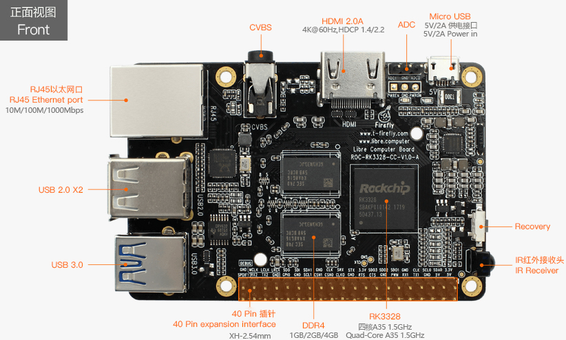

# Introduction

## Welcome

If you’re new to [ROC-RK3328-CC], the [Getting Started] section provides a guide for everything you need to flash the firmware and get the board running.

If you need help and have read through [Getting Started], check out [FAQ].

If you still can’t find what you need here, read [Serial Debug] section, get the log, contact [us][Contact], and help improve this documentation.

## Specification

[ROC-RK3328-CC], the first credit card sized and affordable open source main board honored by Firefly, features:

- Core
    + Quad-Core ARM® Cortex-A53 64-bit processor, with frequency up to 1.5GHz
    + ARM Mali-450 MP2 Quad-Core GPU, supports OpenGL ES1.1/2.0, OpenVG1.1
    + DDR4 RAM (1GB/2GB/4GB)
- Connectivity
    + 2 x USB 2.0 Host, 1 x USB 3.0 Host
    + 10/100/1000Mb Ethernet
    + 1 x IR Receiver Module, supports self-defined IR remote
    + 40 pin expansion interface, contains GPIO, I2S, SPI, I2C, UART, PWM SPDIF, DEBUG
- Display
    + HDMI 2.0 ( Type-A ), supports maximum 4K@60Hz display
    + TV out, CVBS display, in accordance with 480i, 576i standard
- Audio
    + I2S, supports 8 channels
    + SPDIF, for audio output
- Video
    + 4K VP9 and 4K 10bits H265 / H264 video decoding, up to 60fps
    + 1080P multi-format video decoding(WMV, MPEG-1/2/4, VP9, H.264, H.265)
    + 1080P video coding, supports H.264/H.265
    + Video postprocessor: de-interlacing, denoising, edge / detail / color optimization
- Storage
    + High-Speed eMMC extension interface
    + MicroSD (TF) Card Slot

([Full Specification](http://en.t-firefly.com/product/rocrk3328cc.html#spec))

This incredible ultra small board runs Android 7.1 or Ubuntu 16.04 smoothly and quietly, thanks to its low power consumption.

## Package & Accessories

[ROC-RK3328-CC] standard kit contains the following items:

- ROC-RK3328-CC main board
- Micro USB cable

The following accessories are highly recommended, especially when you are doing developer's work:

- [5V2A US Adapter], a good power source is a must have.
- [USB Serial Adapter], for serial console debugging.
- [eMMC Flash], provides more system performance and reliability.

[Getting Started]: getting_started.md
[FAQ]: faqs.md
[Serial Debug]: debug.md
[Building Linux Root Filesystem]: linux_build_ubuntu_rootfs.md
[Contact]: resource.md#community
[Raw Firmware]: getting_started.md#raw-firmware-format
[RK Firmware]: getting_started.md#rk-firmware-format
[Partition Image]: getting_started.md#partition-image
[SDCard Installer]: flash_sd.md#sdcard-installer
[Etcher]: flash_sd.md#etcher
[dd]: flash_sd.md#dd
[SD Firmware Tool]: flash_sd.md#sd-firmware-tool
[AndroidTool]: flash_emmc.md#androidtool
[upgrade_tool]: flash_emmc.md#upgrade-tool
[rkdeveloptool]: flash_emmc.md#rkdeveloptool
[Rockusb Mode]: flash_emmc.md#rockusb-mode
[Maskrom Mode]: flash_emmc.md#maskrom-mode
[Rockusb Driver]: flash_emmc.md#rockusb-driver
[ROC-RK3328-CC]: http://en.t-firefly.com/product/rocrk3328cc.html "ROC-RK3328-CC Official Website"
[Download Page]: https://community.t-firefly.com/en/doc/download/34
[Forum]: http://bbs.t-firefly.com/
[Facebook]: https://www.facebook.com/TeeFirefly
[Google+]: https://plus.google.com/u/0/communities/115232561394327947761
[Youtube]: https://www.youtube.com/channel/UCk7odZvUrTG0on8HXnBT7gA
[Twitter]: https://twitter.com/TeeFirefly
[Shop]: http://shop.t-firefly.com/
[USB Serial Adapter]: https://www.firefly.store/products/usb-to-uart-module-cp2104 
[5V2A US Adapter]: https://www.firefly.store/products/5v2a-us-adapter-3c-fcc-ce 
[eMMC Flash]: https://www.firefly.store/products
[Storage Map]: http://opensource.rock-chips.com/wiki_Partitions#Default_storage_map
 