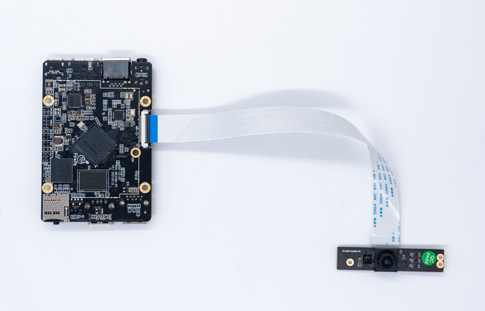
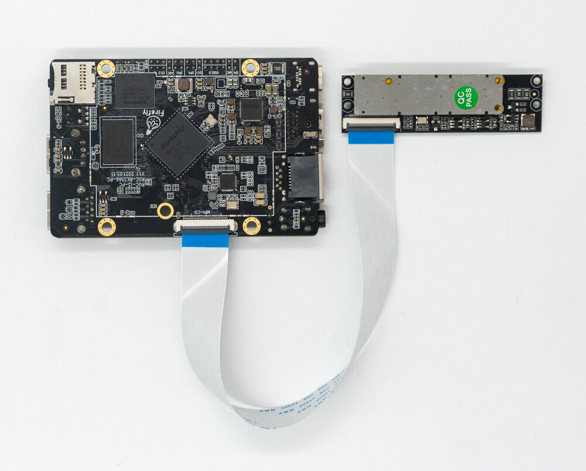

# Camera Module

## [CAM-8MS1M Monocular camera]() 

### Product Parameter
* **Brand**：SV
* **ISP**：xc7160
* **Sensor**: sc8238
* **Interface**: MIPI
* **Pixels**: 800W(Currently only supports up to 1080P, 4K is still being adapted)

### Reference firmware
Public Fimware support CAM-8MS1M camera module by default. If it doesn't work, please update the latest firmware.
[Download link](https://community.t-firefly.com/en/doc/download/106)

### Physical map

### Connection method

### Real pictures

## [CAM-2MS2MF Binocular camera module]() 

### Product Parameter
* **Brand**：SV
* **Sensor**: gc2053(IR)/gc2093(RGB)
* **Interface**: MIPI
* **Pixels**: 200W

### Reference firmware
CAM-2MS2MF Binocular camera module Android11 Firmware Download.
[GoogleDriver Download](https://community.t-firefly.com/en/doc/download/130)

### Physical map

### Connection method

### Real pictures

