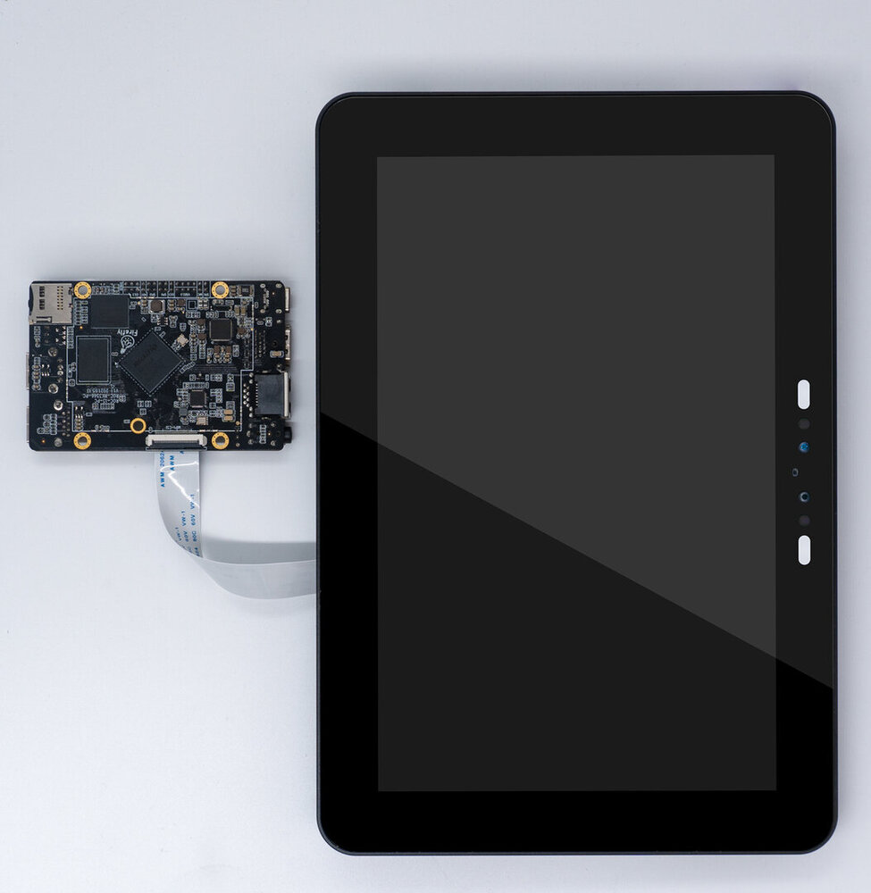
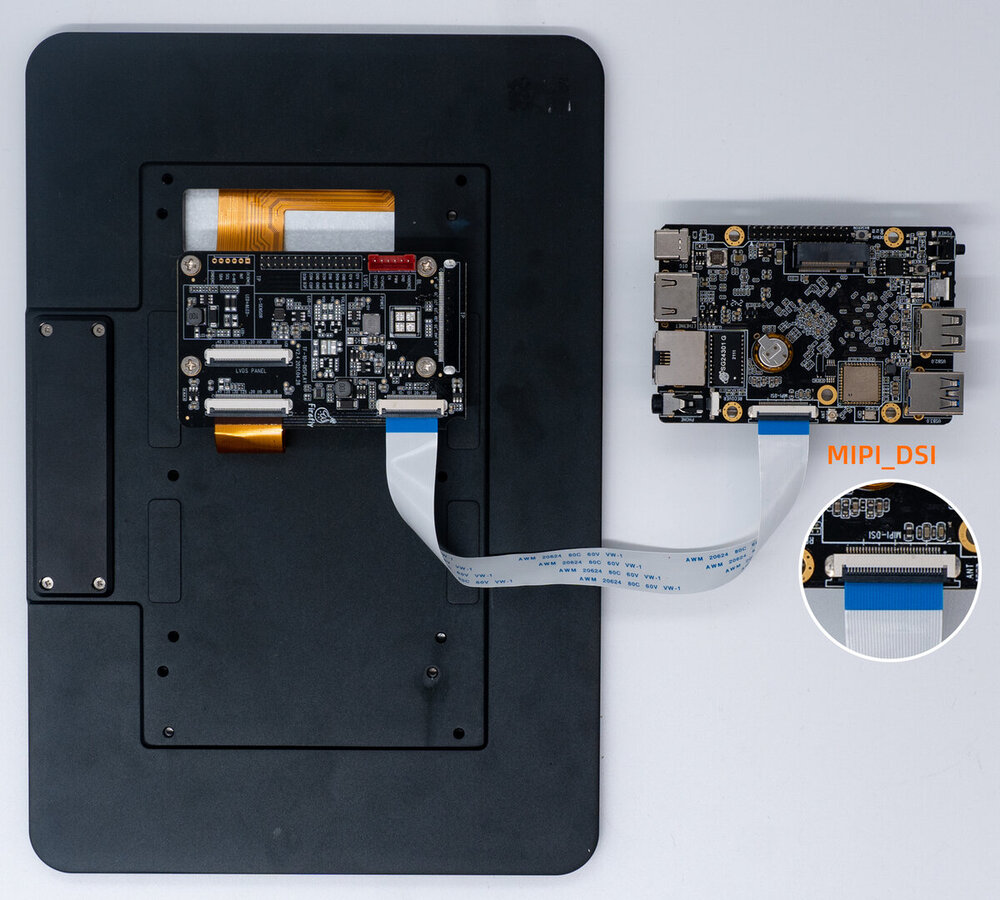

# Screen module

## [DM-M10R800 V2 MIPI module](https://item.taobao.com/item.htm?ft=t&id=655100190974)

### Product parameters

* **model:** M101014_BE45_A1
* **size:** 10.1 inch
* **resolution:** 800x1280
* **display interface:** MIPI
* **panel material:** IPS panel
* **visual Angle:** 160°
* **touch screen:** multi-point capacitive touch

### Refer to the firmware

The official firmware name supporting the 10.1 screen has the word `MIPI`. Below is the link to the firmware: [Firmware link](https://community.t-firefly.com/en/doc/download/125)  

If you need to use the dual screen display function, please refer to the [FAQ](faqs.md) first

### Compile command

```
./FFTools/make.sh -d rk3566-roc-pc-mipi101_M101014_BE45_A1 -j8 -l rk3566_roc_pc_mipi-userdebug
./FFTools/mkupdate/mkupdate.sh -l rk3566_roc_pc_mipi-userdebug
```

<font color=red>**Note: If you need to use the CAM-8MS1M camera, apply the following patch before compiling.**</font>

```
diff --git a/kernel/arch/arm64/boot/dts/rockchip/rk3566-roc-pc-mipi101_M101014_BE45_A1.dts b/kernel/arch/arm64/boot/dts/rockchip/rk3566-roc-pc-mipi101_M101014_BE45_A1.dts
index ebbb5d1123f..71e82f8d9c0 100644
--- a/kernel/arch/arm64/boot/dts/rockchip/rk3566-roc-pc-mipi101_M101014_BE45_A1.dts
+++ b/kernel/arch/arm64/boot/dts/rockchip/rk3566-roc-pc-mipi101_M101014_BE45_A1.dts
@@ -7,6 +7,13 @@
  /dts-v1/;

 #include "rk3566-roc-pc.dtsi"
+/*
+ * Select one of the two
+ * using single camera xc7160 ----> rk3566-roc-pc-cam-8ms1m.dtsi
+ * using dual camera gc2053/gc2093   ----> rk3566-roc-pc-cam-2ms2m.dtsi
+ */
+#include "rk3566-roc-pc-cam-8ms1m.dtsi"
+//#include "rk3566-roc-pc-cam-2ms2m.dtsi"

 / {
     model = "ROC-RK3566-PC MIPI101 M101014-BE45-A1(Android)";
```

### Reference data

[Screen module datasheet and adapter board schematic](https://community.t-firefly.com/en/doc/download/125)

### Real figure

#### Front



#### Back


