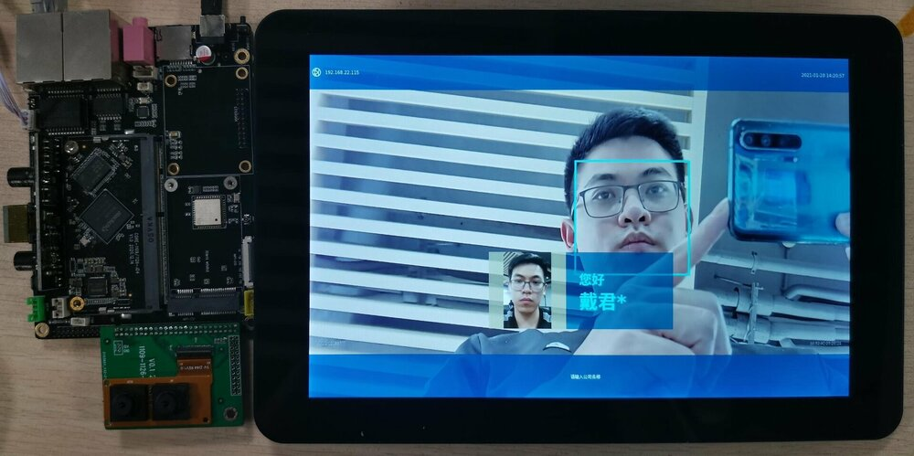
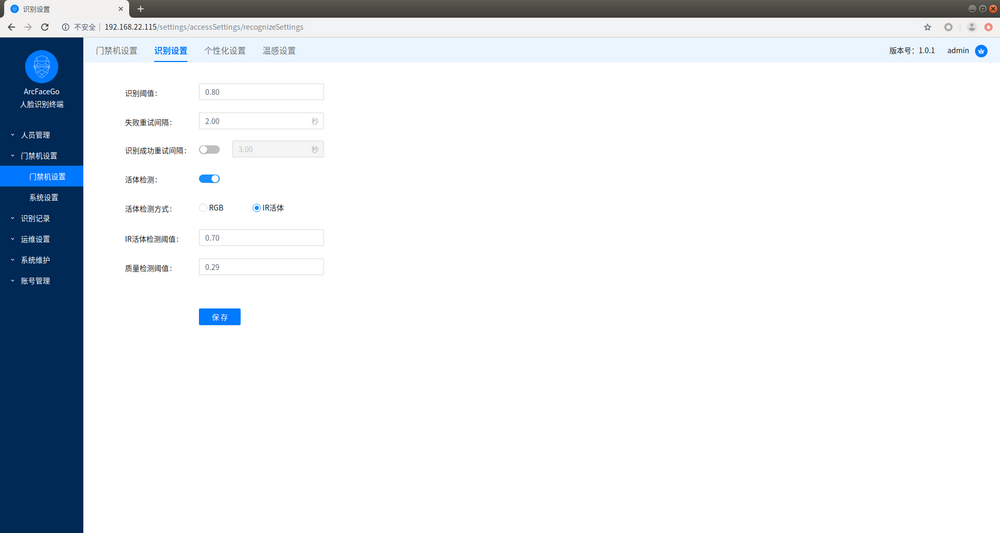
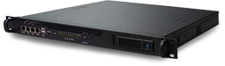
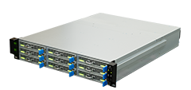

# Technical Case

`CORE-1126-JD4/CORE-1109-JD4` gold finger retains most of the interfaces of Soc, and users can make their own baseboards according to their own needs to meet various application scenarios. The following introduces several application scenarios equipped with the official `MB-1126-JD4` baseboard.

## AI Network Camera

The baseboard has hardware foundations such as `Ethernet interface`, `MIPI-CSI`, and `POE`, which can realize AI smart network camera. AI recognition and RTSP streaming can be realized on the device, and the preview screen can be viewed on the WEB side or RTSP player.

## Face Recognition Gate

The device has reserved two sets of `MIPI-CSI` interfaces, which can adapt to RGB & IR binocular cameras to meet the needs of face recognition gates.

Facial recognition gate web management interface

## Cluster Edge Computing

In addition to being able to adapt to `MB-1126-JD4` for standalone use, `CORE-1126-JD4/CORE-1109-JD4` also adapts to the official CS-R1/CS-R2 series cluster servers.

* CS-R1

* CS-R2

