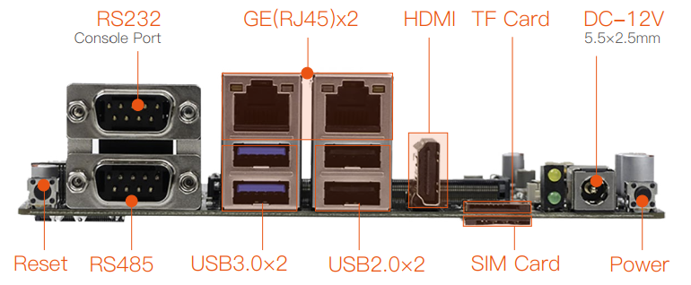
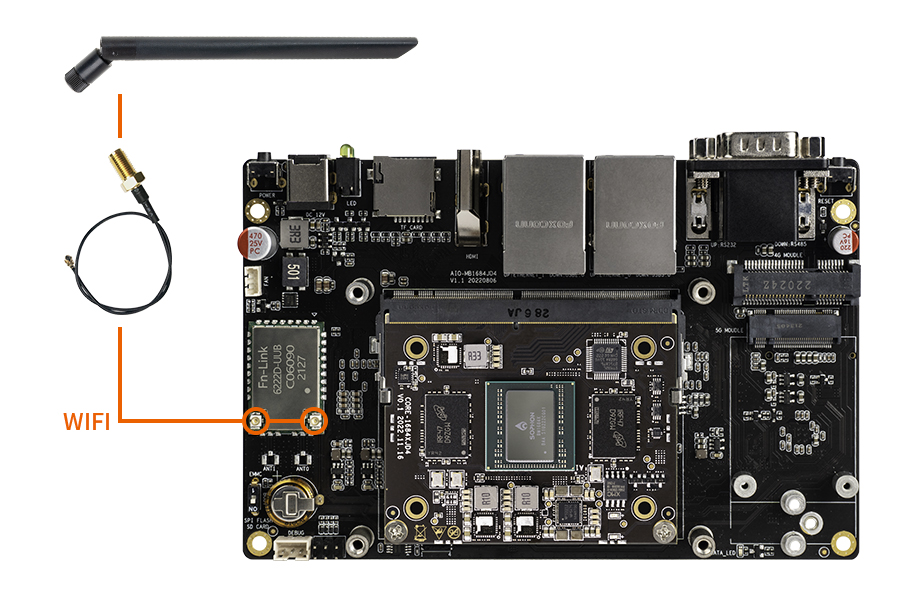
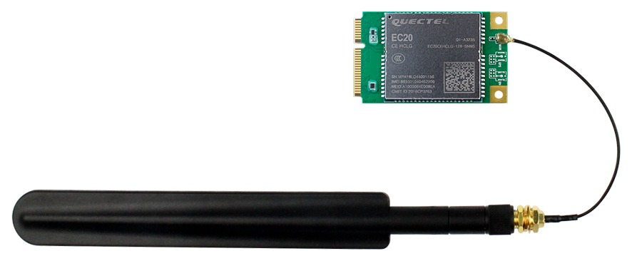
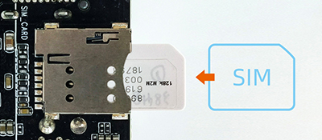

# Interface definition

## Interface definition of the whole machine

AIO-1684XJD4 provides rich interfaces, including:

* 12V Power interface
* 2 x USB 3.0
* 2 x USB 2.0
* 2 x 1000Mbps Ethernet
* WIFI antenna
* HDMI 1.4
* TF card slot
* SIM card slot
* FAN interface
* Power button
* Reset button
* Debugging serial port
* Industrial serial port (RS485, RS232, TTL)
* Mini PCIe interface (4G LTE)
* M.2 interface (5G Module)
* M.2 SATA interface (SATA3.0 SSD)

The specific details are as follows:

## WiFi Antenna Connection

Antenna Specifications: Stick Antenna 5dB; Flat Head

## 4G Module Antenna Connection

Antenna Specifications: Stick Antenna 4GLTE-5dB; Round Head

## SIM Card Connection

## UART Pinout

