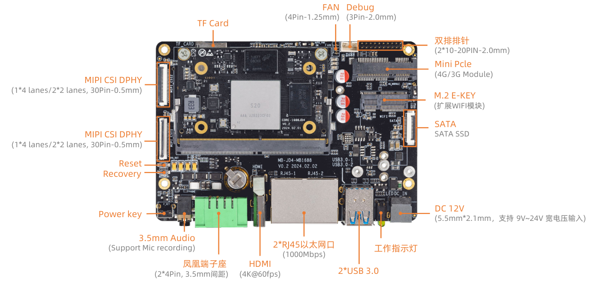
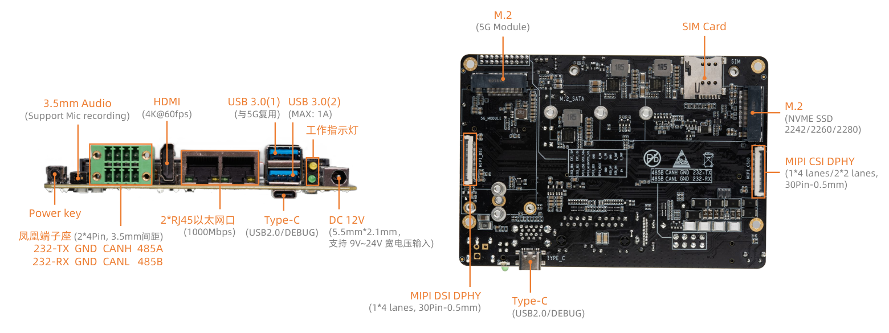

# Interface Definition

## Whole Machine Interface Definition

AIO-1688JD4 provides a rich set of interfaces, mainly including:

* 12V power interface
* 2 x USB 3.0
* 2 x Gigabit Ethernet
* WIFI antenna
* Fan interface
* Power button
* Reset button
* Recovery button
* Debug serial port (TTL)
* CAN 
* Industrial serial port (RS485, RS232)
* Type-C (USB2.0, debug serial port) 
* SIM card slot
* Mini PCIe interface (4G LTE)
* M.2 interface (5G Module)
* NVME interface (PCIE3.0 x 1)
* SATA 3.0
* TF card slot
* Headphone
* RTC 
* MIPI CSI 
* MIPI DSI
* HDMI 2.0

Details are as shown in the pictures below:

