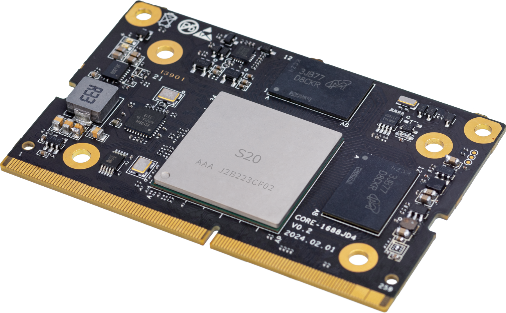
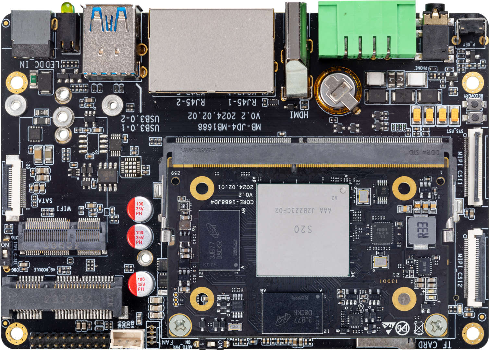
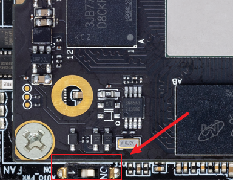

# First Use

## Product Overview

The Core-1688JD4 core board, equipped with the BM1688 intelligent computing chip, is designed for high-integration visual computing chips aimed at AI inference, computer vision, and more. It can be integrated into various products such as intelligent computing servers, edge computing boxes, industrial control computers, professional smart network cameras, and AIOT. It efficiently adapts to all AI algorithms on the market, enabling applications such as image classification, object detection, instance segmentation, semantic segmentation, behavior analysis, text recognition, natural language processing, speech recognition, speech synthesis, and search recommendations, empowering AI across various industries. It also integrates image processing hardware: supporting HDR wide dynamic range, 3D noise reduction, 3A, dehazing, and various image enhancement and computer vision algorithms like fisheye unfolding, image stitching, and stereo fusion, providing professional-level video image quality and hardware image algorithm acceleration.

**Front of Core-1688JD4 Core Board:**



The AIO-1688JD4 motherboard consists of the core board Core-1688JD4 + baseboard MB-JD4-BM1688, featuring rich interfaces such as HDMI2.0, PCIE 3.0 x 1, USB3.0 x 2, RS485, RS232, CAN, CSI, and DSI, which can be directly applied to AI edge computing products.



**For product parameters, please refer to: [Specification](https://download.t-firefly.com/%E4%BA%A7%E5%93%81%E8%A7%84%E6%A0%BC%E6%96%87%E6%A1%A3/%E6%A0%B8%E5%BF%83%E6%9D%BF/Core-1688JD4_16T%E7%AE%97%E5%8A%9BAI%E6%A0%B8%E5%BF%83%E6%9D%BF_%E4%BA%A7%E5%93%81%E4%BB%8B%E7%BB%8D.pdf)**

## Accessory List
During use, you may need the following accessories:
- Display Device
     + Monitor or TV with HDMI interface and HDMI cable
- Network
     + 100M/1000M Ethernet cable, wired router
     + WiFi router
- Firmware Upgrade
     + TF card, 8GB/Class 10 or above
- Debugging
     + USB to serial adapter (Firefly UART serial module)
     + Type-C (can be used as Type-C serial)

## Power On

- If it's not a complete machine, follow these steps to install:
  + Align the gold fingers of the core board (main chip facing up) with the baseboard slot and insert it fully, then press down on the core board to ensure the clips on both sides are securely closed.
  + Connect the power of the cooling fan to the FAN interface (near the UART serial port), place the thermal pad in the center of the heatsink, and then clip the fan onto the main chip, ensuring the thermal pad completely covers the main chip.
- Connect the 12V-5A power adapter and plug the power cable into a 100~220V AC power source, with the other end plugged into the power interface of the development board.
- Pay attention to the power switch status (near the FAN interface):
  + ON: Indicates that the power is plugged in and the machine will start directly.
  + 1: Indicates that after plugging in the power, you need to briefly press the Power button to start.



## Remote Network Login

Network port 0 (near the serial port) is set to dynamic IP, while network port 1 (near the HDMI port) is set to static IP `192.168.150.1`, subnet mask `255.255.255.0`. You can set your PC to `192.168.150.2/24` for initial access.

If the PC can successfully `ping` the network port IP address, you can then log in using `ssh`, with the port number being `22`, and both username and password are `linaro`:

```
ssh linaro@192.168.150.1
```

After connecting to the development board, you can modify the network configuration in the `/etc/netplan/` directory.

## Serial Terminal Access

Please refer to [“Serial Debugging”](debug.md).

## Shutdown

Please avoid directly disconnecting the power for shutdown; first run `sudo poweroff`, and then cut the power to prevent damage to the file system data.

Additionally, if you have successfully entered the Linux system, you can also press and hold the power button, and the system will detect it and safely shut down the system and the development board power.