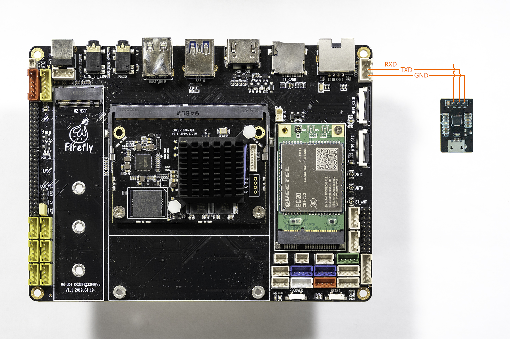

# Serial debuge  
## Purchase the adapter

There are many USB adapter to serial port on the shop, divided by chip, there are the following:
* [CP2104](https://www.firefly.store/products/usb-to-uart-module-cp2104)
* PL2303  
* CH340   

<font color=#ff0000>Note: the default baud rate of RK3399 is 1500000, some USB to serial chip baud rate can not reach 1500000, the same chip may have different series, so be sure to confirm whether to support before purchasing.</font>

## Hardware connection
Serial port to USB adapter, there are four different colors of the cable:
* **Red**:  3.3v power supply, no connection required
* **Black**: GND, ground wire for serial port, GND needle for serial port of development board
* **White**: TXD, output line of serial port, TX needle of serial port of development board
* **Green**: RXD, input line of serial port, RX needle of serial port of development board

Note: if you encounter problems that TX and RX cannot input and output when using other serial port adapters, you can try to adjust the connection between TX and RX.

AIO-1808-JD4 Serial port connection diagram:


## Connection parameters

AIO-1808-JD4 uses the following serial port parameters:
* Baud rate: 1500000
* Data bit: 8
* Stop bit: 1
* Parity check: none
* Flow control: none

## Use serial debuge on Windows
### Install the driver
Download driver and install:
* [CH340](https://sparks.gogo.co.nz/ch340.html)
* [PL2303](http://www.prolific.com.tw/US/ShowProduct.aspx?pcid=41)
* [CP210X](https://www.silabs.com/products/development-tools/software/usb-to-uart-bridge-vcp-drivers)

If you can't use PL2303 normally on Win8, use 3.3.5.122 or older version of the old driver, please refer to [This article](http://blog.csdn.net/ropai/article/details/19619951).

If you install the CP210X driver from the official website on the Windows system, you can set the serial port baud rate to 1500000 using tools such as PUTTY or SecureCRT. If you cannot set the baud rate or it is invalid, you can download the old version [driver](http://t-firefly.oss-cn-hangzhou.aliyuncs.com/product/Tools/Driver/CP210X/CP210x_VCP_Windows.zip).

After the adapter is inserted, the system will prompt for the discovery of new hardware and initialization, and then the corresponding COM port can be found in the device manager:


### Install software

Putty or SecureCRT are commonly used for Windows. Putty is open source software and SecureCRT is used in a similar way.
Here to [Download putty](http://www.chiark.greenend.org.uk/~sgtatham/putty/download.html)(Recommended download ` putty.zip `, it contains other useful tools.)

Extract and run `PUTTY.exe`.
  * Select "Connection type" to "Serial".
  * Modify "Serial line" to the COM port found in the device manager.
  * Set "Speed" to 1500000.
  * Click "Open" button.


## Use serial debuge on Ubuntu

There are many options available on Ubuntu:
* minicom

Here's how minicom works.
### Install
```
sudo apt-get install minicom
```
To connect the serial port line, see what the serial port device file is. The following example is */dev/ttyusb0*
```
$ ls /dev/ttyUSB*
/dev/ttyUSB0
```
Run:
```
$ sudo minicom
Welcome to minicom 2.7                                       
OPTIONS: I18n       
Compiled on Jan  1 2014, 17:13:19.     
Port /dev/ttyUSB0, 15:57:00                                 
Press CTRL-A Z for help on special keys
```
Based on the above tips：Press `Ctrl-a` and then press Z again to bring up the Help menu.
```
   +-------------------------------------------------------------------+
                          Minicom Command Summary                      |
  |                                                                    |
  |              Commands can be called by CTRL-A <key>                |
  |                                                                    |
  |               Main Functions                  Other Functions      |
  |                                                                    |
  | Dialing directory..D  run script (Go)....G | Clear Screen.......C  |
  | Send files.........S  Receive files......R | cOnfigure Minicom..O  |
  | comm Parameters....P  Add linefeed.......A | Suspend minicom....J  |
  | Capture on/off.....L  Hangup.............H | eXit and reset.....X  |
  | send break.........F  initialize Modem...M | Quit with no reset.Q  |
  | Terminal settings..T  run Kermit.........K | Cursor key mode....I  |
  | lineWrap on/off....W  local Echo on/off..E | Help screen........Z  |
  | Paste file.........Y  Timestamp toggle...N | scroll Back........B  |
  | Add Carriage Ret...U                                               |
  |                                                                    |
  |             Select function or press Enter for none.               |
  +--------------------------------------------------------------------+
```
Press O to enter the setting interface, as follows:
```
           +-----[configuration]------+  
           | Filenames and paths      |   
           | File transfer protocols  |   
           | Serial port setup        |  
           | Modem and dialing        |  
           | Screen and keyboard      | 
           | Save setup as dfl        | 
           | Save setup as..          |                 
           | Exit                     |                 
           +--------------------------+
```
Move the cursor to ***Serial port setup***, press ***enter*** to enter the Serial port setup interface, then enter the letter prompted earlier, select the corresponding option, and set it as follows:
```
   +-----------------------------------------------------------------------+                                          
   | A -    Serial Device      : /dev/ttyUSB0                              |                                          
   | B - Lockfile Location     : /var/lock                                 |                                          
   | C -   Callin Program      :                                           |                                          
   | D -  Callout Program      :                                           |                                          
   | E -    Bps/Par/Bits       : 1500000 8N1                               |                                          
   | F - Hardware Flow Control : No                                        |                                          
   | G - Software Flow Control : No                                        |                                          
   |                                                                       |                                          
   |    Change which setting?                                              |                                          
   +-----------------------------------------------------------------------+
   ```
* Note: ***Hardware Flow Control*** and ***Software Flow Control*** should be set to No, otherwise it may be impossible to input.

Go back to the previous menu and select ***Save setup as DFL*** to Save as the default configuration, which will be used by default later.