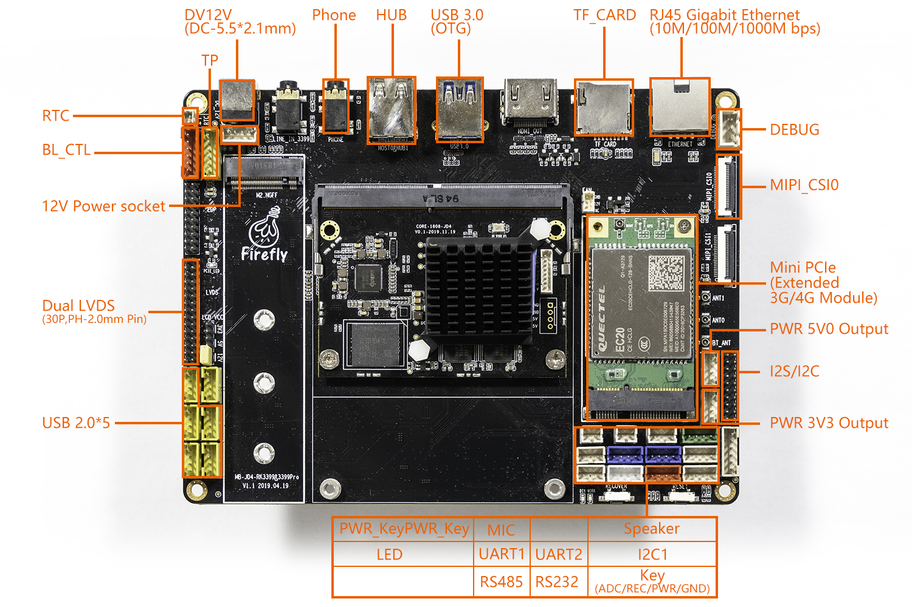
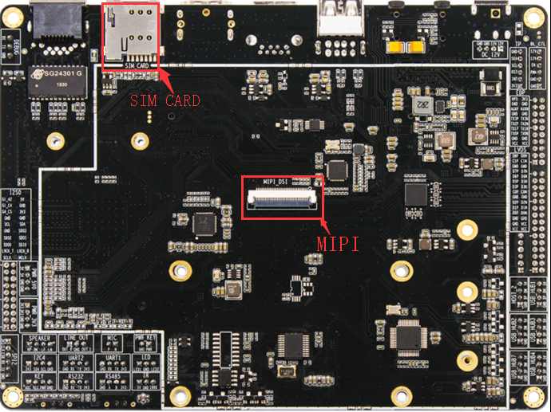

# Interface definition

## Interface definition of the whole machine

AIO-1808-JD4 provides rich interfaces, including : 

* Power interface, 
* 1 x USB3.0(host/device), 6 x USB2.0 (interface 1, seat 5),
* Ethernet, 
* double an LVDS interface screen,
* TP touch interface, 
* screen voltage jump line interface, 
* backlight interface, 
* WIFI antenna, 
* bluetooth antenna, 
* power button, 
* MIC interface, 
* 3.5 mm headphone jack, 
* 12 v power supply interface, 
* TF card slot, SIM card slot, 
* interface extension buttons, 
* speaker interface, 
* recovery button, 
* debugging serial port, 
* industrial serial port (RS485,RS232,2TTL), 
* RTC power interface, 
* MIPI screen interface (dual LVDS multiplex), 

The details are as follows:

*in addition, customers can also customize the boards of relevant functional interfaces as required, as shown in the figure below:*

#### Special interface

Software&Hardware: Not support LINE_IN/LINE_OUT, USB_HOST2, Only support SPEAKER One channel (Baseboard JD4-v1.0)