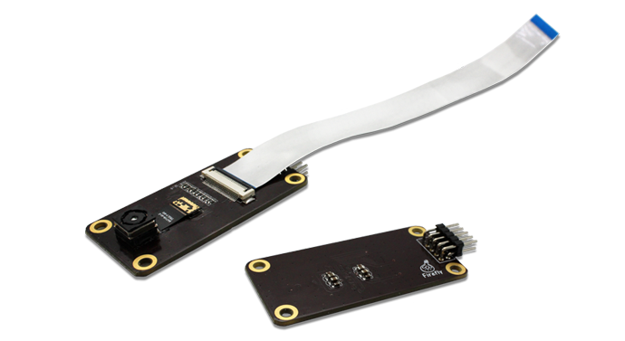
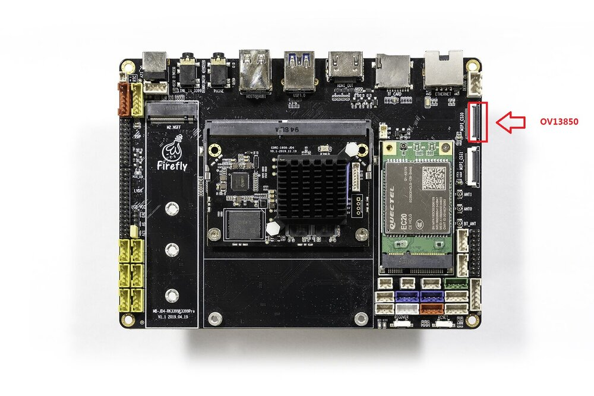
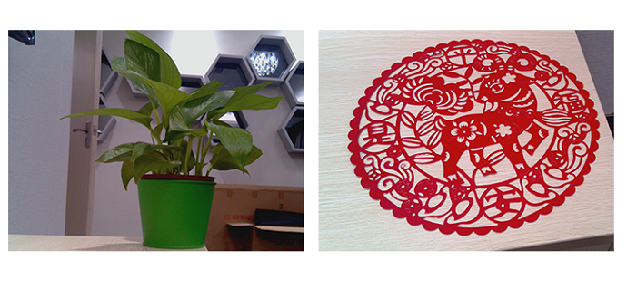

# Camera module
## [OV13850 Camera module](https://www.firefly.store/products/ov13850-camera-module)
### Product parameters

*  brand: Omnivision
* Model: CMK-OV13850
* interface: MIPI
* pixel: 1320W

### Refer to the firmware
The public firmware supports `cmk-ov13850` camera module by default.

### Real figure

### Connection methods

### picture

