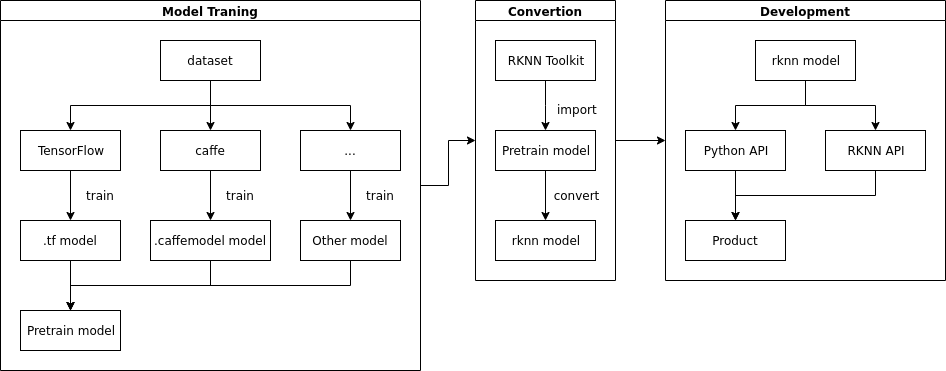

# NPU Brief Introduction to Development

## NPU Characteristics
- Supports 8 bit/16 bit operation with 3.0 TOPS performance
- Compared with the large chip scheme of GPU as AI computing unit, the power consumption of GPU is less than 1%.
- Could load Caffe / Mxnet / TensorFlow model Directly
- Provide AI development tools: support rapid model transformation, development board end-to-side conversion API, TensorFlow / TF Lite / Caffe / ONNX / Darknet and other models
- Provide AI application development interface: support Android NN API, RKNN cross-platform API, Linux support TensorFlow development

## Process
The complete NPU development process is shown in the following figure

### 1. model training
In the model training stage, users choose the appropriate framework (such as Caffe, TensorFlow, etc.) according to the needs and actual conditions to train to get the model that meets the needs. The trained model can also be used directly.

### 2. Model transformation
In this stage, the model obtained from model training is transformed into the model available to NPU through RKNN Toolkit.

### 3. Program Development
The last stage is to implement business logic for Python API development program based on RKNN API or RKNN Tookit

**This document mainly introduces model transformation and RKNN-based program development, and does not involve the content of model training.**